# ApplyWise

**An AI career copilot for engineers breaking into AI roles. It answers one question honestly: apply now, or improve first?**

ApplyWise reads your resume and a job posting, then leads with a plain-language verdict instead of a hype score. It will tell you to improve first when that's the truth — and it always hands you the next concrete step.

> Status: MVP feature-complete, pre-launch · Built solo · Next.js 16 · React 19 · FastAPI · Supabase Postgres · Google Gemini

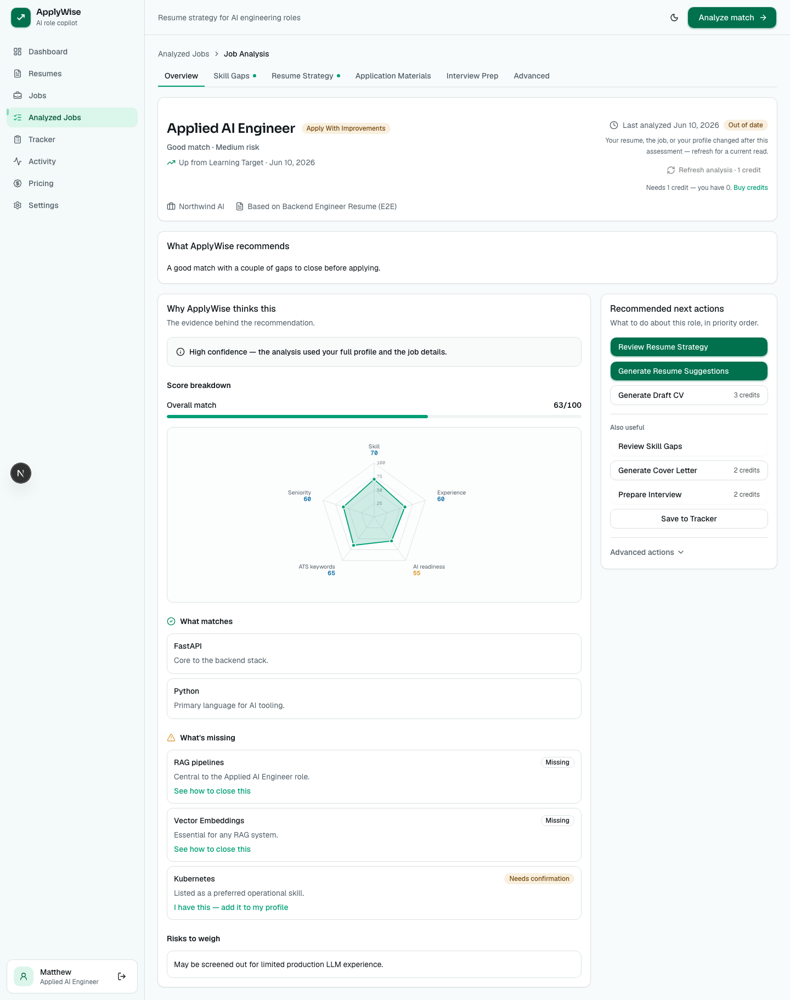

---

## What it does

You add a job (paste it, drop a URL, or search), upload a resume once, and ApplyWise analyzes the fit. Every analysis page opens with a verdict — **Strong Apply Target**, **Apply With Improvements**, **Learning Target**, or **Not Recommended Yet** — followed by the evidence behind it. The model's numbers stay tucked behind an Advanced tab.

From there you can:

- See exactly which requirements you match and which you're missing.
- Get resume bullets tailored to the job — without invented metrics or fake skills.
- Export an ATS-safe CV to PDF, DOCX, or Markdown.
- Generate a cover letter built from the tailored CV, not the raw resume.
- Follow a 4-week roadmap to close the gaps that matter.
- Prep for the interview with questions grounded in your actual experience.
- Track applications and buy credits for the paid AI steps.

## Why I built it

Engineers moving into AI/LLM roles waste effort applying to jobs they aren't ready for. The tools that promise to help mostly inflate claims to beat resume filters — which falls apart the moment you have to defend a fabricated bullet in an interview.

What's missing is honest triage:

- Which jobs should I apply to **now**?
- Which should I **improve for first**?
- What exactly should I build or learn before applying?

No tool I tried was willing to say "not yet." ApplyWise is built around being willing to say it — and then showing a way forward.

## Key features

| Feature | What it does |
| --- | --- |
| **Decision-first analysis** | One verdict per job, evidence underneath, mechanics behind Advanced. A fixed six-tab shell (Overview, Skill Gaps, Resume Strategy, Application Materials, Interview Prep, Advanced) whose order never changes. |
| **Deterministic verdict engine** | A pure, unit-tested engine decides the verdict from recomputed scores using ordered rules. The LLM's text is an input — it never gets the final say. |
| **Truth Guard** | After the model writes a bullet, deterministic guards strip any number or skill not backed by the source resume. A fabricated claim can't reach an exported document. |
| **Tailored CV + export** | One render model serializes the same CV to web, PDF, DOCX, and Markdown, with deterministic page sizing and ATS-safe layout. |
| **Skill gaps + roadmap** | Missing skills typed as true gap / wording gap / proof gap, each with a fix. A 4-week plan turns "improve first" into a concrete path. |
| **Interview prep** | Technical, AI/LLM, system-design, and behavioral questions with answer guidance drawn from your resume — it tells you to go build proof rather than fake it. |
| **Resume import** | Upload PDF/DOCX/image (OCR included) or paste text; an extractor builds a structured profile you review before it goes live. |
| **Prepaid credits** | Stripe-hosted checkout, credits granted only after a signed webhook, balance tracked on an append-only ledger with a server-side spend check. |

## Tech stack

**Frontend** — Next.js 16 (App Router, React Server Components), React 19, TypeScript, Tailwind CSS v4, Base UI primitives, Zod, Clerk for auth, Playwright for E2E.

**Backend** — Python + FastAPI, Pydantic for boundary parsing and AI output validation, Docling for resume normalization (PDF/DOCX/image + OCR), fpdf2 and python-docx for export rendering, Clerk JWKS verification, pytest.

**Data** — Supabase Postgres. User-owned rows with cascade deletion; append-only ledgers for billing, decisions, and the AI run log.

**AI** — Google Gemini (default `gemini-3.5-flash`, with configurable fast and heavy tiers). Structured JSON validated by Pydantic with a single retry on bad JSON. Every workflow has a deterministic, non-LLM fallback that satisfies the same schema, so a missing key or a provider outage never breaks a feature.

**Integrations** — Clerk (auth), Stripe (credits), Firecrawl (job URL scraping, with manual-paste fallback), Google Gemini API.

## How it fits together

A monorepo with two independently deployable surfaces over one Postgres database. The frontend only ever talks to API contracts; the backend owns all AI orchestration, scoring, the decision engine, parsing, export, and persistence.

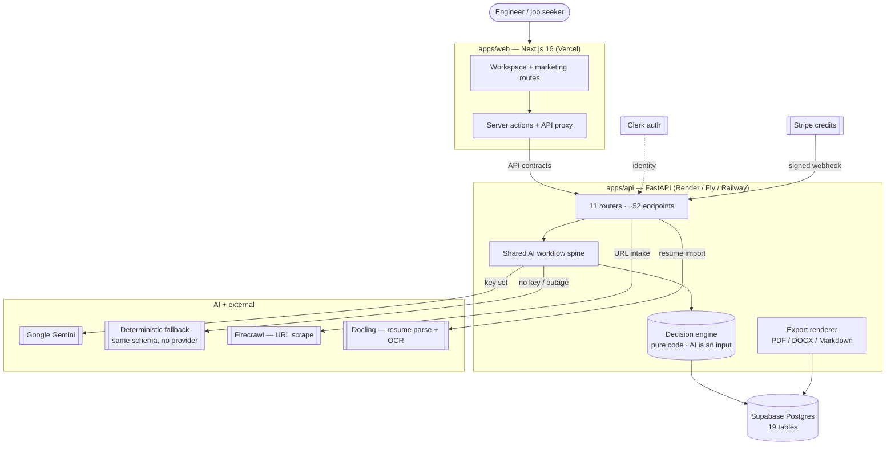

Every AI feature runs the same flow, so reliability lives in one place rather than being reinvented per feature:

```
authorize ownership → insert run row → load minimum input
→ build prompt (truthfulness preamble)
→ call Gemini (retry once on bad JSON)  OR  deterministic fallback
→ validate with Pydantic → run Truth Guard → map confidence to status
→ persist result + snapshot → write activity event → return envelope
```

The full system diagram lives in [`docs/product/architecture.md`](docs/product/architecture.md); the data model is in [`docs/product/data-model.md`](docs/product/data-model.md).

## Screenshots

Captured at 1440px in both light and dark themes. The design system carries full light/dark parity — here's the signature analysis surface in both:

| Light | Dark |
| --- | --- |
|  | 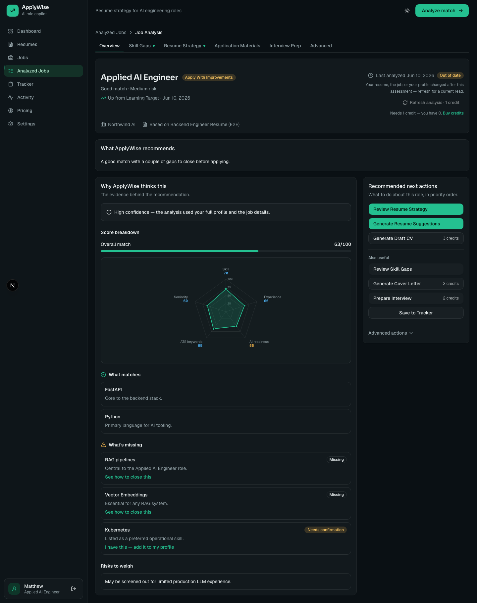 |

**Truth Guard resume suggestions** — every rewrite is tagged Safe to use / Needs confirmation / Do not use yet, traceable to evidence.

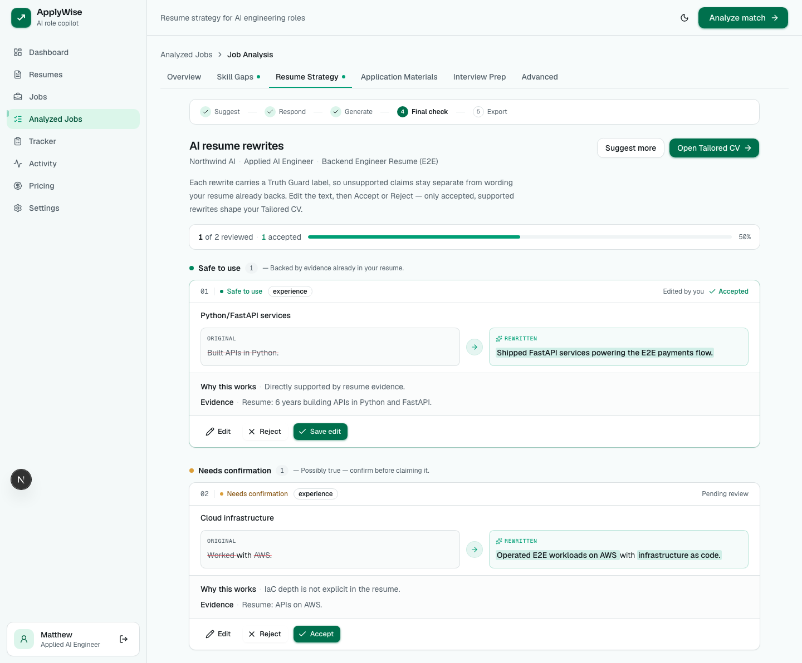

**Tailored CV with ATS-safe export** — one render model, identical output to web, PDF, DOCX, and Markdown.

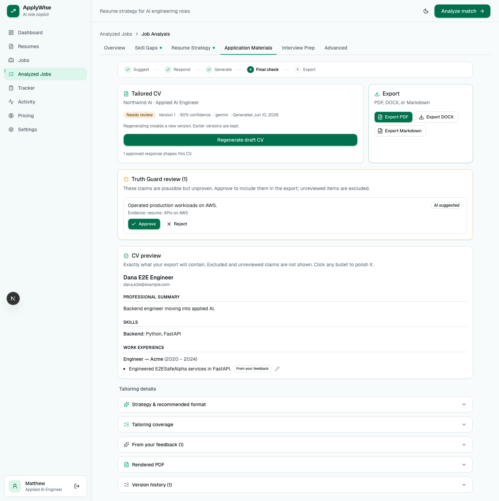

| Skill gaps | 4-week roadmap |
| --- | --- |
| 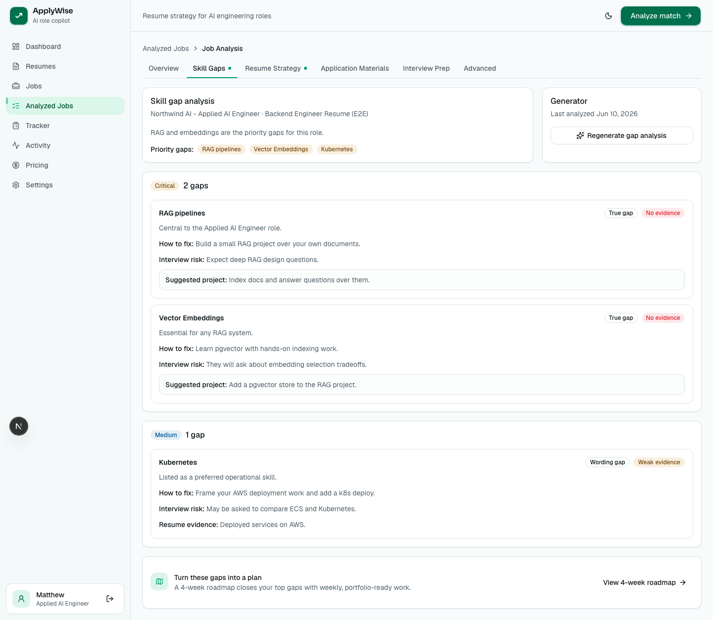 | 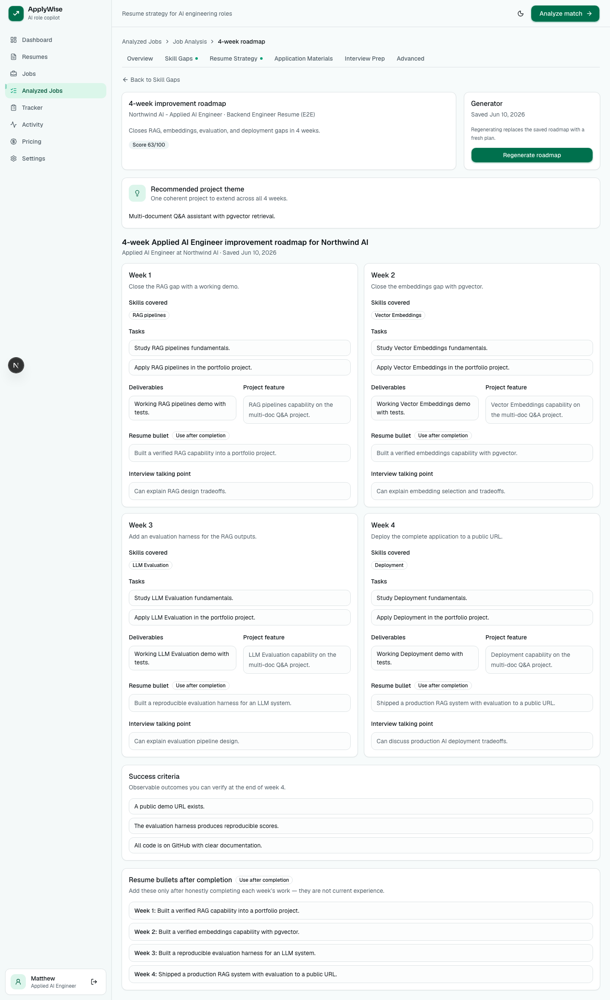 |

| Interview prep | Analyzed jobs list |
| --- | --- |
| 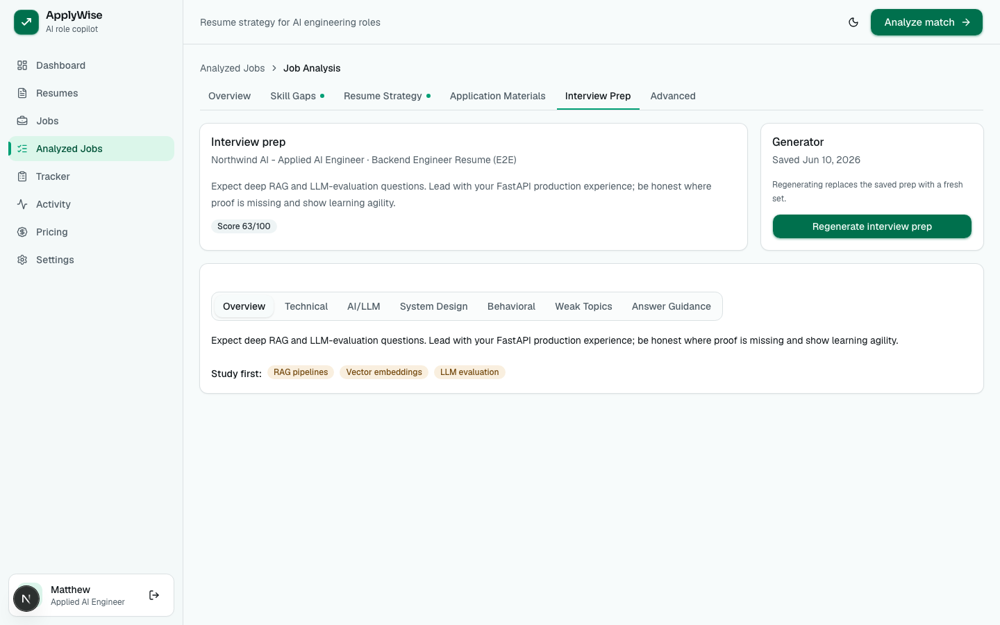 | 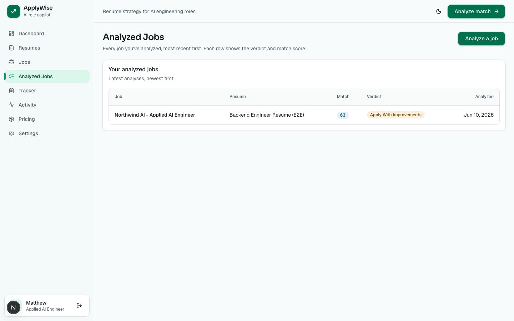 |

| Dashboard | Pricing & credits |
| --- | --- |
| 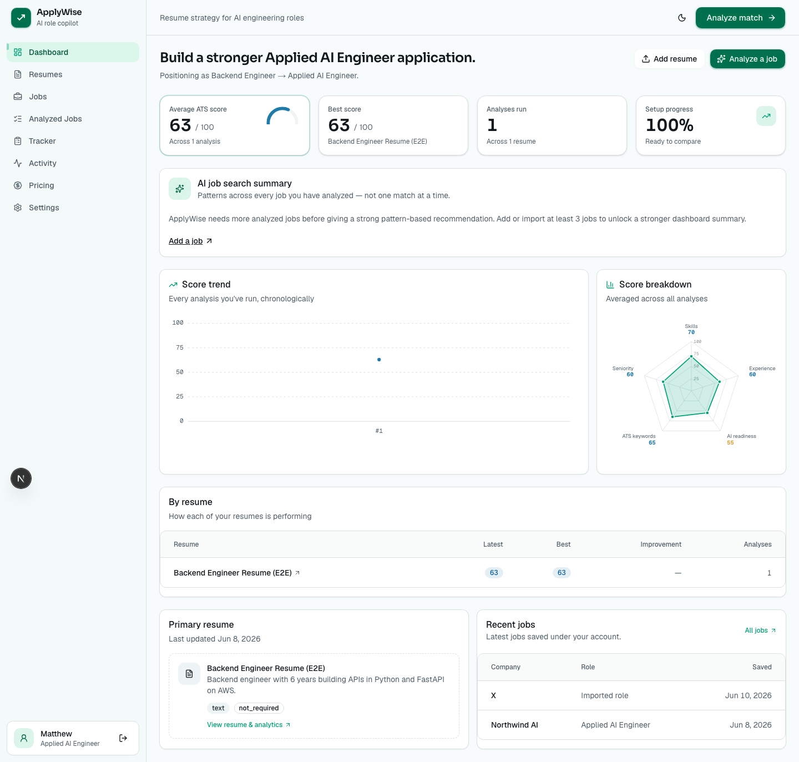 | 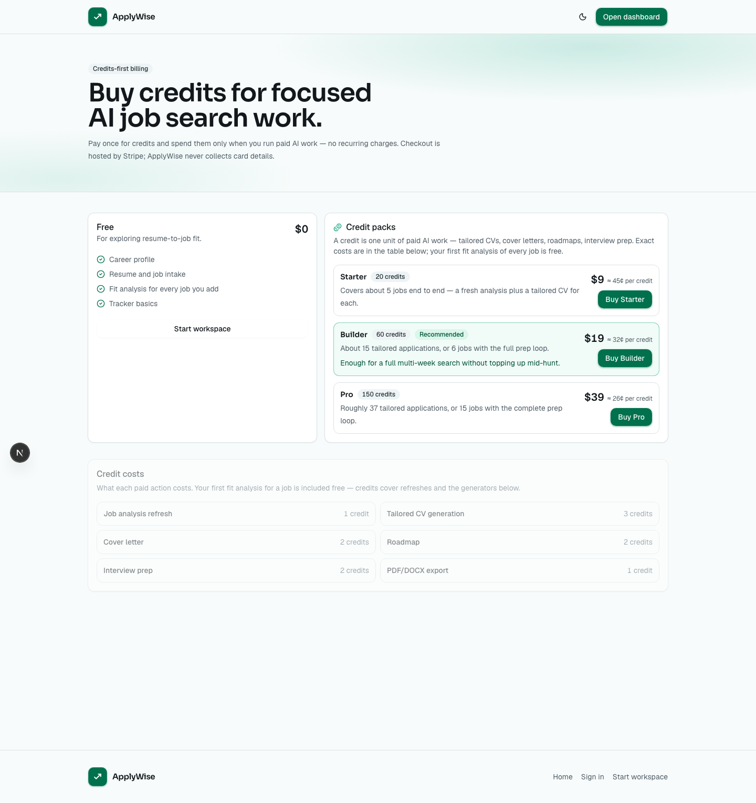 |

## Getting started

### Prerequisites

- **Node 20+** (22+ recommended; the E2E suite needs 22+)
- **Python 3.11+**
- A **Supabase** project (Postgres)
- A **Clerk** application (auth)
- Optional: **Google Gemini** API key — without it, every AI workflow falls back to its deterministic generator, so the app still runs end to end
- Optional: **Stripe** (credits) and **Firecrawl** (job URL scraping) keys

### Install

```bash
git clone <your-fork-url> applywise
cd applywise

# Web (npm workspace)
npm install

# API (Python venv + dev deps)
npm run setup:api
```

### Environment variables

Copy the examples and fill them in:

```bash
cp apps/web/.env.example apps/web/.env
cp apps/api/.env.example apps/api/.env.local
```

**`apps/web/.env`**

| Variable | Purpose |
| --- | --- |
| `NEXT_PUBLIC_API_BASE_URL` | Where the FastAPI backend runs (`http://localhost:8000`) |
| `NEXT_PUBLIC_CLERK_PUBLISHABLE_KEY` / `CLERK_SECRET_KEY` | Clerk auth |
| `SUPABASE_URL` / `SUPABASE_SERVICE_ROLE_KEY` / `SUPABASE_DB_URL` | Database access |
| `STRIPE_SECRET_KEY` / `STRIPE_WEBHOOK_SECRET` | Billing (optional) |

**`apps/api/.env.local`**

| Variable | Purpose |
| --- | --- |
| `SUPABASE_URL` / `SUPABASE_SERVICE_ROLE_KEY` | Database access |
| `CLERK_SECRET_KEY` | Server-side identity verification |
| `GEMINI_API_KEY` | AI workflows (omit to use deterministic fallbacks) |
| `GEMINI_MODEL` | Default model tier (`gemini-3.5-flash`) |
| `JOB_SEARCH_PROVIDER` / `ADZUNA_APP_ID` / `ADZUNA_APP_KEY` | AI job search (optional) |
| `STRIPE_SECRET_KEY` / `STRIPE_WEBHOOK_SECRET` | Billing (optional) |

See both `.env.example` files for the complete list and inline notes.

### Database setup

The schema is Supabase Postgres — 19 tables documented in [`docs/product/data-model.md`](docs/product/data-model.md). Apply the schema to your Supabase project (via the Supabase SQL editor or `psql` against `SUPABASE_DB_URL`) before running the API. The backend reads and writes through the service-role key, with ownership enforced per request.

### Run it locally

Three terminals:

```bash
# 1) API on :8000
npm run dev:api

# 2) Web on :3000
npm run dev:web

# 3) Optional — forward Stripe webhooks for billing
npm run dev:stripe
```

Then open <http://localhost:3000>.

## Available scripts

Run from the repo root:

| Script | What it does |
| --- | --- |
| `npm run dev:web` | Start the Next.js dev server |
| `npm run dev:api` | Start the FastAPI server with reload |
| `npm run dev:stripe` | Forward Stripe webhooks to the local API |
| `npm run setup:api` | Create the Python venv and install API deps |
| `npm run build:web` | Production build of the web app |
| `npm run lint:web` | Lint the web app |
| `npm run test:web` | Run the web unit tests |
| `npm run kill:ports` | Free the dev ports if something hangs |

Inside `apps/web`, `npm run test:e2e` runs the Playwright suite (needs Node 22+ and both dev servers up). Inside `apps/api`, `.venv/bin/python -m pytest` runs the backend tests.

## Project structure

```
applywise/
├─ apps/
│  ├─ web/                 Next.js 16 frontend
│  │  └─ src/
│  │     ├─ app/           App Router routes (workspace + marketing + auth)
│  │     ├─ components/    UI, forms, jobs, matches, billing, design system
│  │     └─ lib/           server actions, data access, auth, supabase
│  └─ api/                 FastAPI backend
│     └─ app/
│        ├─ routers/       11 routers (~52 endpoints)
│        ├─ schemas/       Pydantic DTOs
│        └─ services/
│           ├─ ai/         11 AI workflows + deterministic fallbacks
│           ├─ export/     PDF / DOCX / Markdown renderers
│           └─ job_search/ external search + enrichment
├─ docs/                   architecture, data model, decisions, screenshots
└─ scripts/                tooling
```

## Implementation notes

A few decisions worth calling out, because they're the interesting part:

- **AI is an input, not the verdict.** An LLM that grades its own confidence drifts run to run and can't be explained. The verdict comes from a pure decision engine with ordered, first-match-wins rules over recomputed scores. Decision history is append-only and the rules are versioned, so the history can say "the rules changed, not you."

- **Truth Guard is enforced in code, not in the prompt.** A prompt that says "don't fabricate" guarantees nothing. After the model returns, deterministic guards demote any number missing from the source resume and remove any unsupported skill. Server-side render filtering is authoritative — the client can't ship a fabricated bullet into an export.

- **Cost control is a feature.** To keep a free-tier-friendly model viable: task-based model tiers, version-keyed run reuse that skips the model entirely when nothing changed (keyed on a hash of row IDs and timestamps — never raw resume text), and a local pre-score before any opt-in AI match.

- **Deterministic export.** Export isn't an AI call. One shared render model turns stored CV JSON into web, PDF, DOCX, and Markdown identically, with page sizing derived from experience level rather than the model's opinion. Swapping the PDF engine (WeasyPrint → fpdf2) when native libs weren't available was invisible to the other formats because the render model is the contract.

- **Parse at the boundary.** HTTP bodies, env vars, DB rows, and provider payloads are all parsed into typed DTOs before they reach application logic. Sensitive resume/JD text is minimized in prompts and never logged in production.

The reasoning behind these (with the alternatives I rejected) is written up as architecture decision records in [`docs/decisions/`](docs/decisions).

## Roadmap

Pre-launch. What's next:

- A second live AI provider (the stack is already provider-abstracted behind a typed interface — OpenAI/Claude wiring is the next step).
- Subscription billing alongside the current prepaid credits.
- Expanding the AI job search beyond the initial provider.
- Full WCAG AAA audit on the surfaces still at the AA floor.
- Usage analytics once there are real users to measure.

## A note on how this was built

ApplyWise was built solo over a focused two-week window, with AI agents assisting under a human-owned engineering process — a written product spec, a documented design system, and architecture decision records that captured the trade-offs as they were made and kept the judgment human-owned while moving fast. That thinking is recorded in `SPEC.md`, `DESIGN.md`, and `docs/decisions/`; the product itself is everything under `apps/`.

## License

No license file yet — all rights reserved for now. Open an issue if you'd like to use any part of it.
