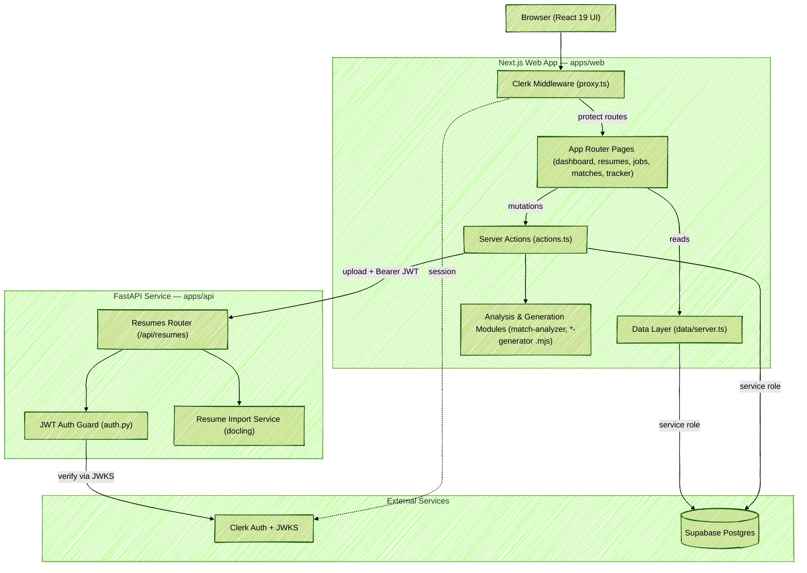
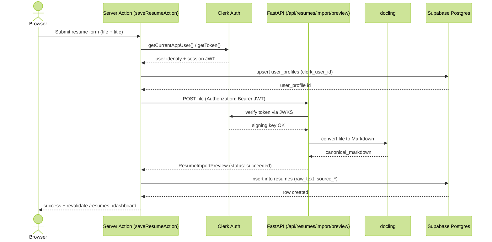
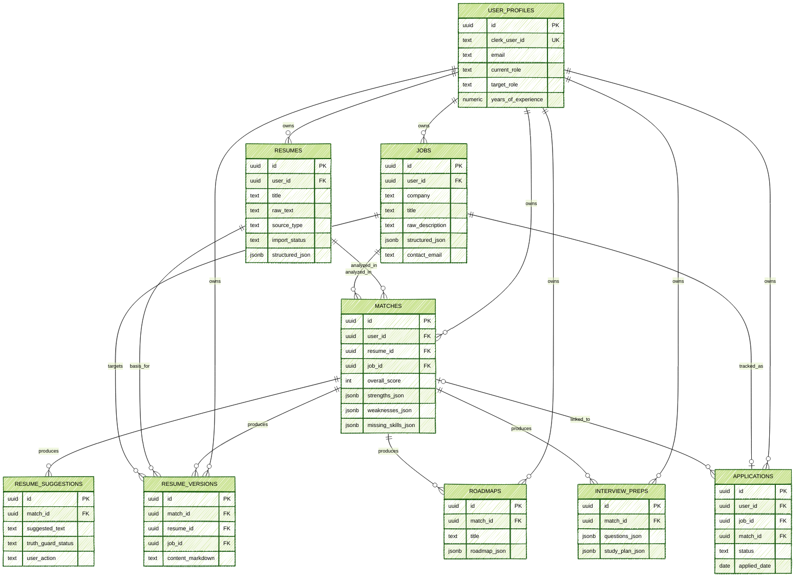

# ApplyWise Architecture Diagrams

These diagrams describe **ApplyWise**, the application that lives under `apps/`
(the repo's top-level README documents the *Harness* tooling, not the app).
ApplyWise is an AI career copilot that imports a resume, analyzes its fit
against a job, and generates tailored suggestions, drafts, roadmaps, interview
prep, and an application tracker.

**Stack at a glance**

- **Web (`apps/web`)** — Next.js 16 App Router + React 19, Clerk auth,
  Tailwind v4 / shadcn UI, Zod. All mutations run through Next.js **Server
  Actions** and all reads through a server **Data Layer**, both talking to
  Supabase via the service-role client. The "AI" work (scoring, suggestions,
  drafts, roadmaps, interview prep) is done by **deterministic heuristic
  modules** (`*.mjs`), not an external LLM.
- **API (`apps/api`)** — FastAPI + Uvicorn (Python 3.11+). A focused
  microservice whose one real job is **resume file import**: it verifies a
  Clerk JWT, then converts uploaded PDF/DOCX/image files to Markdown with
  **docling**.
- **External services** — **Clerk** (authentication + JWKS) and **Supabase
  Postgres** (the single database). **docling** is an in-process third-party
  conversion library inside the API.

---

## Diagram 1 — System Architecture

High-level components and how they connect. The Next.js web app is also the
primary backend (Server Actions + Data Layer write/read Supabase directly with
the service role); the FastAPI service is called only for resume-file import,
authenticated with a Clerk bearer token.

---

## Diagram 2 — Data Flow (Resume Import & Save)

The lifecycle of the only request that crosses every layer: a user uploads a
resume file. The Server Action authenticates the user, ensures their profile
row exists, forwards the file to FastAPI (which verifies the Clerk JWT and runs
docling), then persists the canonical Markdown to Supabase.

---

## Diagram 3 — Data Model

The Supabase Postgres schema (migrations `0001`–`0007`). Every record is scoped
to a `user_profiles` row (keyed by Clerk user id). A `match` is the analysis hub:
it joins one resume and one job, and is the parent of suggestions, draft
versions, roadmaps, and interview prep. Applications are unique per
(user, job) and optionally link back to a match.

