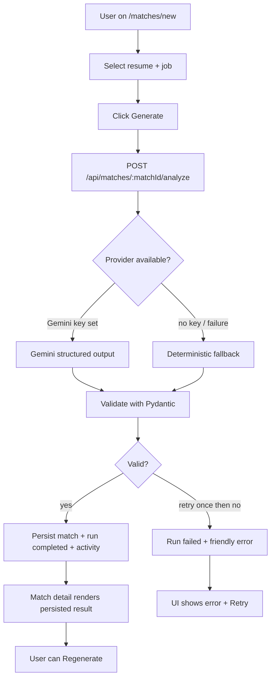
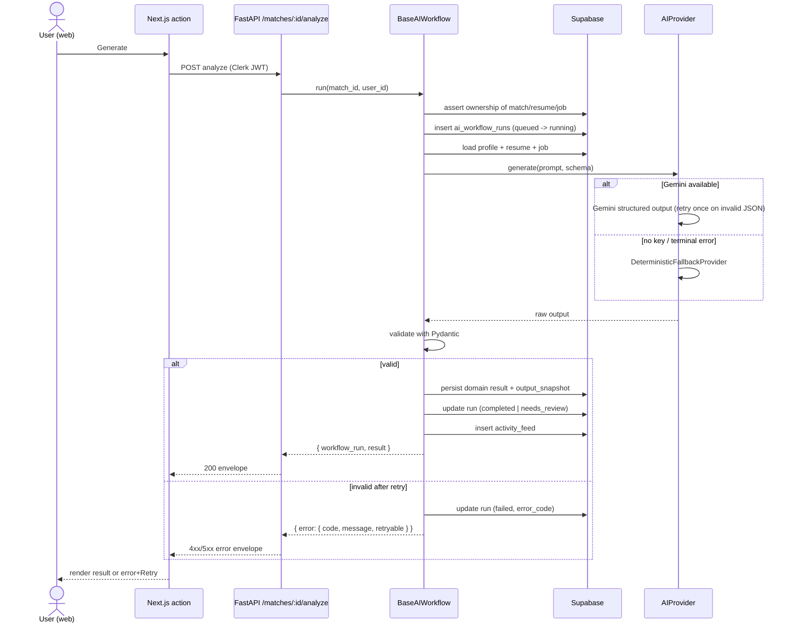
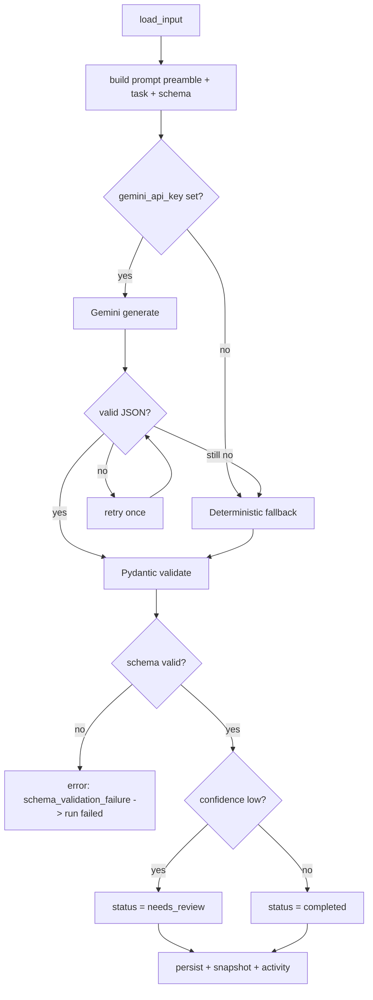
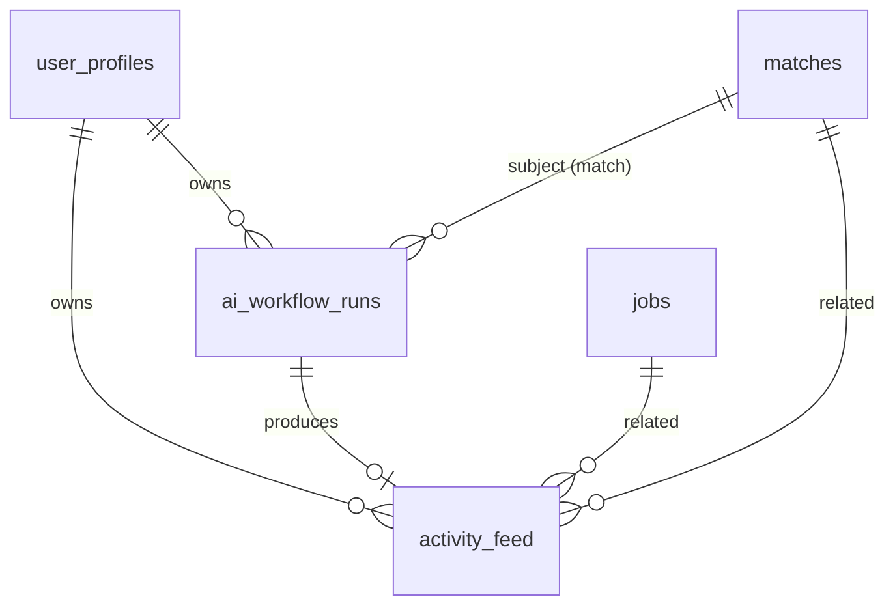

# US-027 — AI Workflow Foundation & Standards · Dev Flow

> **Feature 12** of `applywise_ai_assistant_update_tasks.md`. This is the shared
> substrate for every other Period 8 story. US-028–US-038 reference the
> conventions defined here (envelope, `BaseAIWorkflow`, tables, error taxonomy,
> prompt preamble, provider/fallback rule). Direction:
> `docs/decisions/0012-ai-workflow-standards.md`.

---

## 1. Feature Summary

- **What it does:** Adds one reusable backend pipeline for running any AI feature
  in `apps/api`: create a run record → load data → call the provider (Gemini) →
  validate output with Pydantic → persist the domain result + an output snapshot
  → write an activity event → return a typed envelope. Ships a provider
  abstraction (Gemini primary, deterministic fallback), the `ai_workflow_runs`
  and `activity_feed` tables, a shared error taxonomy, and redacting
  observability.
- **Why the user needs it:** Indirectly. It makes every AI feature reliable,
  explainable, regenerable, and safe with sensitive resume/JD data — so the
  product behaves like one coherent assistant rather than 10 ad-hoc features.
- **Problem it solves:** Today AI logic is split — real Gemini extractors live in
  `apps/api` (`job_extractor.py`, `candidate_profile_extractor.py`) while the
  analysis features are deterministic `*.mjs` in `apps/web`. There is no run
  history, no activity feed, no shared validation/retry/observability. Each new
  AI feature would re-invent this.
- **MVP connection:** Reuses the existing Gemini client pattern, FastAPI router
  layout, `SupabaseDataClient`, and `settings.py`. No new product screen; it is
  proven by routing the existing match generation through the new pipeline.

---

## 2. User Flow

This story has no new screen. The only visible change: when a user generates a
match, the work now runs through the backend pipeline (it previously ran inline
in a web server action). Behavior on the match page is unchanged.

1. **Entry point:** `/matches/new` (existing) — user selects a resume + job.
2. **User action:** clicks *Generate* (existing button).
3. **System response:** web calls `POST /api/matches/{matchId}/analyze`; backend
   runs `BaseAIWorkflow`.
4. **AI processing:** provider selected (Gemini if key set, else deterministic
   fallback); output validated; run + activity persisted.
5. **Result shown:** match detail renders persisted scores (unchanged UI).
6. **Next action:** user can regenerate; the workflow panel (US-038) later reads
   run status written here.



---

## 3. Technical Flow

- **Frontend:** `apps/web/src/app/(app)/matches/new` action + a thin API client
  for the standard envelope (`apps/web/src/lib/ai-workflow-client.mjs`, new).
  Match detail page unchanged.
- **API endpoint:** `apps/api/app/routers/matches.py` (new) — `POST
  /api/matches/{matchId}/analyze`, `GET /api/matches/{matchId}/ai-workflow`.
  Mounted in `apps/api/app/main.py`.
- **Backend service:** `apps/api/app/services/ai/base_workflow.py` (new,
  `BaseAIWorkflow`); `apps/api/app/services/ai/providers.py` (new, `AIProvider`,
  `GeminiProvider`, `DeterministicFallbackProvider`);
  `apps/api/app/services/ai/errors.py` (new, taxonomy);
  `apps/api/app/services/ai/logging.py` (new, redaction).
- **AI helper:** reuse the structured-output + retry logic already in
  `job_extractor.py` / `candidate_profile_extractor.py`; extract a shared
  `generate_structured(...)` helper.
- **DB tables/models:** new `ai_workflow_runs`, `activity_feed`. Persistence via
  new `SupabaseDataClient` methods in
  `apps/api/app/services/supabase_data.py`.
- **External integration:** Gemini (`settings.gemini_api_key`,
  `settings.gemini_model = gemini-2.5-flash`, `gemini_max_attempts`,
  `gemini_retry_base_delay_seconds`).
- **Error handling:** typed taxonomy → error envelope `{ error: { code, message,
  retryable } }`. Run row always written (even on failure).
- **Response to UI:** standard envelope (below).



---

## 4. AI Behavior

- **Input AI receives:** only the minimum needed per workflow (subclass
  `load_input()`); for the reference match run: candidate profile, canonical
  resume text, structured job requirements.
- **Prompt:** every prompt begins with the standard preamble (Feature 12.4):

  ```text
  Role: You are ApplyWise, an AI job hunting assistant for software engineers
        targeting AI roles in the US market.
  Source of truth: Use only the provided candidate profile, resume, and job
        description.
  Truthfulness: Do not invent experience, skills, projects, companies, dates,
        metrics, or certifications.
  Output: Return valid JSON matching the provided schema.
  Tone: Clear, direct, helpful, professional.
  ```

- **Output format:** strict JSON validated by a per-feature Pydantic model that
  extends a shared base carrying `confidence_score` and model metadata.
- **Validation:** parse JSON → Pydantic validate. On invalid JSON, retry once.
  On a second failure or terminal provider error, fall back to the deterministic
  provider (same schema). If even validation of the fallback fails, the run is
  `failed`.
- **On failure:** map to a typed error code, set run `failed`, write an activity
  event, return `{ error: { code, message, retryable } }`. Never lose canonical
  resume/JD content.
- **UI display:** consumers render `result`; `workflow_run.status` drives badges
  (`completed` / `needs_review` / `failed`); `confidence_score` may be shown.

**Standard response envelope (reused by US-028–US-038):**

```json
{
  "workflow_run": {
    "id": "uuid",
    "workflow_type": "match_analysis",
    "status": "completed | needs_review | failed",
    "model_provider": "gemini | deterministic",
    "model_name": "gemini-2.5-flash | deterministic-baseline",
    "latency_ms": 1840,
    "confidence_score": 0.82,
    "error_message": null
  },
  "result": { "...feature payload..." }
}
```



---

## 5. Data Model Impact

**New tables** (migration `0010_period8_ai_workflow_foundation.sql`). Existing
tables unchanged.

`ai_workflow_runs`

| Column | Type | Notes |
| --- | --- | --- |
| id | uuid pk | |
| user_id | uuid fk → user_profiles(id) cascade | ownership |
| workflow_type | text | enum below |
| subject_type | text | `match \| resume \| job \| dashboard` |
| subject_id | uuid null | null for dashboard runs |
| status | text | `queued\|running\|completed\|needs_review\|failed` |
| model_provider | text | `gemini \| deterministic` |
| model_name | text | |
| started_at / completed_at | timestamptz | |
| latency_ms | integer | |
| confidence_score | numeric | |
| output_snapshot_json | jsonb | validated output for reuse |
| error_code / error_message | text | |
| created_at / updated_at | timestamptz | |

Index: `(user_id, subject_type, subject_id, workflow_type)`.

`activity_feed`

| Column | Type | Notes |
| --- | --- | --- |
| id | uuid pk | |
| user_id | uuid fk → user_profiles(id) cascade | |
| workflow_run_id | uuid fk → ai_workflow_runs(id) set null | |
| activity_type | text | workflow_type + lifecycle |
| related_job_id | uuid fk → jobs(id) set null | |
| related_match_id | uuid fk → matches(id) set null | |
| title | text | |
| assistant_description | text null | filled by US-037; fallback allowed |
| importance | text | `low\|medium\|high` |
| created_at | timestamptz | |

Index: `(user_id, created_at desc)`.

**`workflow_type` enum:** `match_analysis`, `missing_skills`,
`resume_suggestions`, `resume_draft`, `cover_letter`, `roadmap`,
`interview_prep`, `assistant_insight`, `dashboard_summary`,
`activity_description`.



---

## 6. API Requirements

### `POST /api/matches/{matchId}/analyze`

Reference workflow (US-028 owns the real prompt/UI). Auth: Clerk JWT → resolve
`user_profiles.id`; assert match ownership.

Request body: none (subject is the path param). Optional `{ "regenerate": true }`.

Response `200`: standard envelope (`workflow_type: match_analysis`).

Errors:

| Code | HTTP | retryable | When |
| --- | --- | --- | --- |
| unauthorized | 403 | false | match not owned by user |
| missing_profile | 422 | false | no candidate profile |
| missing_job_requirements | 422 | false | job not parsed |
| invalid_json | 502 | true | model output unparseable after retry |
| schema_validation_failure | 502 | true | parsed but fails Pydantic |
| model_timeout / network_failure / provider_rate_limit | 503 | true | provider issues |

```json
{ "error": { "code": "missing_job_requirements", "message": "This job has not been parsed yet. Parse the job before analyzing.", "retryable": false } }
```

### `GET /api/matches/{matchId}/ai-workflow`

Returns the latest run per `workflow_type` for the match (drives US-038 panel).

```json
{
  "match_id": "uuid",
  "runs": [
    { "workflow_type": "match_analysis", "status": "completed", "model_provider": "gemini", "confidence_score": 0.82, "completed_at": "2026-06-08T10:00:00Z" }
  ]
}
```

---

## 7. UI Requirements

No new screen. Add a reusable web client + states reused by later stories:

- **Client:** `apps/web/src/lib/ai-workflow-client.mjs` — `runWorkflow(path)`,
  returns `{ workflowRun, result }` or throws a typed `AIWorkflowError`.
- **Loading state:** generation in progress (spinner / "ApplyWise is analyzing…").
- **Error state:** friendly message from `error.message` + a *Retry* button when
  `error.retryable`.
- **needs_review state:** badge + note that the result needs a look.
- **Empty state:** "Not generated yet — run analysis."

These are scaffolding; the match page itself is upgraded in US-028.

---

## 8. Acceptance Criteria

- **Given** a match I own, **when** I call analyze, **then** an `ai_workflow_runs`
  row is created (`queued→running→completed`), the match result is persisted, and
  an `activity_feed` row is written.
- **Given** `gemini_api_key` is unset, **when** analyze runs, **then** the
  deterministic provider produces schema-valid output and the run records
  `model_provider = deterministic`.
- **Given** the model returns invalid JSON, **when** analyze runs, **then** it
  retries once, then falls back to deterministic; if all fail, run = `failed`
  with a typed `error_code` and the API returns a retryable error envelope.
- **Given** a match I do not own, **when** I call analyze, **then** I get
  `unauthorized` and no run/activity is written.
- **Given** a successful or failed run, **then** no raw resume/JD text appears in
  emitted logs.
- **Given** generation succeeds, **when** the match page loads again, **then** it
  reads persisted data without re-calling the model.
- **Edge:** low-confidence output sets run `needs_review`; the result is still
  persisted.

---

## 9. Mermaid Diagrams

User flow (§2), technical sequence (§3), AI processing (§4), and the data/ER
diagram (§5) are above and render as-is.

---

## 10. Development Tasks

**Database**
1. Write `0010_period8_ai_workflow_foundation.sql` creating `ai_workflow_runs` +
   `activity_feed` with indexes and FKs (cascade/set-null per §5).

**Backend**
2. `services/ai/providers.py`: `AIProvider` interface, `GeminiProvider` (extract
   shared `generate_structured` from existing extractors), and
   `DeterministicFallbackProvider`; selection logic (key present → Gemini, else
   fallback; fallback also on terminal failure).
3. `services/ai/errors.py`: error taxonomy + HTTP/retryable mapping + error
   envelope serializer.
4. `services/ai/logging.py`: redacting logger (strips `raw_text`,
   `raw_description`, prompt bodies); one canonical JSON log line per run.
5. `services/ai/base_workflow.py`: `BaseAIWorkflow` implementing the standard
   flow; abstract `load_input`, `build_prompt`, `output_model`,
   `deterministic_fallback`, `persist`.
6. `services/supabase_data.py`: `insert_workflow_run`, `update_workflow_run`,
   `insert_activity`, `get_match_with_resume_and_job`, helper to read latest run
   per type.
7. Reference `MatchAnalysisWorkflow` (thin — full prompt is US-028) + `matches.py`
   router (`analyze`, `ai-workflow`); mount in `main.py`.

**AI integration**
8. Wire the standard prompt preamble constant + per-workflow Pydantic base
   (`confidence_score`, model metadata).

**Frontend**
9. `lib/ai-workflow-client.mjs` envelope client + typed `AIWorkflowError`; point
   the existing match generate action at `POST /matches/:id/analyze`.

**Testing**
10. `apps/api/tests/test_ai_workflow_foundation.py`: provider selection, retry,
    fallback, schema failure, ownership denial, run+activity persistence, log
    redaction (fake provider — no live calls).
11. `apps/web/tests/ai-workflow-client.test.mjs`: envelope parsing + error
    mapping.

**Assumptions:** pytest is the `apps/api` test runner; the web app uses the node
test runner (`node --test`), matching existing `apps/web/tests/*.test.mjs`.
