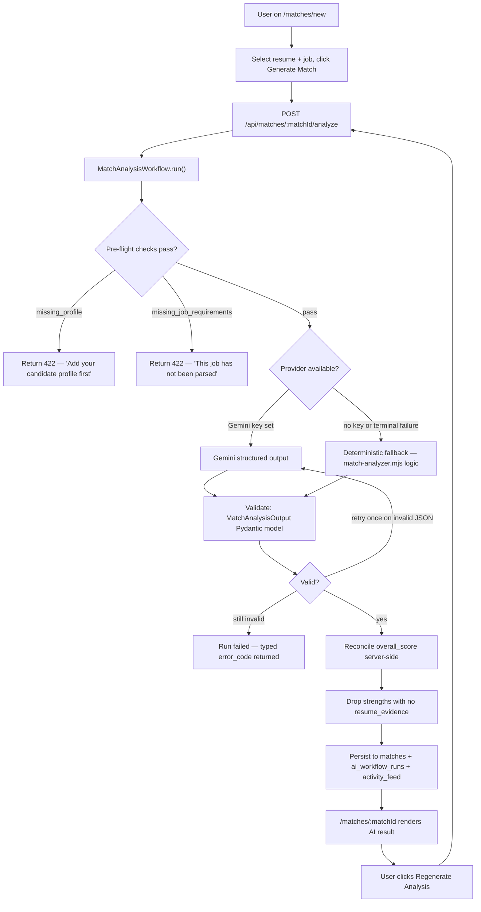
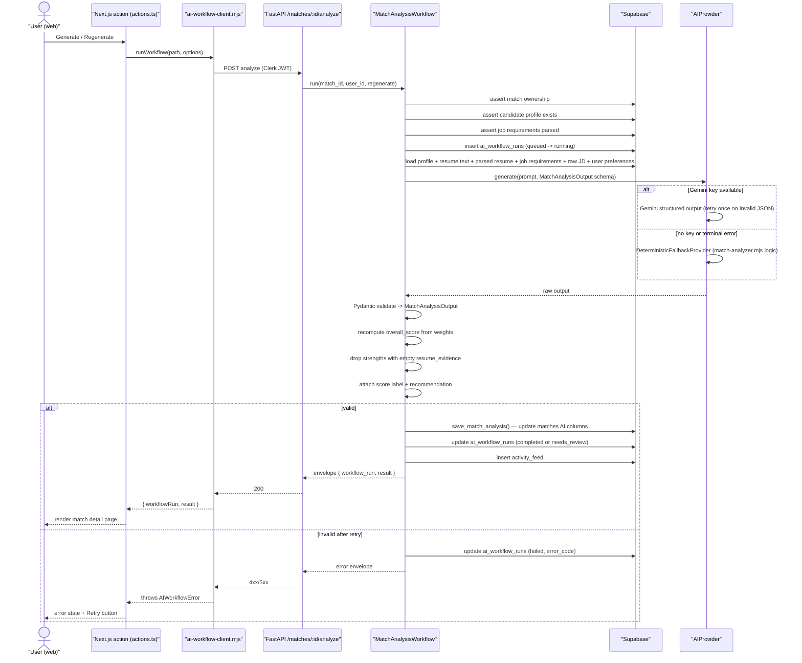
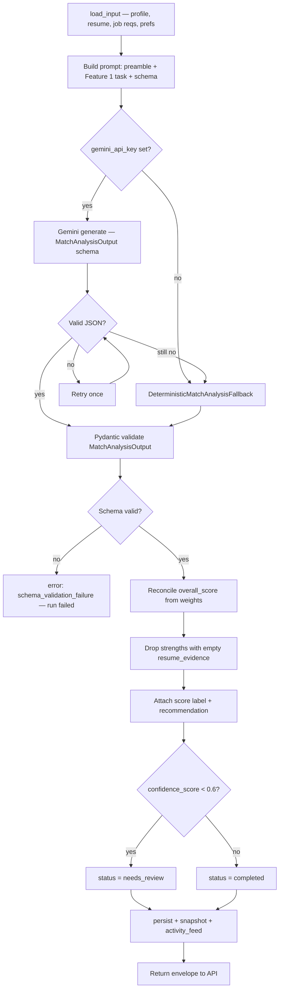
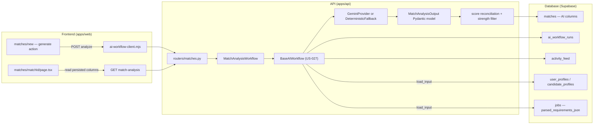
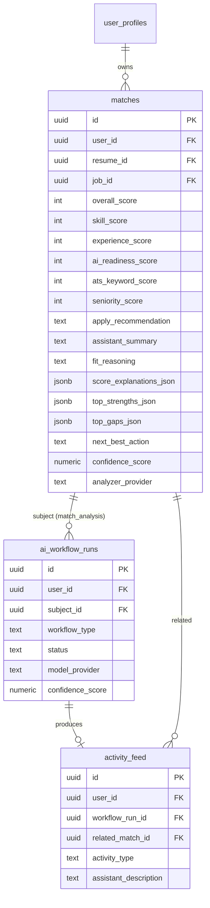

# US-028 — AI Match Analyzer · Dev Flow

> **Feature 1** of `applywise_ai_assistant_update_tasks.md`. This story
> upgrades the deterministic match analyzer (US-007) into a Gemini-powered
> evidence-based analysis built on the US-027 `BaseAIWorkflow` foundation.
> Conventions defined in US-027 (envelope, `BaseAIWorkflow`, `ai_workflow_runs`,
> `activity_feed`, error taxonomy, prompt preamble, provider/fallback rule,
> `workflow_type` enum) are reused here without redefinition. Direction:
> `docs/decisions/0012-ai-workflow-standards.md`.

---

## 1. Feature Summary

- **What it does:** Replaces the regex-based `analyzeResumeJobFit` function in
  `apps/web/src/lib/match-analyzer.mjs` with an AI-generated, evidence-backed
  match analysis. Gemini evaluates the candidate's profile and resume against a
  specific job's requirements and returns: five sub-scores, a server-reconciled
  `overall_score`, an `apply_recommendation`, an `assistant_summary`,
  `fit_reasoning`, per-score explanations, evidence-linked `top_strengths`,
  classified `top_gaps`, `risks`, a `next_best_action`, and a `confidence_score`.
  Results persist to the existing `matches` table (via new additive columns),
  `ai_workflow_runs` and `activity_feed` rows are written, and the match detail
  page (`apps/web/src/app/(app)/matches/[matchId]/page.tsx`) is upgraded to
  render every section.
- **Why the user needs it:** The first moment ApplyWise should feel like a real
  assistant. Today scores are identical in shape regardless of resume/job content
  because they come from regex keyword matching. After this story, the user gets
  a personalized explanation of fit, named evidence from their actual resume,
  classified gaps with suggested actions, a clear apply/improve recommendation,
  and a next best action — instead of generic templated text.
- **Problem it solves:** The current output of `match-analyzer.mjs` has no
  `apply_recommendation`, no evidence-linked strengths (Story 1.2 rule), no gap
  typing (`true_gap | wording_gap | proof_gap`), no `assistant_summary`, and no
  `ai_workflow_runs` history. There is no regenerate that creates a new AI run.
  Scores are not explained. The reasoning text does not change meaningfully with
  the specific resume or job wording.
- **MVP connection:** Extends the existing `matches` table (additive only),
  mounts a new router at `apps/api/app/routers/matches.py` (alongside the
  existing `jobs.py`, `profile.py`, `resumes.py`), and upgrades the already-
  live match detail page. The deterministic `match-analyzer.mjs` becomes the
  typed fallback — same Pydantic schema, zero new provider dependencies.

---

## 2. User Flow

1. **Entry point:** `/matches/new` (existing) — user selects an active candidate
   profile and a parsed job, then clicks *Generate Match*.
2. **API call:** the Next.js server action in `apps/web/src/lib/actions.ts`
   calls `POST /api/matches/{matchId}/analyze` using the envelope client from
   `apps/web/src/lib/ai-workflow-client.mjs` (built in US-027).
3. **Loading state:** the match detail page (`/matches/[matchId]`) shows the
   US-027 loading state: spinner + "ApplyWise is analyzing…".
4. **AI processing:** `MatchAnalysisWorkflow` runs through `BaseAIWorkflow`;
   Gemini generates the Feature 1.4 output; server reconciles `overall_score`
   from the accepted weighting.
5. **Persisted result:** analysis columns written to `matches`; `ai_workflow_runs`
   row updated to `completed`; `activity_feed` event written.
6. **Result displayed:** match detail page renders the AI summary, apply
   recommendation badge, per-score breakdown with explanations, why-you-match,
   what-is-missing, wording gaps, risks, and next best action.
7. **Regenerate:** user clicks *Regenerate Analysis*; the action calls
   `POST /api/matches/{matchId}/analyze/regenerate`; a new run row is created;
   saved analysis is overwritten; prior run rows are retained for history.



---

## 3. Technical Flow

- **Frontend page:** `apps/web/src/app/(app)/matches/[matchId]/page.tsx` (upgrade
  existing) — reads persisted analysis columns from the match; uses
  `apps/web/src/lib/ai-workflow-client.mjs` (US-027) to call analyze; renders
  all Feature 1.7 sections; Regenerate button calls the regenerate endpoint.
- **Frontend action:** `apps/web/src/lib/actions.ts` — add `generateMatchAnalysis`
  and `regenerateMatchAnalysis` server actions that call the API and return the
  typed envelope.
- **API endpoints:** `apps/api/app/routers/matches.py` (new file) —
  `POST /api/matches/{matchId}/analyze`,
  `POST /api/matches/{matchId}/analyze/regenerate`,
  `GET /api/matches/{matchId}/match-analysis`. Mounted in
  `apps/api/app/main.py` at prefix `/api`.
- **Backend service:** `apps/api/app/services/ai/match_analysis_workflow.py`
  (new) — `MatchAnalysisWorkflow(BaseAIWorkflow)` with concrete implementations
  of `load_input`, `build_prompt`, `output_model`, `deterministic_fallback`, and
  `persist`. Calls `BaseAIWorkflow` (US-027, `apps/api/app/services/ai/base_workflow.py`).
- **AI helper:** `apps/api/app/services/ai/providers.py` (US-027) —
  `GeminiProvider` with the shared `generate_structured` helper extracted from
  `apps/api/app/services/job_extractor.py` and
  `apps/api/app/services/candidate_profile_extractor.py`.
- **DB table:** existing `matches` table with additive AI columns (migration
  `0011_period8_match_analysis_ai.sql`). Run + activity via the existing
  `ai_workflow_runs` and `activity_feed` tables (US-027). New method
  `SupabaseDataClient.save_match_analysis()` in
  `apps/api/app/services/supabase_data.py`.
- **External integration:** Gemini API via `settings.gemini_api_key`,
  `settings.gemini_model` (`gemini-2.5-flash`), `settings.gemini_max_attempts`,
  `settings.gemini_retry_base_delay_seconds` (all defined in
  `apps/api/app/settings.py`).
- **Error handling:** US-027 taxonomy — `missing_profile`, `missing_job_requirements`,
  `invalid_json`, `schema_validation_failure`, `model_timeout`,
  `network_failure`, `provider_rate_limit`. On any failure, `ai_workflow_runs`
  row is updated to `failed` with `error_code`; the API returns the US-027
  typed error envelope. No analysis columns written on failure.
- **Response:** standard US-027 envelope `{ workflow_run, result }`.



---

## 4. AI Behavior

### Input

`MatchAnalysisWorkflow.load_input()` assembles:

```json
{
  "candidate_profile": "active structured candidate profile (from user_profiles / candidate_profiles)",
  "resume_text": "original resume markdown or plain text",
  "parsed_resume": "structured resume data if available, else null",
  "job_requirements": "structured job requirements (from jobs table parsed_requirements_json)",
  "job_raw_text": "raw JD text (from jobs table)",
  "user_preferences": {
    "target_roles": [],
    "target_locations": [],
    "work_type_preference": "remote | hybrid | onsite | any",
    "seniority_preference": "junior | mid | senior | any"
  }
}
```

Sensitive fields (`resume_text`, `job_raw_text`) are redacted from logs by
`apps/api/app/services/ai/logging.py` (US-027).

### Prompt

Every prompt begins with the standard US-027 preamble:

```text
Role: You are ApplyWise, an AI job hunting assistant for software engineers
      targeting AI roles in the US market.
Source of truth: Use only the provided candidate profile, resume, and job
      description.
Truthfulness: Do not invent experience, skills, projects, companies, dates,
      metrics, or certifications.
Output: Return valid JSON matching the provided schema.
Tone: Clear, direct, helpful, professional.
```

Followed by the Feature 1 task:

```text
Task: Analyze the candidate's fit for this job. Evaluate:
1. Skill match (0–100) — how well the candidate's technical skills match job requirements.
2. Experience match (0–100) — how well their experience history fits the role.
3. AI readiness (0–100) — how well they demonstrate AI/ML/LLM engineering capability.
4. ATS keyword score (0–100) — keyword alignment between resume and job description.
5. Seniority match (0–100) — alignment of candidate seniority with job expectations.
6. Location/work-type alignment (0–100, advisory only, not weighted in overall).
For every strength listed, you MUST cite exact or summarized resume evidence.
If you cannot cite evidence for a strength, do not list it.
For every gap, classify it as true_gap (skill absent), wording_gap (present but
not articulated), or proof_gap (claimed but unsupported by evidence).
Write assistant_summary in plain English as a direct job assistant addressing the user.
Return valid JSON matching the provided schema exactly.
```

The scoring guidance from brief §1.5 is included as guidance text — not
hardcoded into the assistant output (the model generates all explanatory text
from data).

### Exact Output Schema (brief §1.4)

```json
{
  "overall_score": 0,
  "skill_score": 0,
  "experience_score": 0,
  "ai_readiness_score": 0,
  "ats_keyword_score": 0,
  "seniority_score": 0,
  "location_score": 0,
  "apply_recommendation": "apply_now | apply_with_improvements | improve_first | not_recommended",
  "assistant_summary": "string",
  "fit_reasoning": "string",
  "top_strengths": [
    {
      "strength": "string",
      "resume_evidence": "string",
      "job_requirement": "string",
      "why_it_matters": "string"
    }
  ],
  "top_gaps": [
    {
      "gap": "string",
      "gap_type": "true_gap | wording_gap | proof_gap",
      "job_requirement": "string",
      "why_it_matters": "string",
      "suggested_action": "string"
    }
  ],
  "risks": ["string"],
  "next_best_action": "string",
  "confidence_score": 0.0
}
```

The `score_explanations` object is added by the prompt as an additional field:

```json
{
  "score_explanations": {
    "skill": "string",
    "experience": "string",
    "ai_readiness": "string",
    "ats_keyword": "string",
    "seniority": "string"
  }
}
```

Assumption: `score_explanations` is requested in the prompt schema but is not
in the published brief §1.4. It is included because `design.md` lists it in
the Interface Contract and the brief §1.7 requires "Each score must include a
short AI explanation." The Pydantic model extends the brief schema with this
field.

### Validation and Post-Processing (server-side, not model)

1. Parse JSON → `MatchAnalysisOutput` Pydantic model.
2. **Reject and retry once** on invalid JSON.
3. On second failure or terminal provider error → deterministic fallback.
4. **Score reconciliation (always server-side):**
   ```
   overall_score = round(
     skill_score * 0.30 +
     experience_score * 0.20 +
     ai_readiness_score * 0.25 +
     ats_keyword_score * 0.15 +
     seniority_score * 0.10
   )
   ```
   The model's `overall_score` is treated as advisory and overwritten.
5. **Score label:**
   ```
   90–100 → "Strong match"
   75–89  → "Good match"
   60–74  → "Possible match with gaps"
   40–59  → "Weak match"
   0–39   → "Not recommended yet"
   ```
6. **Strength filter:** any item in `top_strengths` where `resume_evidence` is
   empty string or null is dropped before persistence (Story 1.2 rule).
7. **Confidence gate:** if `confidence_score < 0.6` → run status `needs_review`;
   result is still persisted.

### Failure Handling

- Failure → `ai_workflow_runs.status = failed`, `error_code` set, no match
  analysis columns written.
- API returns US-027 typed error envelope (`{ error: { code, message, retryable } }`).
- UI shows friendly message from `error.message` + *Retry* when `retryable`.

### Deterministic Fallback

`DeterministicMatchAnalysisFallback` wraps the existing `analyzeResumeJobFit`
logic from `apps/web/src/lib/match-analyzer.mjs`, ported to Python. Key
differences from the live Gemini path:

- `assistant_summary`, `fit_reasoning`, `score_explanations`, `next_best_action`
  are generated from templates using the score band — not AI-generated prose.
- `top_strengths` — only skill matches with explicit keyword hits in the resume
  text are included; `resume_evidence` is the matched text fragment. Items with
  no hit are dropped (same rule).
- `top_gaps` — missing `AI_SKILLS` keywords → `true_gap`; no `wording_gap` or
  `proof_gap` classification (requires AI reasoning).
- `apply_recommendation` — derived deterministically from `overall_score` band
  using the brief's recommendation rules.
- `model_provider = "deterministic"`, `model_name = "deterministic-baseline"`.

### User-Facing Assistant Description Example (brief §1.6)

```
ApplyWise thinks this role is a possible match with important gaps. Your backend
engineering background helps because the role requires production API development
and database-backed systems. However, this job strongly expects hands-on RAG,
embeddings, and vector database experience, which are not clearly proven in your
resume. You should apply only after tailoring your resume and preparing a clear
AI project story.
```

### AI Processing Flow



---

## 5. Data Model Impact

This story **REUSES the existing `matches` table** — no new table is created.
Migration `0011_period8_match_analysis_ai.sql` adds additive columns only.
Existing columns (`overall_score`, `skill_score`, `experience_score`,
`ai_readiness_score`, `ats_keyword_score`, `seniority_score`, `strengths_json`,
`weaknesses_json`, `missing_skills_json`, `risks_json`, `explanation_json`) are
preserved. `strengths_json` and `missing_skills_json` may be mirrored from the
new structured arrays for backward compatibility with any existing page readers.

### New Columns Added to `matches`

| Column | Type | Notes |
| --- | --- | --- |
| `apply_recommendation` | `text` | `apply_now \| apply_with_improvements \| improve_first \| not_recommended` |
| `assistant_summary` | `text` | Free-prose AI assistant summary |
| `fit_reasoning` | `text` | Detailed fit reasoning from AI |
| `score_explanations_json` | `jsonb` | `{ skill, experience, ai_readiness, ats_keyword, seniority }` each a text explanation |
| `top_strengths_json` | `jsonb` | Array of `{ strength, resume_evidence, job_requirement, why_it_matters }` |
| `top_gaps_json` | `jsonb` | Array of `{ gap, gap_type, job_requirement, why_it_matters, suggested_action }` |
| `next_best_action` | `text` | Single actionable next step |
| `confidence_score` | `numeric` | `0.0–1.0`; gate at `< 0.6` for `needs_review` |
| `analyzer_provider` | `text` | `gemini \| deterministic` |

### Relationships

```
matches (existing) ← save_match_analysis() writes AI columns
matches (id) ← ai_workflow_runs.subject_id (subject_type = 'match')
matches (id) ← activity_feed.related_match_id
```

The `ai_workflow_runs` and `activity_feed` tables were created in US-027
(`0010_period8_ai_workflow_foundation.sql`) and are reused unchanged.

### Example Persisted JSON

`score_explanations_json`:
```json
{
  "skill": "Your Python and FastAPI experience directly address the core backend requirements. LLM API usage is present but RAG and vector DB are not evident.",
  "experience": "3 years of production API work aligns with the mid-level expectation. AI product experience is limited to side projects.",
  "ai_readiness": "You demonstrate LLM API calls and prompt engineering, but lack evidence of evaluation frameworks, RAG pipelines, or production AI system design.",
  "ats_keyword": "FastAPI, PostgreSQL, and REST API appear in both resume and JD. RAG, pgvector, and embeddings are absent from your resume.",
  "seniority": "The job targets mid-senior engineers. Your experience level and project scope are consistent with mid-level."
}
```

`top_strengths_json`:
```json
[
  {
    "strength": "Production FastAPI backend experience",
    "resume_evidence": "Built and deployed REST APIs using FastAPI serving 10k+ daily requests",
    "job_requirement": "Production API development in Python",
    "why_it_matters": "The core engineering work is directly transferable."
  }
]
```

`top_gaps_json`:
```json
[
  {
    "gap": "RAG pipeline experience",
    "gap_type": "true_gap",
    "job_requirement": "Hands-on RAG and embedding pipeline design",
    "why_it_matters": "Listed as a required, not preferred, skill in the JD.",
    "suggested_action": "Build a small RAG demo using LangChain or LlamaIndex with pgvector and add it to your profile."
  },
  {
    "gap": "LLM evaluation frameworks",
    "gap_type": "proof_gap",
    "job_requirement": "Experience evaluating LLM output quality",
    "why_it_matters": "Evaluation is central to AI product reliability.",
    "suggested_action": "Add a resume bullet describing how you measured output quality in any LLM project."
  }
]
```

### Migration File

`apps/web/supabase/migrations/0011_period8_match_analysis_ai.sql`

---

## 6. API Requirements

### `POST /api/matches/{matchId}/analyze`

Triggers a new match analysis run. If an analysis already exists and `regenerate`
is not set, the existing result is returned without re-running (idempotent read).

**Auth:** Clerk JWT → resolved to `user_profiles.id`; match ownership asserted.

**Request body:** none, or optionally `{}`. Path param is the sole identifier.

**Response 200:** standard US-027 envelope:

```json
{
  "workflow_run": {
    "id": "uuid",
    "workflow_type": "match_analysis",
    "status": "completed",
    "model_provider": "gemini",
    "model_name": "gemini-2.5-flash",
    "latency_ms": 2140,
    "confidence_score": 0.81,
    "error_message": null
  },
  "result": {
    "overall_score": 74,
    "skill_score": 72,
    "experience_score": 68,
    "ai_readiness_score": 55,
    "ats_keyword_score": 80,
    "seniority_score": 85,
    "location_score": 90,
    "apply_recommendation": "apply_with_improvements",
    "assistant_summary": "ApplyWise thinks this role is a possible match with important gaps. ...",
    "fit_reasoning": "Your backend engineering background is relevant...",
    "score_explanations": {
      "skill": "...", "experience": "...", "ai_readiness": "...",
      "ats_keyword": "...", "seniority": "..."
    },
    "top_strengths": [ { "strength": "...", "resume_evidence": "...", "job_requirement": "...", "why_it_matters": "..." } ],
    "top_gaps": [ { "gap": "...", "gap_type": "true_gap", "job_requirement": "...", "why_it_matters": "...", "suggested_action": "..." } ],
    "risks": ["No demonstrated production AI system beyond side projects."],
    "next_best_action": "Tailor your resume to emphasize API work and add one clearly described AI project before applying.",
    "confidence_score": 0.81
  }
}
```

### `POST /api/matches/{matchId}/analyze/regenerate`

Forces a new AI run regardless of existing analysis. Creates a new
`ai_workflow_runs` row; prior rows are retained for history. Overwrites match
AI columns with new output.

**Request body:** none.

**Response 200:** same envelope as `POST /analyze`.

### `GET /api/matches/{matchId}/match-analysis`

Returns the persisted analysis for the match without triggering a new run.

**Response 200 (analysis exists):**

```json
{
  "match_id": "uuid",
  "analysis": { "...the result object..." },
  "workflow_run": { "...latest completed run metadata..." }
}
```

**Response 200 (no analysis yet):**

```json
{
  "match_id": "uuid",
  "analysis": null,
  "workflow_run": null
}
```

### Error Cases (US-027 taxonomy)

| Code | HTTP | `retryable` | When |
| --- | --- | --- | --- |
| `unauthorized` | 403 | `false` | Match not owned by the authenticated user |
| `missing_profile` | 422 | `false` | No active candidate profile for the user |
| `missing_job_requirements` | 422 | `false` | Job exists but `parsed_requirements_json` is null |
| `invalid_json` | 502 | `true` | Model output unparseable after one retry |
| `schema_validation_failure` | 502 | `true` | Parsed JSON fails `MatchAnalysisOutput` Pydantic validation |
| `model_timeout` | 503 | `true` | Gemini call exceeds timeout |
| `network_failure` | 503 | `true` | Network error calling Gemini |
| `provider_rate_limit` | 503 | `true` | Gemini rate limit hit |

**Friendly error envelope examples:**

```json
{ "error": { "code": "missing_profile", "message": "Add your candidate profile first before running match analysis.", "retryable": false } }
```

```json
{ "error": { "code": "missing_job_requirements", "message": "This job has not been parsed yet. Parse the job description before analyzing.", "retryable": false } }
```

---

## 7. UI Requirements

**Page path:** `apps/web/src/app/(app)/matches/[matchId]/page.tsx` (upgrade
existing file — do NOT create a new route).

**Routing note:** All match analysis is accessed at `/matches/[matchId]`. The
brief's `§1.7` references `/jobs/:id/analysis` — that route mapping is
**overridden** by the shared architecture decision (MATCH-CENTRIC routing).

### States

| State | Trigger | Rendered content |
| --- | --- | --- |
| **Empty** | `analysis === null && !loading` | "ApplyWise hasn't analyzed this match yet." + *Generate Analysis* button |
| **Loading** | `loading === true` | Spinner + "ApplyWise is analyzing…" (US-027 pattern) |
| **Success** | `status === "completed"` | All Feature 1.7 sections (see below) |
| **needs_review** | `status === "needs_review"` | All sections + amber badge "Review recommended — confidence is lower than usual" |
| **Error** | `error !== null` | Friendly `error.message` + *Retry* button when `error.retryable === true` |

### Feature 1.7 Sections (in order)

1. **AI Job Assistant Summary** — `assistant_summary` prose block; provider badge
   (`Gemini` or `Deterministic`); confidence percentage if available.
2. **Apply Recommendation** — colored badge:
   - `apply_now` → green "Apply Now"
   - `apply_with_improvements` → blue "Apply with Improvements"
   - `improve_first` → amber "Improve First"
   - `not_recommended` → red "Not Recommended"
3. **Score Breakdown** — five score bars (`skill`, `experience`, `ai_readiness`,
   `ats_keyword`, `seniority`) each with the numeric score, the score label
   (computed server-side), and the AI `score_explanations[key]` text beneath
   the bar.
4. **Why You Match** — `top_strengths` list; each card shows `strength`,
   `resume_evidence` (quoted), `job_requirement`, `why_it_matters`. Strengths
   with no `resume_evidence` are not shown (already filtered server-side).
5. **What Is Missing** — `top_gaps` list; each card shows `gap`, a `gap_type`
   badge (`True Gap` / `Wording Gap` / `Proof Gap`), `job_requirement`,
   `why_it_matters`, `suggested_action`. This is the inline summary; the full
   grouped gaps analysis is US-029 (do not build `/gaps` here).
6. **Resume Wording Gaps** — filtered subset of `top_gaps` where
   `gap_type === "wording_gap"`, rendered with a distinct "Wording" label.
7. **Risks** — `risks` string array as a bulleted list.
8. **Next Best Action** — `next_best_action` highlighted in a call-to-action card.
9. **Regenerate Analysis** — *Regenerate Analysis* button; calls
   `POST /api/matches/{matchId}/analyze/regenerate`; shows loading state inline;
   displays last-run timestamp from `workflow_run.completed_at`.

### Buttons and Actions

- *Generate Analysis* — visible in empty state only; calls `POST analyze`.
- *Regenerate Analysis* — visible in success/needs_review state; calls `POST regenerate`.
- *Retry* — visible in error state when `error.retryable === true`; calls `POST analyze`.

---

## 8. Acceptance Criteria

### Success — AI generates analysis

**Given** I have an active candidate profile and a job with parsed requirements,
**when** I call `POST /api/matches/{matchId}/analyze`,
**then**:
- An `ai_workflow_runs` row transitions `queued → running → completed`.
- The match AI columns (`apply_recommendation`, `assistant_summary`,
  `fit_reasoning`, `score_explanations_json`, `top_strengths_json`,
  `top_gaps_json`, `next_best_action`, `confidence_score`, `analyzer_provider`)
  are written.
- An `activity_feed` row is created with `related_match_id` set and
  `assistant_description` describing the analysis result.
- The API returns the US-027 envelope with `status = "completed"`.
- The match detail page renders all nine Feature 1.7 sections without re-calling
  the model on subsequent loads.

### Score reconciliation

**Given** the model returns sub-scores `skill=72, experience=68, ai_readiness=55, ats_keyword=80, seniority=85`,
**when** the server persists the result,
**then** `overall_score = round(72*0.30 + 68*0.20 + 55*0.25 + 80*0.15 + 85*0.10) = 70`
regardless of any `overall_score` value the model returned.

### Evidence-less strength dropped

**Given** the model returns a `top_strengths` item where `resume_evidence` is
`""` or `null`,
**when** the server post-processes the output,
**then** that strength is not present in `top_strengths_json` and is not
rendered on the match page.

### Fallback provider

**Given** `settings.gemini_api_key` is unset (or the provider returns a terminal
error after retry),
**when** analyze runs,
**then** `DeterministicMatchAnalysisFallback` produces schema-valid output,
`analyzer_provider = "deterministic"`, `model_name = "deterministic-baseline"`,
and `ai_workflow_runs.model_provider = "deterministic"`.

### Regenerate creates a new run

**Given** an analysis already exists for the match,
**when** I call `POST /api/matches/{matchId}/analyze/regenerate`,
**then** a second `ai_workflow_runs` row is created, the match AI columns are
overwritten with the new result, and the prior run row is still present in the
database.

### Pre-flight failures

**Given** no active candidate profile exists for the user,
**when** analyze is called,
**then** the API returns `422` with `error.code = "missing_profile"`,
`error.message = "Add your candidate profile first before running match analysis."`,
no `ai_workflow_runs` row is written.

**Given** the job has not been parsed (`parsed_requirements_json` is null),
**when** analyze is called,
**then** the API returns `422` with `error.code = "missing_job_requirements"`,
`error.message = "This job has not been parsed yet."`, no run row is written.

### Ownership denial

**Given** a match I do not own,
**when** analyze is called,
**then** `403` with `error.code = "unauthorized"`, and no run or analysis is
written.

### No sensitive data in logs

**Given** a successful or failed run,
**then** no `resume_text` or `job_raw_text` content appears in emitted log
lines (redaction by `apps/api/app/services/ai/logging.py`).

### needs_review state

**Given** the model returns `confidence_score < 0.6`,
**then** `ai_workflow_runs.status = "needs_review"`, the result is still
persisted and rendered, and the match page shows the amber "Review recommended"
badge.

### Invalid JSON → deterministic fallback

**Given** the model returns unparseable JSON,
**when** analyze runs,
**then** it retries once; on a second failure it falls to the deterministic
fallback; if even the fallback fails Pydantic validation, the run is `failed`
and a retryable `schema_validation_failure` envelope is returned.

---

## 9. Mermaid Diagrams

User flow diagram is in §2. Technical sequence diagram is in §3. AI processing
flow diagram is in §4.

### Data Flow Diagram



### ER Diagram (US-028 scope)



---

## 10. Development Tasks

### Database

1. Write `apps/web/supabase/migrations/0011_period8_match_analysis_ai.sql`:
   `ALTER TABLE matches ADD COLUMN IF NOT EXISTS` for each of the nine AI
   columns listed in §5. All columns nullable (existing rows have no AI output).
   Add index on `(user_id, job_id)` if not already present.

### Backend

2. **`apps/api/app/schemas/match_analysis.py`** (new): define the Pydantic models:
   - `StrengthItem(BaseModel)`: `strength`, `resume_evidence`, `job_requirement`,
     `why_it_matters` — all `str`; `resume_evidence` must be non-empty to pass
     the strength filter (validated post-model in the workflow, not in Pydantic).
   - `GapItem(BaseModel)`: `gap`, `gap_type` (`Literal["true_gap","wording_gap","proof_gap"]`),
     `job_requirement`, `why_it_matters`, `suggested_action`.
   - `ScoreExplanations(BaseModel)`: `skill`, `experience`, `ai_readiness`,
     `ats_keyword`, `seniority` — all `str`.
   - `MatchAnalysisOutput(BaseModel)`: all fields from brief §1.4 plus
     `score_explanations: ScoreExplanations`. `overall_score` is present (model
     provides it) but server recomputes after validation.

3. **`apps/api/app/services/ai/match_analysis_workflow.py`** (new):
   `MatchAnalysisWorkflow(BaseAIWorkflow)` implementing:
   - `load_input(match_id, user_id)` — call `SupabaseDataClient` to load
     profile, resume text, job requirements, raw JD, user preferences.
   - `build_prompt(input_data)` — standard preamble + Feature 1 task text +
     JSON schema hint.
   - `output_model` → `MatchAnalysisOutput`.
   - `deterministic_fallback(input_data)` → call `DeterministicMatchAnalysisFallback`.
   - `persist(match_id, user_id, result, run_id)` → call
     `SupabaseDataClient.save_match_analysis()`.
   - Score reconciliation helper `_reconcile_scores(output)` per brief §1.5
     formula.
   - Strength filter `_filter_strengths(strengths)` dropping items with empty
     `resume_evidence`.
   - Score label helper `_score_label(score)` mapping the five bands.
   - Recommendation derivation `_derive_recommendation(score)` for the
     deterministic fallback path (Gemini provides its own).

4. **`apps/api/app/services/ai/deterministic_match_fallback.py`** (new): Python
   port of `apps/web/src/lib/match-analyzer.mjs` — `AI_SKILLS` keyword list,
   regex years-of-experience extractor, five sub-score computations, template-
   based `assistant_summary`, recommendation from score band. Returns a dict
   matching `MatchAnalysisOutput`.

5. **`apps/api/app/services/supabase_data.py`** (extend existing
   `SupabaseDataClient`): add `save_match_analysis(match_id, analysis: dict)` —
   `UPDATE matches SET apply_recommendation=$1, assistant_summary=$2, ...
   WHERE id=$n`. Reuse the existing `get_match_with_resume_and_job()` helper
   (create it if absent) for `load_input`.

6. **`apps/api/app/routers/matches.py`** (new): three FastAPI routes:
   - `POST /matches/{match_id}/analyze` → `MatchAnalysisWorkflow().run(...)`;
     returns envelope.
   - `POST /matches/{match_id}/analyze/regenerate` → same workflow with
     `regenerate=True`.
   - `GET /matches/{match_id}/match-analysis` → read persisted columns from
     `matches` + latest `ai_workflow_runs` row; return without triggering a run.

7. **`apps/api/app/main.py`** (extend existing): mount the new matches router:
   `app.include_router(matches_router, prefix="/api")`.

### AI Integration

8. Prompt constant `MATCH_ANALYSIS_TASK` in
   `apps/api/app/services/ai/match_analysis_workflow.py` — include the Feature 1
   task text and scoring guidance comment (guidance, not hardcoded output text).
   Prepend the US-027 `STANDARD_PREAMBLE` constant.

9. `MatchAnalysisOutput` Pydantic model schema is passed to `GeminiProvider` as
   the `response_schema` argument (reusing the structured-output approach from
   `apps/api/app/services/job_extractor.py`).

### Frontend

10. **`apps/web/src/app/(app)/matches/[matchId]/page.tsx`** (upgrade): replace
    the current render with all nine Feature 1.7 sections. Read `analysis` from
    persisted match data (server component). Add client-side Regenerate / Retry
    buttons wired through new server actions.

11. **`apps/web/src/lib/actions.ts`** (extend existing): add
    `generateMatchAnalysis(matchId: string)` and
    `regenerateMatchAnalysis(matchId: string)` server actions — call the
    respective API endpoints using the `ai-workflow-client.mjs` envelope client;
    return the typed envelope or throw `AIWorkflowError`.

12. **`apps/web/src/components/matches/`** (new directory if not present): add
    sub-components:
    - `ApplyRecommendationBadge.tsx` — maps the four recommendation values to
      color/label.
    - `ScoreBreakdown.tsx` — five score bars with explanation text beneath each.
    - `StrengthCard.tsx` — displays one strength item with evidence quote.
    - `GapCard.tsx` — displays one gap with `gap_type` badge and suggested action.
    - `AnalysisShell.tsx` — empty / loading / needs_review / error states per
      §7 table.

### Testing

13. **`apps/api/tests/test_match_analysis_workflow.py`** (new):
    - Unit: `overall_score` recomputed from weights (fixture sub-scores);
      score→label at all five band boundaries (39/40, 59/60, 74/75, 89/90);
      strength with empty `resume_evidence` dropped; gap `gap_type` preserved;
      recommendation derived from each band; `DeterministicMatchAnalysisFallback`
      returns schema-valid output; `schema_validation_failure` error on bad
      model output.
    - Integration: `POST /analyze` writes match AI columns + `ai_workflow_runs`
      (completed) + `activity_feed`; `missing_profile` / `missing_job_requirements`
      return 422 with no run written; `regenerate` creates second run, overwrites
      analysis; ownership denial returns 403; `GET /match-analysis` reads
      persisted result. Use `FakeGeminiProvider` — no live Gemini calls.
    - Log audit: no `resume_text` or `job_raw_text` in log output.

14. **`apps/web/tests/match-analysis-page.test.mjs`** (new):
    - Renders empty state when `analysis === null`.
    - Renders all nine sections on success payload.
    - `ApplyRecommendationBadge` maps each of the four values to correct label.
    - Strength with no `resume_evidence` is absent from the rendered output
      (double-check client-side if server guard is bypassed).
    - `needs_review` badge visible when status is `needs_review`.
    - Run `node --test apps/web/tests/match-analysis-page.test.mjs`.

15. **Fixture files:**
    - `apps/api/tests/fixtures/backend_engineer_resume.txt` — resume with Python,
      FastAPI, PostgreSQL; no RAG/embeddings/vector DB.
    - `apps/api/tests/fixtures/ai_engineer_jd.txt` — JD requiring RAG,
      pgvector, LLM evaluation, mid-senior.
    - `apps/api/tests/fixtures/fake_gemini_match_outputs.py` — three canned
      responses: well-evidenced result, one evidence-less strength (must be
      dropped), low-confidence variant (`confidence_score = 0.45`).

**Assumptions:**

- `BaseAIWorkflow`, `GeminiProvider`, `DeterministicFallbackProvider`, the
  `ai_workflow_runs` table, and the `activity_feed` table are in place from
  US-027 before US-028 work begins.
- The `matches` table already has the five score columns listed in the overview
  (US-007 foundation). Migration 0011 is strictly additive.
- `apps/api/app/routers/matches.py` does not yet exist; it is a new file
  analogous to the existing `apps/api/app/routers/jobs.py`.
- The web `ai-workflow-client.mjs` envelope client and `AIWorkflowError` type
  are available from US-027 before frontend work here begins.
- `score_explanations` is not in brief §1.4 but is required by §1.7 ("each
  score must include a short AI explanation") and is present in `design.md`'s
  interface contract. It is treated as part of the Feature 1 output schema.
