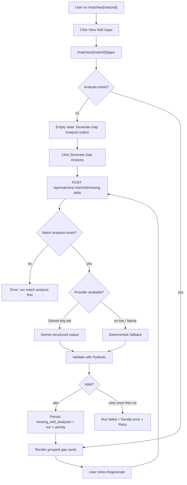
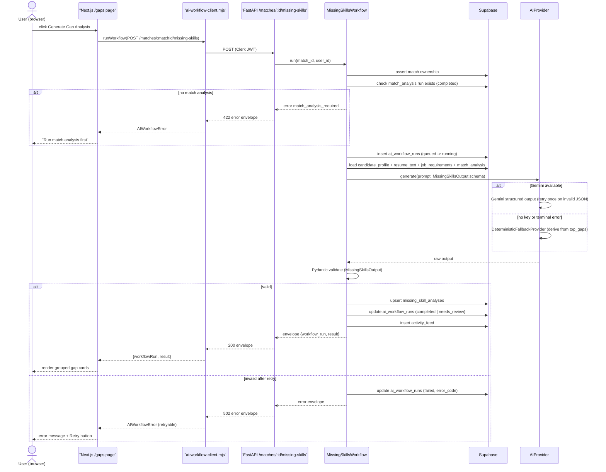
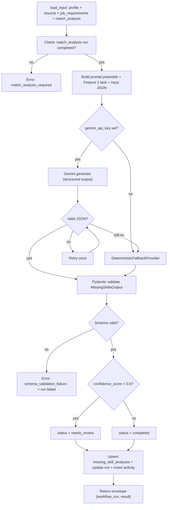
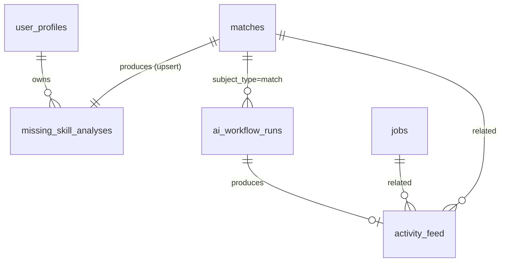
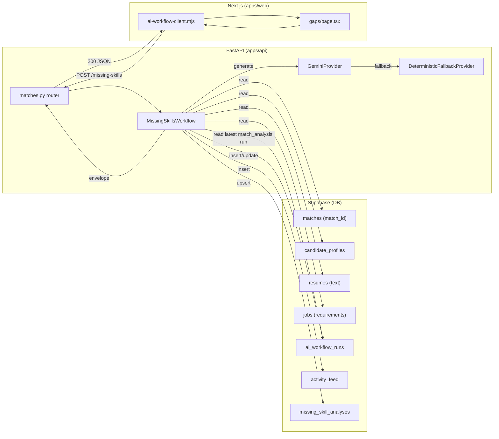

# US-029 — AI Missing Skill Analysis · Dev Flow

> **Feature 2** of `applywise_ai_assistant_update_tasks.md`. Depends on
> US-027 (BaseAIWorkflow, ai_workflow_runs, activity_feed, error taxonomy,
> prompt preamble, envelope) and US-028 (match analysis — provides top_gaps +
> missing_skills). Reads the match-centric route convention from
> `docs/decisions/0012-ai-workflow-standards.md`. Do not re-decide provider
> selection, envelope format, or error codes — inherit from US-027.

---

## 1. Feature Summary

- **What it does:** For a scored match, ApplyWise generates a structured
  explanation of every missing or weak skill — classifying each as a
  `true_gap`, `wording_gap`, or `proof_gap`, scoring importance, confirming
  evidence status against actual resume text, and giving a concrete fix,
  optional project task, and interview-risk note. The output is saved to
  `missing_skill_analyses`, regenerable on demand, and displayed on a
  `/matches/[matchId]/gaps` page grouped by importance (Critical / Medium /
  Nice-to-have).
- **Why the user needs it:** A raw list of missing keywords does not tell the
  user what to do. This feature converts the gap data from US-028 into
  actionable, prioritized advice — distinguishing a true learning gap from
  a resume wording problem or a credibility/proof problem.
- **Problem it solves:** US-028 produces `top_gaps` and `missing_skills` arrays
  but does not explain gap type, evidence status, or concrete fix. Users
  currently see a score with no clear next action.
- **MVP connection:** Reuses `BaseAIWorkflow` (US-027), the Gemini provider
  and fallback already wired for match analysis, `SupabaseDataClient`, and
  `apps/api/app/settings.py` Gemini config. The `/matches/[matchId]/gaps`
  page is a new child route under the existing match detail structure in
  `apps/web/src/app/(app)/matches/[matchId]/`.

---

## 2. User Flow

1. **Entry point:** `/matches/[matchId]` — the match detail page (US-028)
   shows a *View Skill Gaps* or *Analyze Gaps* link/button once the match
   analysis exists.
2. **Navigate:** user clicks through to `/matches/[matchId]/gaps`.
3. **Empty state:** if no missing-skill analysis has been run, the page shows
   an empty state with a *Generate Gap Analysis* button.
4. **User action:** clicks *Generate Gap Analysis*.
5. **System response:** web calls `POST /api/matches/{matchId}/missing-skills`;
   the backend runs `MissingSkillsWorkflow` (extends `BaseAIWorkflow`).
6. **Dependency guard:** backend checks that a completed `match_analysis`
   run exists for this match. If not, returns `match_analysis_required` error
   and the UI shows a friendly prompt to run match analysis first.
7. **AI processing:** loads candidate profile, job requirements, and
   US-028 match analysis; calls Gemini (or deterministic fallback); validates
   output; persists to `missing_skill_analyses`.
8. **Result shown:** gaps page renders cards grouped by importance.
9. **Regenerate:** a *Regenerate* button at the top right calls
   `POST /api/matches/{matchId}/missing-skills/regenerate`; a new
   `ai_workflow_runs` row is created and the saved analysis is replaced.



---

## 3. Technical Flow

- **Frontend:**
  - New page: `apps/web/src/app/(app)/matches/[matchId]/gaps/page.tsx`
  - Uses `apps/web/src/lib/ai-workflow-client.mjs` (US-027) for envelope
    calls.
  - New form component: `apps/web/src/components/gaps/gap-card.tsx` (gap
    card display) and `apps/web/src/components/gaps/gaps-by-importance.tsx`
    (grouping wrapper). Assumption: component directory `gaps/` is new.
- **API endpoints:**
  - `POST /api/matches/{matchId}/missing-skills` — trigger analysis.
  - `GET /api/matches/{matchId}/missing-skills` — return saved analysis.
  - `POST /api/matches/{matchId}/missing-skills/regenerate` — replace saved
    analysis.
  - Mounted in `apps/api/app/main.py` via `apps/api/app/routers/matches.py`
    (router created in US-027/US-028; this story adds the three new routes).
- **Backend service:**
  - `apps/api/app/services/ai/missing_skills_workflow.py` (new) —
    `MissingSkillsWorkflow(BaseAIWorkflow)` with `workflow_type =
    "missing_skills"`.
  - Depends on `apps/api/app/services/ai/base_workflow.py` (US-027).
  - Depends on `apps/api/app/services/ai/providers.py` (US-027).
  - Persistence via new `SupabaseDataClient` methods in
    `apps/api/app/services/supabase_data.py`.
- **Fallback source:** `apps/web/src/lib/match-analyzer.mjs` missing-skills
  output + US-028 `top_gaps` array — used by `DeterministicFallbackProvider`
  (see §4).
- **External integration:** Gemini via `settings.gemini_api_key`,
  `settings.gemini_model`, `settings.gemini_max_attempts`,
  `settings.gemini_retry_base_delay_seconds` (all set in
  `apps/api/app/settings.py`).
- **Auth:** Clerk JWT → resolve `user_profiles.id`; assert ownership of
  the match (match.user_id == resolved user_id).



---

## 4. AI Behavior

### Prompt Preamble (US-027 standard — every prompt starts here)

```text
Role: You are ApplyWise, an AI job hunting assistant for software engineers
      targeting AI roles in the US market.
Source of truth: Use only the provided candidate profile, resume, and job
      description.
Truthfulness: Do not invent experience, skills, projects, companies, dates,
      metrics, or certifications.
Output: Return valid JSON matching the provided schema.
Tone: Clear, direct, helpful, professional.
```

### Feature 2 Task Section (appended after preamble)

```text
Task: Missing Skill Analysis

You are given:
- candidate_profile: the candidate's structured profile
- job_requirements: the parsed job's requirements
- match_analysis: the prior match analysis including top_gaps and missing_skills
- target_role: the role the candidate is applying for

For every missing or weak skill identified in the match analysis, produce a
structured entry that classifies the gap and gives actionable advice.

Gap classification rules:
- true_gap: the skill does not appear anywhere in the candidate's profile or
  resume text — no evidence at all.
- wording_gap: related experience exists in the resume but is not expressed
  using the required terminology or level of clarity for this role.
- proof_gap: the skill is claimed or implied but is NOT supported by a
  concrete project, work output, or quantified result in the resume text.

Evidence status rules:
- no_evidence: zero mention in resume text.
- weak_evidence: mentioned once or implicitly, without project or result detail.
- strong_evidence: supported by at least one specific project, role, or result
  with concrete context.

IMPORTANT: evidence_status MUST be based solely on the provided resume text.
Do not invent evidence. If you cannot find supporting text, use no_evidence.

Return your response as valid JSON matching the schema exactly.
```

### Input Object (passed as structured context, not raw text)

```json
{
  "candidate_profile": {},
  "job_requirements": {},
  "match_analysis": {},
  "target_role": "AI Engineer"
}
```

### Output Schema (Feature 2.4 — verbatim)

```json
{
  "summary": "string",
  "missing_skills": [
    {
      "skill": "string",
      "importance": "critical | medium | nice_to_have",
      "gap_type": "true_gap | wording_gap | proof_gap",
      "evidence_status": "no_evidence | weak_evidence | strong_evidence",
      "resume_evidence": "string | null",
      "job_requirement": "string",
      "why_it_matters": "string",
      "how_to_fix": "string",
      "suggested_project_task": "string | null",
      "interview_risk": "string"
    }
  ],
  "top_3_priority_gaps": ["string"],
  "confidence_score": 0.0
}
```

### Validation

1. Parse Gemini response as JSON. On invalid JSON: retry once (Gemini only).
2. Feed parsed JSON to `MissingSkillsOutput` Pydantic model — validates field
   types, enum values for `importance`, `gap_type`, `evidence_status`, and
   that `confidence_score` is `0.0–1.0`.
3. On second invalid JSON or Pydantic failure: invoke
   `DeterministicFallbackProvider`.
4. If the fallback also fails validation: set run `failed`, return
   `schema_validation_failure` error envelope.
5. If `confidence_score < 0.6`: set run `needs_review`; result is still
   persisted.

### Deterministic Fallback

When Gemini is unavailable or fails, `DeterministicFallbackProvider` derives
gaps from:
- `match_analysis.top_gaps` (list of skill strings from US-028 output).
- `match_analysis.missing_skills` array (list of skill strings).
- Heuristic gap-type classification:
  - skill appears nowhere in resume text → `true_gap`, `no_evidence`.
  - skill term appears in resume text (simple substring match against
    resume plain text loaded from Supabase) → `wording_gap`,
    `weak_evidence`.
  - Assumption: all fallback items default to `importance = "medium"`
    unless the skill appears in the US-028 `top_gaps` list, in which case
    `importance = "critical"`.
- `how_to_fix`, `why_it_matters`, `interview_risk` are templated strings
  based on `gap_type` (e.g. for `true_gap`: "This skill is not present in
  your profile. Add a project or certification to demonstrate it.").
- `suggested_project_task = null` for all fallback items.
- `summary` = "Deterministic gap analysis based on match score — AI
  explanation unavailable."
- `confidence_score = 0.4`.
- `model_provider = "deterministic"`.

### Failure Handling

On any hard failure (terminal provider error, validation failure after retry
and fallback), `MissingSkillsWorkflow` maps to the US-027 error taxonomy,
sets `ai_workflow_runs.status = "failed"`, writes an `activity_feed` row
with the failure, and returns the standard error envelope:

```json
{ "error": { "code": "schema_validation_failure", "message": "Gap analysis could not be validated. Please retry.", "retryable": true } }
```

Never write raw resume or JD text to logs (US-027 redaction rule).

### User-Facing Assistant Description (Feature 2.5 — verbatim example)

This text is written to `activity_feed.assistant_description` (populated by
US-037 or templated here as a fallback):

```text
Your biggest gap for this role is not general backend engineering. It is proof of AI application experience. The job repeatedly mentions RAG, embeddings, and evaluation. Your current profile does not show those clearly, so ApplyWise recommends building or documenting one AI project before prioritizing similar roles.
```



---

## 5. Data Model Impact

**New table:** `missing_skill_analyses`. Migration:
`apps/web/supabase/migrations/0012_period8_missing_skills.sql`.

### `missing_skill_analyses` columns

| Column | Type | Notes |
| --- | --- | --- |
| id | uuid pk | `gen_random_uuid()` |
| user_id | uuid fk → user_profiles(id) on delete cascade | ownership / RLS |
| match_id | uuid fk → matches(id) on delete cascade | one analysis per match (latest wins) |
| summary | text not null | AI-generated summary paragraph |
| missing_skills_json | jsonb not null | array of gap objects per schema 2.4 |
| top_3_priority_gaps_json | jsonb not null | array of 3 skill name strings |
| confidence_score | numeric(4,3) | 0.000–1.000 |
| provider | text not null | `gemini` or `deterministic` |
| created_at | timestamptz | `now()` |
| updated_at | timestamptz | `now()` (updated on regenerate) |

Index: `(user_id, match_id)` unique — one analysis per match (upsert on
regenerate replaces the row; the old `ai_workflow_runs` row is preserved for
history).

### Relationships



`missing_skill_analyses` stores the latest persisted result. All historical
run metadata (provider, latency, confidence, status) lives in
`ai_workflow_runs` (`subject_type = "match"`, `subject_id = matchId`,
`workflow_type = "missing_skills"`). The `ai_workflow_runs.output_snapshot_json`
column carries the validated output snapshot as-of-run, independently of the
upserted `missing_skill_analyses` row.

### Example Persisted JSON (`missing_skills_json` entry)

```json
{
  "skill": "RAG (Retrieval-Augmented Generation)",
  "importance": "critical",
  "gap_type": "proof_gap",
  "evidence_status": "weak_evidence",
  "resume_evidence": "Familiar with vector databases",
  "job_requirement": "3+ years building production RAG pipelines",
  "why_it_matters": "RAG is the core architecture for this role. Without demonstrated experience, the candidate cannot show they can own it.",
  "how_to_fix": "Add a resume bullet describing a specific RAG project: dataset, retriever, re-ranker, and measurable outcome.",
  "suggested_project_task": "Build a small RAG demo on a public dataset (e.g. arXiv papers) and publish it on GitHub with an evaluation script.",
  "interview_risk": "High — interviewers will almost certainly ask you to design or critique a RAG system."
}
```

---

## 6. API Requirements

All endpoints live under `apps/api/app/routers/matches.py`, mounted at `/api`
in `apps/api/app/main.py`. Auth: Clerk JWT → `user_profiles.id`; assert
`matches.user_id == resolved_user_id` on every request.

---

### `POST /api/matches/{matchId}/missing-skills`

Trigger a new missing-skill analysis.

**Request body:** none (match is the path param). Optional:
```json
{ "regenerate": false }
```

**Response `200`:** standard US-027 envelope.
```json
{
  "workflow_run": {
    "id": "uuid",
    "workflow_type": "missing_skills",
    "status": "completed",
    "model_provider": "gemini",
    "model_name": "gemini-2.5-flash",
    "latency_ms": 2340,
    "confidence_score": 0.81,
    "error_message": null
  },
  "result": {
    "summary": "...",
    "missing_skills": [...],
    "top_3_priority_gaps": [...],
    "confidence_score": 0.81
  }
}
```

---

### `GET /api/matches/{matchId}/missing-skills`

Return the saved missing-skill analysis for the match.

**Response `200`:** same envelope; `result` is the persisted
`missing_skill_analyses` row deserialized. Returns `404` with code
`analysis_not_found` if not generated yet.

---

### `POST /api/matches/{matchId}/missing-skills/regenerate`

Re-run the analysis. Creates a new `ai_workflow_runs` row; upserts
`missing_skill_analyses` (updates the row and sets `updated_at`).

**Request body:** none.

**Response `200`:** same envelope as POST generate.

---

### Error Table

All error codes use the US-027 taxonomy and envelope format
`{ "error": { "code": "...", "message": "...", "retryable": bool } }`.

| Code | HTTP | retryable | When |
| --- | --- | --- | --- |
| unauthorized | 403 | false | match not owned by calling user |
| match_analysis_required | 422 | false | no completed match_analysis run exists for this match (US-028 must run first) |
| missing_profile | 422 | false | no candidate profile for the user |
| missing_job_requirements | 422 | false | job has not been parsed |
| invalid_json | 502 | true | Gemini output unparseable after one retry |
| schema_validation_failure | 502 | true | parsed but fails MissingSkillsOutput Pydantic model |
| model_timeout | 503 | true | Gemini request timed out |
| network_failure | 503 | true | Gemini network error |
| provider_rate_limit | 503 | true | Gemini 429 |
| analysis_not_found | 404 | false | GET with no prior analysis |

---

## 7. UI Requirements

### Page: `apps/web/src/app/(app)/matches/[matchId]/gaps/page.tsx`

This is a new Next.js server component (or hybrid) under the existing match
detail route tree. No new router segment outside matches is introduced
(match-centric routing, per `docs/decisions/0012-ai-workflow-standards.md`).

#### States

| State | What renders |
| --- | --- |
| **Empty** | Centered card: "No gap analysis yet" + *Generate Gap Analysis* button. Show a note if match analysis (US-028) has not been run, with a link to the match page to run it first. |
| **Loading** | Skeleton cards in three groups + "ApplyWise is analyzing your gaps…" banner. |
| **Success** | Grouped gap cards (see below) + summary paragraph at top + confidence badge + *Regenerate* button (top right). |
| **needs_review** | Same as success but with a `needs_review` badge ("Review suggested — AI was less confident"). |
| **Error** | Friendly message from `error.message` + *Retry* button when `error.retryable`. If `match_analysis_required`: "Run match analysis first" with link to `/matches/[matchId]`. |

#### Grouped Gap Cards Display

Groups rendered in order: **Critical** → **Medium** → **Nice-to-have**.
Each group has a heading with a count badge (e.g. "Critical (3)").

Each gap card shows (in order):

1. **Skill** — bold heading
2. **Importance** — colored badge (`critical` = red, `medium` = amber,
   `nice_to_have` = blue)
3. **Gap type** — pill badge (`true_gap` / `wording_gap` / `proof_gap`)
4. **Evidence status** — icon + label (`no_evidence` / `weak_evidence` /
   `strong_evidence`)
5. **Resume evidence** — quoted text block (only if `resume_evidence` is
   non-null)
6. **Job requirement** — small italic text
7. **Why it matters** — paragraph
8. **How to fix** — paragraph (primary action text)
9. **Interview risk** — warning-tinted paragraph
10. **Suggested project task** — highlighted box (only if non-null)

#### Buttons and Actions

- **Generate Gap Analysis** — `POST /api/matches/{matchId}/missing-skills`.
  Disabled while loading. Disappears once result exists (replaced by
  Regenerate).
- **Regenerate** — `POST /api/matches/{matchId}/missing-skills/regenerate`.
  Placed top-right. Shows loading state during request. On success, replaces
  current result in-place.
- **Retry** — shown only on retryable error. Re-fires the same POST.

#### Navigation

- Breadcrumb / back link: `← Match` pointing to `/matches/[matchId]`.
- Assumption: the match detail page (`/matches/[matchId]/page.tsx`) will get
  a *View Skill Gaps* link added pointing to `/matches/[matchId]/gaps`. This
  link is conditionally shown when a completed match_analysis exists.

---

## 8. Acceptance Criteria

**Dependency guard**
- Given I navigate to `/matches/[matchId]/gaps` and no match analysis (US-028)
  exists for this match, when I click Generate, then the API returns
  `match_analysis_required` (422) and the UI shows "Run match analysis first"
  with a link back to the match page.

**Generation**
- Given a completed match analysis exists, when I click Generate Gap Analysis,
  then `POST /api/matches/{matchId}/missing-skills` returns a `200` envelope
  with `workflow_type = "missing_skills"`, an `ai_workflow_runs` row is
  created, a `missing_skill_analyses` row is upserted, and an `activity_feed`
  row is written.

**Gap-type classification**
- Given a skill is absent from the candidate's profile and resume text, then
  the gap is classified `true_gap` with `evidence_status = no_evidence`.
- Given related experience exists in the resume but uses different terminology,
  then the gap is classified `wording_gap`.
- Given the skill is claimed in the profile but no concrete project or result
  backs it in resume text, then the gap is classified `proof_gap`.

**Evidence-status backing**
- Given `evidence_status = strong_evidence` or `weak_evidence`, then
  `resume_evidence` is non-null and quotes actual text from the candidate's
  resume — no invented content.
- Given `evidence_status = no_evidence`, then `resume_evidence` is `null`.

**Importance grouping**
- Given a successful analysis, when the gaps page renders, then gaps are
  displayed in three labeled groups: Critical, Medium, Nice-to-have, in that
  order.

**Fix and project task**
- Given a critical gap exists, then `how_to_fix` is a concrete, non-generic
  action string.
- Given `suggested_project_task` is non-null, then the gap card displays it
  in a highlighted box.

**Regenerate**
- Given a prior analysis exists, when I click Regenerate, then
  `POST /api/matches/{matchId}/missing-skills/regenerate` creates a new
  `ai_workflow_runs` row (prior row preserved), upserts the
  `missing_skill_analyses` row with fresh data, and the gaps page updates
  in-place.

**Fallback**
- Given `gemini_api_key` is unset, when analysis runs, then the deterministic
  fallback produces a schema-valid `MissingSkillsOutput` (all required fields
  present, enum values valid) and the run records `model_provider =
  "deterministic"`.

**Ownership**
- Given a match I do not own, when I call any missing-skills endpoint, then
  I receive `403 unauthorized` and no run, analysis, or activity row is
  written.

**Logging**
- Given any analysis run (success or failure), then no raw resume text, JD
  text, or prompt body appears in emitted server logs.

**Error display**
- Given a retryable error, then the UI shows the `error.message` and a *Retry*
  button.
- Given a non-retryable error (`match_analysis_required`, `unauthorized`), then
  no Retry button is shown.

---

## 9. Mermaid Diagrams

Diagrams are in §2 (user flow), §3 (sequence), §4 (AI processing), and §5
(ER). Below is the data-flow diagram showing how data moves through the system
for this feature.



---

## 10. Development Tasks

### Database

1. Write `apps/web/supabase/migrations/0012_period8_missing_skills.sql`:
   - Create `missing_skill_analyses` table per §5 column spec.
   - Add unique index on `(user_id, match_id)` (upsert target).
   - Add foreign keys with cascade on `user_id → user_profiles(id)` and
     `match_id → matches(id)`.
   - Enable Row Level Security; add policy: user can select/insert/update own
     rows where `user_id = auth.uid()`.

### Backend

2. `apps/api/app/services/ai/missing_skills_workflow.py` (new):
   - `MissingSkillsOutput(BaseModel)` — Pydantic model matching schema 2.4
     exactly; include `MissingSkillEntry` sub-model with enum literals for
     `importance`, `gap_type`, `evidence_status`.
   - `MissingSkillsWorkflow(BaseAIWorkflow)` implementing:
     - `workflow_type = "missing_skills"`
     - `load_input()`: loads `candidate_profile`, `resume_text`, `job_requirements`,
       and the latest completed `match_analysis` run's `output_snapshot_json`
       from `ai_workflow_runs` via `SupabaseDataClient`; raises
       `match_analysis_required` if none found.
     - `build_prompt()`: US-027 preamble + Feature 2 task block + serialized
       input JSON.
     - `output_model()`: returns `MissingSkillsOutput`.
     - `deterministic_fallback()`: implements heuristic described in §4.
     - `persist()`: upserts `missing_skill_analyses` via `SupabaseDataClient`.

3. `apps/api/app/services/supabase_data.py` — add methods:
   - `upsert_missing_skill_analysis(user_id, match_id, result)` — upserts on
     `(user_id, match_id)`.
   - `get_missing_skill_analysis(user_id, match_id)` — returns latest row or
     `None`.
   - `get_latest_workflow_run(user_id, match_id, workflow_type)` — used by
     `load_input()` to fetch the match_analysis snapshot.

4. `apps/api/app/routers/matches.py` — add three routes:
   - `POST /api/matches/{matchId}/missing-skills` → call
     `MissingSkillsWorkflow.run()`; return envelope.
   - `GET /api/matches/{matchId}/missing-skills` → call
     `get_missing_skill_analysis()`; 404 with `analysis_not_found` if none.
   - `POST /api/matches/{matchId}/missing-skills/regenerate` → call
     `MissingSkillsWorkflow.run(regenerate=True)`; return envelope.
   - Auth guard: resolve Clerk JWT to `user_profiles.id`; assert ownership.

5. Ensure `apps/api/app/main.py` mounts the matches router if not already done
   by US-027/US-028 (add the routes to the existing router include).

### AI Integration

6. Add `workflow_type = "missing_skills"` to the `workflow_type` enum/constant
   in `apps/api/app/services/ai/base_workflow.py` (or wherever the enum lives
   after US-027 implementation).

7. Wire `DeterministicFallbackProvider` in
   `apps/api/app/services/ai/providers.py` to accept a `fallback_fn` callable
   provided by the workflow subclass (`MissingSkillsWorkflow.deterministic_fallback`).

### Frontend

8. `apps/web/src/app/(app)/matches/[matchId]/gaps/page.tsx` (new):
   - On mount: `GET /api/matches/{matchId}/missing-skills`; if 404 → empty
     state; if 200 → render grouped cards.
   - Generate button → `POST /api/matches/{matchId}/missing-skills`.
   - Regenerate button → `POST /api/matches/{matchId}/missing-skills/regenerate`.
   - All calls via `ai-workflow-client.mjs`; handle all states from §7.

9. `apps/web/src/components/gaps/gap-card.tsx` (new): accepts a single gap
   object; renders all fields per §7 card spec; conditionally shows
   `resume_evidence` block and `suggested_project_task` box.

10. `apps/web/src/components/gaps/gaps-by-importance.tsx` (new): accepts full
    `missing_skills` array; splits into three groups by `importance`; renders
    group headings with count badges; renders `GapCard` for each item.

11. Add *View Skill Gaps* link to `apps/web/src/app/(app)/matches/[matchId]/page.tsx`
    pointing to `/matches/[matchId]/gaps`; show only when match analysis is
    completed.

### Testing

12. `apps/api/tests/test_missing_skills_workflow.py` (new):
    - Gap-type classification: true_gap / wording_gap / proof_gap logic in
      deterministic fallback (fake provider — no live calls).
    - Evidence-status rule: `evidence_status = no_evidence` → `resume_evidence`
      must be null; `strong_evidence` → non-null.
    - Importance grouping preserved through Pydantic model.
    - `match_analysis_required` raised when no completed match_analysis run
      exists.
    - `unauthorized` on wrong user_id.
    - `schema_validation_failure` when both Gemini and fallback produce invalid
      output.
    - Upsert behavior: second run replaces `missing_skill_analyses` row;
      both `ai_workflow_runs` rows preserved.

13. `apps/web/tests/gaps-page.test.mjs` (new):
    - Envelope parsing for all three endpoint responses.
    - Empty state when `GET` returns 404.
    - `match_analysis_required` error maps to correct UI message.
    - Grouped-card rendering: correct group order (Critical → Medium →
      Nice-to-have).
    - `suggested_project_task = null` → project task box not rendered.
    - `resume_evidence = null` → evidence quote block not rendered.
