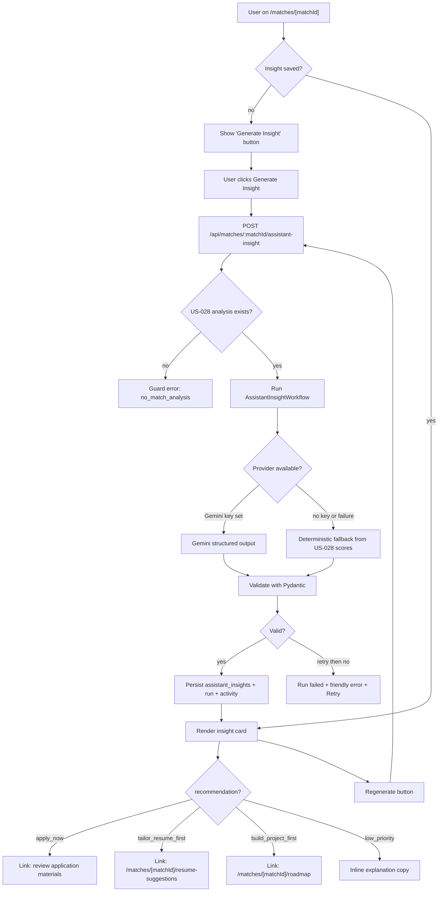
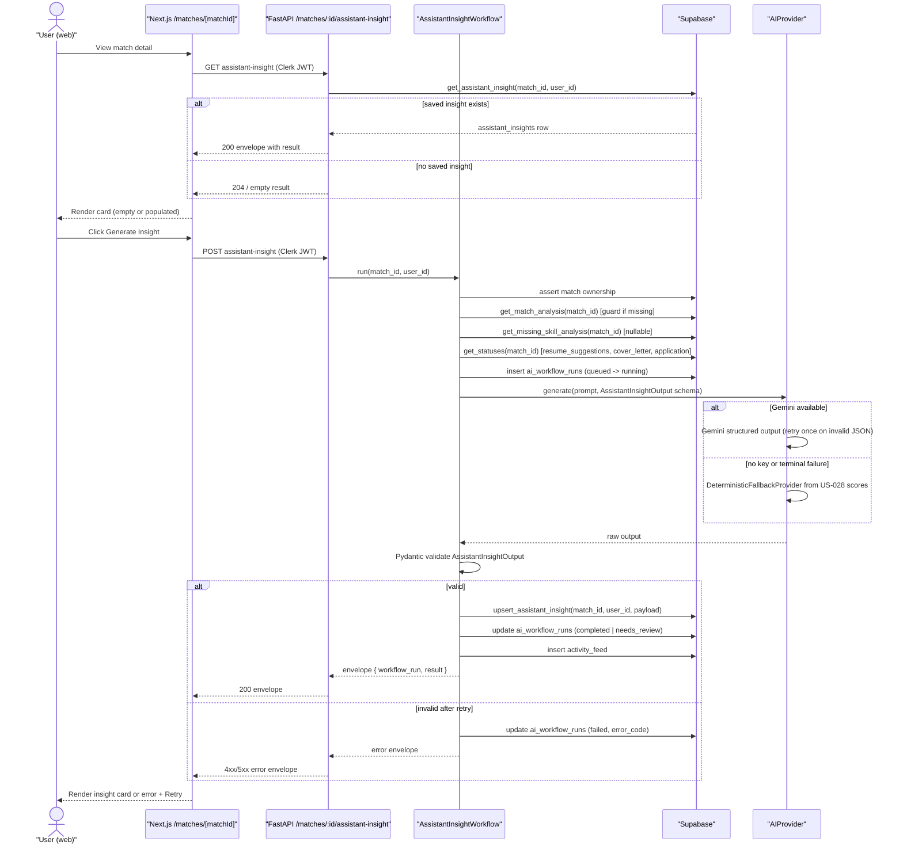
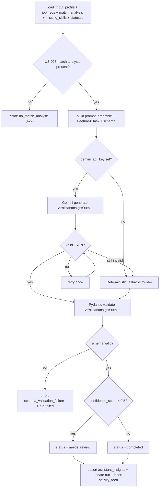
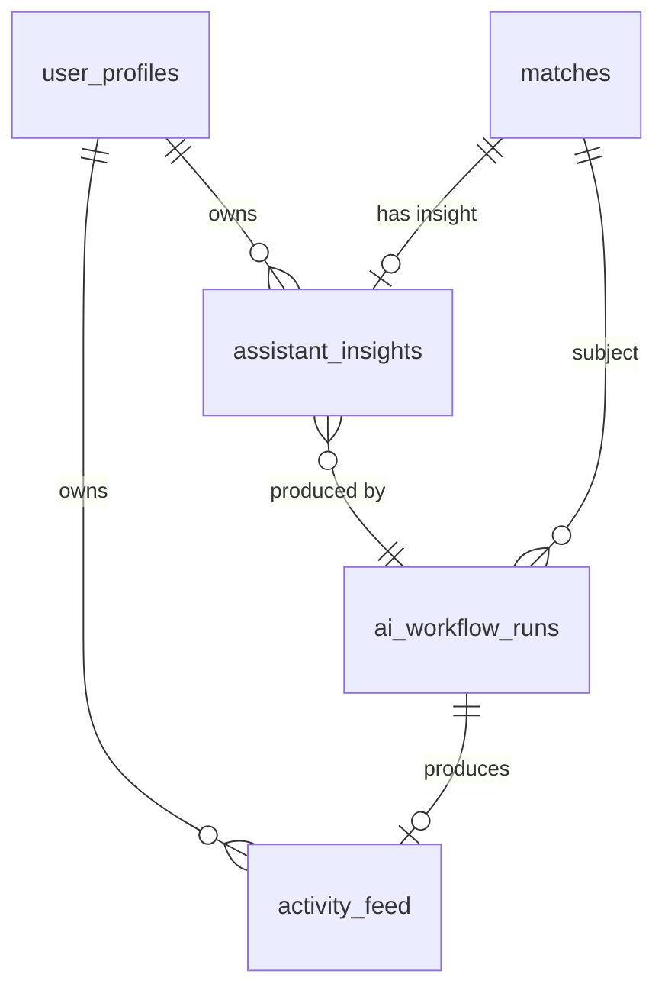
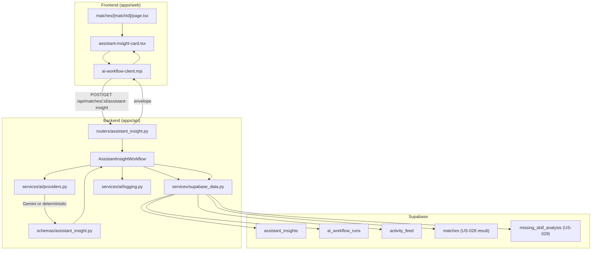

# US-030 — Job Assistant Insight Card · Dev Flow

> **Feature 8** of `applywise_ai_assistant_update_tasks.md`. Depends on
> US-027 (foundation) and US-028 (match analysis); reads US-029 missing-skill
> analysis when present. Inherits shared conventions from
> `docs/stories/period-8/flows/US-027-ai-workflow-foundation-flow.md`
> (envelope, `BaseAIWorkflow`, `ai_workflow_runs` + `activity_feed`, error
> codes, prompt preamble, provider/fallback, `workflow_type` enum).
> Architecture direction: `docs/decisions/0012-ai-workflow-standards.md`.

---

## 1. Feature Summary

- **What it does:** Generates a high-level AI decision card for each match,
  telling the user whether the job is worth pursuing, why, what to do next,
  and what application strategy to follow. The card surfaces at the top of
  `/matches/[matchId]` and is the primary "AI assistant" moment on the detail
  page.
- **Why the user needs it:** A user looking at a match today must mentally
  integrate match scores, skill gaps, application status, and resume readiness
  themselves. This card does that synthesis and produces one clear, actionable
  recommendation.
- **Problem it solves:** After US-028 scores and US-029 gaps are generated,
  the user still has no single answer to "should I apply, and what should I do
  right now?" The insight card closes that gap.
- **MVP connection:** Extends the existing match detail page
  (`apps/web/src/app/(app)/matches/[matchId]/page.tsx`), reuses
  `BaseAIWorkflow` from US-027, the Gemini client pattern from
  `apps/api/app/services/job_extractor.py`, and `SupabaseDataClient` from
  `apps/api/app/services/supabase_data.py`. One new table, one new router, one
  new service.

---

## 2. User Flow

1. **Entry point:** User navigates to `/matches/[matchId]` after a match has
   been analyzed (US-028 completed). The insight card section is at the top of
   the page.
2. **Empty state:** Card shows "Generate Insight" button if no saved insight
   exists; or it auto-generates on first visit when US-028 is completed.
3. **Generation:** User clicks *Generate Insight* (or the page auto-triggers).
   A loading state replaces the card while the backend runs.
4. **AI processing:** Backend runs `AssistantInsightWorkflow`, reads saved
   US-028 scores + US-029 gaps + application/resume statuses, calls Gemini
   (or deterministic fallback), validates output.
5. **Result displayed:** The card renders:
   - Recommendation badge (Apply Now / Tailor Resume First / Build Project
     First / Low Priority)
   - Assistant Summary
   - Why This Recommendation
   - Next Best Action (with a contextual link to the next step)
   - Application Strategy
   - Risk Level indicator
   - *Regenerate* button
6. **Next-action routing:** The "Next Best Action" link routes based on
   `recommendation`:
   - `apply_now` → review application materials on the match page
   - `tailor_resume_first` → resume suggestions (US-031) at
     `/matches/[matchId]/resume-suggestions`
   - `build_project_first` → roadmap (US-034) at
     `/matches/[matchId]/roadmap`
   - `low_priority` → explanatory copy inline; no navigation link
7. **Regenerate:** User may click *Regenerate*; the card shows loading state
   again and the saved insight is replaced on success.
8. **Error state:** A friendly error message and *Retry* button appear when
   generation fails hard (after fallback exhausted).



---

## 3. Technical Flow

- **Frontend:** Match detail page at
  `apps/web/src/app/(app)/matches/[matchId]/page.tsx` — add
  `AssistantInsightCard` component (new:
  `apps/web/src/components/matches/assistant-insight-card.tsx`). Uses the
  shared `apps/web/src/lib/ai-workflow-client.mjs` envelope client from
  US-027.
- **API endpoints:** New router
  `apps/api/app/routers/assistant_insight.py` — three match-centric
  endpoints mounted in `apps/api/app/main.py` with prefix
  `/api/matches/{matchId}`.
- **Backend service:** New
  `apps/api/app/services/ai/assistant_insight_workflow.py` —
  `AssistantInsightWorkflow(BaseAIWorkflow)` from
  `apps/api/app/services/ai/base_workflow.py` (US-027).
- **Data loading:** `SupabaseDataClient` in
  `apps/api/app/services/supabase_data.py` — add helpers to fetch the
  saved US-028 match analysis, US-029 missing-skill analysis (nullable),
  application status, resume-suggestions status, and cover-letter status for
  the match.
- **AI schema:** New Pydantic model `AssistantInsightOutput` in
  `apps/api/app/schemas/assistant_insight.py`.
- **Persistence:** New `SupabaseDataClient` methods:
  `upsert_assistant_insight(match_id, user_id, payload)`,
  `get_assistant_insight(match_id, user_id)`.
- **External integration:** Gemini primary via `settings.gemini_api_key`,
  `settings.gemini_model` (`gemini-2.5-flash`), `settings.gemini_max_attempts`,
  `settings.gemini_retry_base_delay_seconds` (all from
  `apps/api/app/settings.py`). Deterministic fallback when key absent or
  terminal failure.
- **Response to UI:** Standard US-027 envelope `{ workflow_run, result }`.



---

## 4. AI Behavior

### Prompt Preamble (US-027 standard — reused verbatim)

```text
Role: You are ApplyWise, an AI job hunting assistant for software engineers
      targeting AI roles in the US market.
Source of truth: Use only the provided candidate profile, resume, and job
      description.
Truthfulness: Do not invent experience, skills, projects, companies, dates,
      metrics, or certifications.
Output: Return valid JSON matching the provided schema.
Tone: Clear, direct, helpful, professional.
```

### Feature-8 Task Extension (appended after preamble)

```text
Task: Generate a decision-oriented assistant insight for the following match.

Use the provided match analysis scores, apply_recommendation, missing skill
gaps (if present), and the current status of resume suggestions, cover letter,
and application to determine:

1. A concise assistant_summary of the match fit and situation.
2. A recommendation: one of apply_now | tailor_resume_first |
   build_project_first | low_priority.
   - Derive consistently from match_analysis.apply_recommendation and score
     band: strong match (>=75) + apply_recommendation=apply -> apply_now;
     moderate match (50-74) + gaps fixable via resume -> tailor_resume_first;
     significant skill gaps requiring new projects -> build_project_first;
     weak match (<50) or role misalignment -> low_priority.
3. why_this_recommendation: 1-2 sentences explaining the reasoning.
4. next_best_action: a specific, actionable instruction aligned with the
   recommendation.
5. application_strategy: a brief tactical plan for how to approach this role.
6. risk_level: low | medium | high based on competition, gap severity, and
   time to close gaps.
7. confidence_score: 0.0-1.0 reflecting certainty given available data.

Do not invent skills or experience not present in the candidate profile or
resume text.
```

### Output Schema (Feature 8.4 — exact)

```json
{
  "assistant_summary": "string",
  "recommendation": "apply_now | tailor_resume_first | build_project_first | low_priority",
  "why_this_recommendation": "string",
  "next_best_action": "string",
  "application_strategy": "string",
  "risk_level": "low | medium | high",
  "confidence_score": 0.0
}
```

**Pydantic model** (`apps/api/app/schemas/assistant_insight.py`):

```python
from enum import Enum
from pydantic import BaseModel, Field

class Recommendation(str, Enum):
    apply_now = "apply_now"
    tailor_resume_first = "tailor_resume_first"
    build_project_first = "build_project_first"
    low_priority = "low_priority"

class RiskLevel(str, Enum):
    low = "low"
    medium = "medium"
    high = "high"

class AssistantInsightOutput(BaseModel):
    assistant_summary: str
    recommendation: Recommendation
    why_this_recommendation: str
    next_best_action: str
    application_strategy: str
    risk_level: RiskLevel
    confidence_score: float = Field(ge=0.0, le=1.0)
```

### Example Output (Feature 8.5 — verbatim)

```text
ApplyWise recommends tailoring your resume before applying. This job is a
reasonable target because your backend and API experience are relevant, but
your profile does not yet show strong proof of RAG or vector database work.
Your best strategy is to emphasize production engineering strengths and add a
clear AI project only if you have actually built it.
```

As JSON (illustrative):

```json
{
  "assistant_summary": "Your backend and API experience aligns well with this role, but your profile lacks demonstrated RAG and vector database work that the JD emphasizes.",
  "recommendation": "tailor_resume_first",
  "why_this_recommendation": "A moderate match score (62) and clear addressable skill gaps in vector search suggest resume tailoring before applying will meaningfully improve your odds.",
  "next_best_action": "Update your resume to highlight any production LLM integration work; emphasize API performance and reliability achievements.",
  "application_strategy": "Apply within 2 weeks after resume tailoring. Lead with your production engineering strengths and frame AI experience accurately — do not overstate RAG experience.",
  "risk_level": "medium",
  "confidence_score": 0.78
}
```

### Validation, Failure, and Deterministic Fallback

- **Validation:** Parse JSON → `AssistantInsightOutput` Pydantic. On invalid
  JSON, retry once (US-027 rule). On second failure or terminal provider
  error, route to `DeterministicFallbackProvider`.
- **Deterministic fallback:** Derive `recommendation` from the saved US-028
  `apply_recommendation` + `overall_score` band (see prompt task clause 2
  above); construct minimal valid `AssistantInsightOutput` with fixed
  `confidence_score=0.5`. No model call is made. The run records
  `model_provider=deterministic`.
- **Hard failure:** If even the fallback produces an invalid schema, the run
  is marked `failed` with `error_code=schema_validation_failure`; the API
  returns the error envelope; the UI shows a friendly message + *Retry*.
- **Guard:** If no US-028 match analysis row exists for the match, the
  workflow aborts before any provider call with `error_code=no_match_analysis`
  (HTTP 422, not retryable).
- **On failure:** Never expose raw resume or JD text in logs (US-027 redacting
  logger in `apps/api/app/services/ai/logging.py`).

### AI Processing Flowchart



---

## 5. Data Model Impact

### New Table: `assistant_insights`

Migration: `apps/web/supabase/migrations/0013_period8_assistant_insight.sql`

| Column | Type | Notes |
| --- | --- | --- |
| id | uuid pk default gen_random_uuid() | |
| user_id | uuid not null fk → user_profiles(id) on delete cascade | ownership |
| match_id | uuid not null fk → matches(id) on delete cascade | one insight per match (upsert) |
| assistant_summary | text not null | |
| recommendation | text not null | enum: `apply_now\|tailor_resume_first\|build_project_first\|low_priority` |
| why_this_recommendation | text not null | |
| next_best_action | text not null | |
| application_strategy | text not null | |
| risk_level | text not null | enum: `low\|medium\|high` |
| confidence_score | numeric(4,3) not null | 0.000–1.000 |
| provider | text not null | `gemini\|deterministic` |
| created_at | timestamptz not null default now() | |
| updated_at | timestamptz not null default now() | |

Index: `(user_id, match_id)` unique (enforces one active insight per match;
regenerate is an upsert).

**Relationship to existing tables:**



Assumption: `matches` table exists from `0002_period2_matches.sql`;
`user_profiles` from `0001_period1_foundation.sql`. `ai_workflow_runs` and
`activity_feed` from US-027 migration `0010_period8_ai_workflow_foundation.sql`.

**Example persisted row (JSON representation):**

```json
{
  "id": "a1b2c3d4-...",
  "user_id": "u-uuid",
  "match_id": "m-uuid",
  "assistant_summary": "Your backend and API experience aligns well with this role, but your profile lacks demonstrated RAG and vector database work.",
  "recommendation": "tailor_resume_first",
  "why_this_recommendation": "A moderate match score (62) and clear addressable skill gaps in vector search suggest resume tailoring before applying.",
  "next_best_action": "Update your resume to highlight any production LLM integration work.",
  "application_strategy": "Apply within 2 weeks after resume tailoring. Lead with production engineering strengths.",
  "risk_level": "medium",
  "confidence_score": 0.780,
  "provider": "gemini",
  "created_at": "2026-06-08T10:15:00Z",
  "updated_at": "2026-06-08T10:15:00Z"
}
```

---

## 6. API Requirements

All endpoints are match-centric. Auth: Clerk JWT → resolve `user_profiles.id`;
assert match ownership on every call.

### `POST /api/matches/{matchId}/assistant-insight`

Generate (or first-time generate) an assistant insight for a match. Guard:
requires a saved US-028 match analysis row.

Request body: none (match is the path param).

Response `200`: standard US-027 envelope:

```json
{
  "workflow_run": {
    "id": "uuid",
    "workflow_type": "assistant_insight",
    "status": "completed",
    "model_provider": "gemini",
    "model_name": "gemini-2.5-flash",
    "latency_ms": 2100,
    "confidence_score": 0.78,
    "error_message": null
  },
  "result": {
    "assistant_summary": "...",
    "recommendation": "tailor_resume_first",
    "why_this_recommendation": "...",
    "next_best_action": "...",
    "application_strategy": "...",
    "risk_level": "medium",
    "confidence_score": 0.78
  }
}
```

### `GET /api/matches/{matchId}/assistant-insight`

Returns the saved insight row for the match (most recent upsert). Returns
`204` with empty body when no insight has been generated yet.

Response `200`:

```json
{
  "workflow_run": { "...latest run for assistant_insight type..." },
  "result": { "...saved assistant_insights row..." }
}
```

### `POST /api/matches/{matchId}/assistant-insight/regenerate`

Replaces the saved insight (upserts `assistant_insights`, creates a new
`ai_workflow_runs` row). Same guard and response shape as POST generate.

**Error table (extends US-027 taxonomy):**

| Code | HTTP | retryable | When |
| --- | --- | --- | --- |
| `unauthorized` | 403 | false | match not owned by requesting user |
| `no_match_analysis` | 422 | false | US-028 match analysis not yet run for this match |
| `missing_profile` | 422 | false | no candidate profile for user |
| `missing_job_requirements` | 422 | false | job not yet parsed |
| `invalid_json` | 502 | true | model output unparseable after retry |
| `schema_validation_failure` | 502 | true | parsed but fails `AssistantInsightOutput` Pydantic |
| `model_timeout` | 503 | true | provider timeout |
| `network_failure` | 503 | true | provider network error |
| `provider_rate_limit` | 503 | true | provider rate limit |

Error envelope example:

```json
{
  "error": {
    "code": "no_match_analysis",
    "message": "This match has not been analyzed yet. Run match analysis (US-028) before generating the assistant insight.",
    "retryable": false
  }
}
```

**Router file:** `apps/api/app/routers/assistant_insight.py` — mounted in
`apps/api/app/main.py` with `prefix="/api/matches"`.

---

## 7. UI Requirements

### Placement

The `AssistantInsightCard` is the **top card** on
`apps/web/src/app/(app)/matches/[matchId]/page.tsx`, rendered before match
scores. It is also surfaced in a condensed read-only form on the job detail
page (`apps/web/src/app/(app)/jobs/[jobId]/page.tsx`) for the active match.

New component: `apps/web/src/components/matches/assistant-insight-card.tsx`.

### States

| State | What renders |
| --- | --- |
| **Empty** | "No insight yet" placeholder with a *Generate Insight* primary button |
| **Loading** | Spinner + "ApplyWise is analyzing…" (replaces card content during generation/regenerate) |
| **Success** | Full card: badge + all 5 content sections + *Regenerate* button |
| **needs_review** | Full card + a `needs_review` badge note ("AI confidence is low — review carefully") |
| **Error** | Friendly error message from `error.message`; *Retry* button when `error.retryable = true` |

### Recommendation Badges and Colors

| Recommendation value | Badge label | Visual treatment |
| --- | --- | --- |
| `apply_now` | Apply Now | Green / positive |
| `tailor_resume_first` | Tailor Resume First | Yellow / caution |
| `build_project_first` | Build Project First | Blue / informational |
| `low_priority` | Low Priority | Gray / muted |

### Card Sections (in order)

1. Recommendation badge (prominent, at top)
2. **Assistant Summary** — paragraph text from `assistant_summary`
3. **Why This Recommendation** — `why_this_recommendation`
4. **Next Best Action** — `next_best_action` text + a contextual CTA link:
   - `apply_now` → anchor/scroll to application materials section on the same
     match page
   - `tailor_resume_first` → link to
     `/matches/[matchId]/resume-suggestions` (US-031)
   - `build_project_first` → link to `/matches/[matchId]/roadmap` (US-034)
   - `low_priority` → no navigation link; inline explanatory paragraph only
5. **Application Strategy** — `application_strategy`
6. **Risk Level** — `risk_level` displayed as a labeled indicator (Low /
   Medium / High)
7. **Regenerate** — secondary button; triggers
   `POST /api/matches/{matchId}/assistant-insight/regenerate`

### Data flow

The page fetches via `GET /api/matches/{matchId}/assistant-insight` on load
using `ai-workflow-client.mjs`. If `204`, it shows the empty state. On
generate/regenerate, it calls via the same client and updates local state with
the returned envelope.

Assumption: the `apps/web/src/lib/ai-workflow-client.mjs` envelope client
from US-027 is already wired; US-030 reuses it with new path arguments.

---

## 8. Acceptance Criteria

**Generation and persistence:**

- **Given** a match I own with US-028 analysis completed, **when** I call
  `POST /api/matches/{matchId}/assistant-insight`, **then** an
  `assistant_insights` row is upserted, an `ai_workflow_runs` row transitions
  `queued→running→completed`, and an `activity_feed` row is written.
- **Given** the same match, **when** I call
  `GET /api/matches/{matchId}/assistant-insight`, **then** the saved insight
  is returned in the standard envelope without triggering a new model call.

**Recommendation routing (all four paths):**

- **Given** `recommendation = apply_now`, **then** `next_best_action` text
  directs to reviewing application materials; the UI card CTA links to the
  application materials section on the match page.
- **Given** `recommendation = tailor_resume_first`, **then** `next_best_action`
  text directs to resume suggestions; the UI card CTA links to
  `/matches/[matchId]/resume-suggestions`.
- **Given** `recommendation = build_project_first`, **then** `next_best_action`
  text directs to the roadmap; the UI card CTA links to
  `/matches/[matchId]/roadmap`.
- **Given** `recommendation = low_priority`, **then** the card explains why
  the role may not be worth prioritizing; no navigation CTA is shown.

**Recommendation derivation consistency:**

- **Given** US-028 `overall_score >= 75` and `apply_recommendation = apply`,
  **then** `AssistantInsightWorkflow` produces `recommendation = apply_now`.
- **Given** US-028 `overall_score` in 50–74 with addressable skill gaps,
  **then** `recommendation = tailor_resume_first`.
- **Given** significant US-029 skill gaps requiring new project work, **then**
  `recommendation = build_project_first`.
- **Given** US-028 `overall_score < 50` or role misalignment, **then**
  `recommendation = low_priority`.

**Regenerate:**

- **Given** a saved insight, **when** I call
  `POST /api/matches/{matchId}/assistant-insight/regenerate`, **then** the
  `assistant_insights` row is replaced (same `match_id`), a new
  `ai_workflow_runs` row is created, and the UI card updates with the new
  result.

**Guard — no match analysis:**

- **Given** no US-028 match analysis exists for the match, **when** I call
  generate or regenerate, **then** the API returns `422` with
  `error_code=no_match_analysis` and no run/insight/activity row is written.

**Fallback and failure:**

- **Given** `gemini_api_key` is unset, **when** the workflow runs, **then**
  `DeterministicFallbackProvider` produces a schema-valid
  `AssistantInsightOutput` derived from saved US-028 scores, and the run
  records `model_provider = deterministic`.
- **Given** the model returns invalid JSON, **when** the workflow runs, **then**
  it retries once, then falls back to deterministic; if all fail, the run is
  `failed` with a typed `error_code` and the API returns a retryable error
  envelope.

**Authorization and observability:**

- **Given** a match I do not own, **when** I call any endpoint, **then** I get
  `unauthorized` and no insight/run/activity row is written.
- **Given** any run (successful or failed), **then** no raw resume text or JD
  text appears in emitted logs (US-027 redacting logger).

**UI:**

- **Given** the match page loads, **then** the `AssistantInsightCard` is the
  topmost card; all five content sections are present when an insight is saved.
- **Given** generation is in progress, **then** the card shows a loading state
  with "ApplyWise is analyzing…" text.
- **Given** `needs_review` status, **then** the card is shown with a visible
  low-confidence note.

---

## 9. Mermaid Diagrams

User flow (§2), technical sequence (§3), and AI processing flowchart (§4) are
above. Data-flow / ER diagram (§5) is above.

### Summary Data Flow



---

## 10. Development Tasks

### Database

1. Write
   `apps/web/supabase/migrations/0013_period8_assistant_insight.sql`:
   create `assistant_insights` table with all columns, unique index on
   `(user_id, match_id)`, FK to `user_profiles` (cascade), FK to `matches`
   (cascade). Add `assistant_insight` to the `workflow_type` check constraint
   on `ai_workflow_runs` if implemented as a constraint (or leave as free text
   per US-027 pattern).

### Backend

2. **Schema** — create
   `apps/api/app/schemas/assistant_insight.py` with
   `AssistantInsightOutput(BaseModel)` — enums `Recommendation`, `RiskLevel`,
   and `confidence_score` field with `ge=0.0, le=1.0`.

3. **Service** — create
   `apps/api/app/services/ai/assistant_insight_workflow.py` implementing
   `AssistantInsightWorkflow(BaseAIWorkflow)`:
   - `load_input()`: fetch US-028 match analysis (raise `no_match_analysis`
     guard if absent), US-029 missing skills (nullable), application status,
     resume-suggestions status, cover-letter status via `SupabaseDataClient`.
   - `build_prompt()`: standard preamble + Feature-8 task clause with
     score-band → recommendation mapping.
   - `output_model`: `AssistantInsightOutput`.
   - `deterministic_fallback()`: derive `recommendation` from
     `apply_recommendation` + `overall_score` band; fill remaining fields
     with templated copy; `confidence_score=0.5`.
   - `persist()`: call `upsert_assistant_insight()`.

4. **Persistence helpers** — add to
   `apps/api/app/services/supabase_data.py`:
   - `upsert_assistant_insight(match_id, user_id, payload: dict) -> dict`
   - `get_assistant_insight(match_id, user_id) -> dict | None`
   - `get_match_analysis_for_insight(match_id, user_id) -> dict | None`
     (reads saved US-028 result from `ai_workflow_runs.output_snapshot_json`
     or the domain table)
   - `get_missing_skill_analysis(match_id, user_id) -> dict | None` (nullable)
   - `get_match_statuses(match_id, user_id) -> dict` (resume_suggestions,
     cover_letter, application status fields)

5. **Router** — create
   `apps/api/app/routers/assistant_insight.py` with three endpoints:
   `POST /{matchId}/assistant-insight`,
   `GET /{matchId}/assistant-insight`,
   `POST /{matchId}/assistant-insight/regenerate`. Mount in
   `apps/api/app/main.py` with `prefix="/api/matches"` using
   `app.include_router(assistant_insight_router)`.

### AI Integration

6. Wire `AssistantInsightWorkflow` to the `AIProvider` / fallback selection
   from `apps/api/app/services/ai/providers.py` (US-027). Confirm
   `workflow_type="assistant_insight"` is passed to `ai_workflow_runs`.

7. Verify the standard preamble constant (US-027
   `apps/api/app/services/ai/base_workflow.py` or a shared constants file) is
   imported rather than copied.

### Frontend

8. Create
   `apps/web/src/components/matches/assistant-insight-card.tsx`:
   - All five content sections + recommendation badge with color mapping.
   - Four next-action routing cases (CTA link or inline copy for
     `low_priority`).
   - Empty / loading / success / `needs_review` / error states.
   - *Generate Insight* and *Regenerate* buttons wired to
     `ai-workflow-client.mjs` with the correct endpoint paths.

9. Integrate the card at the top of
   `apps/web/src/app/(app)/matches/[matchId]/page.tsx` — place before the
   match scores section. Add a condensed read-only view in
   `apps/web/src/app/(app)/jobs/[jobId]/page.tsx` for the active match.

### Testing

10. `apps/api/tests/test_assistant_insight.py` (pytest, fake provider — no
    live calls):
    - Recommendation derivation for all four score/band combinations.
    - `next_best_action` text alignment with each recommendation value.
    - Deterministic fallback produces schema-valid `AssistantInsightOutput`
      from saved US-028 scores.
    - `POST /assistant-insight` writes `assistant_insights` + run + activity.
    - Regenerate replaces saved insight and creates a new run row.
    - `GET /assistant-insight` returns saved insight without a model call.
    - Ownership denial: `unauthorized` error, no rows written.
    - Guard: `no_match_analysis` when US-028 not run.
    - Schema-validation failure → typed error envelope, run marked `failed`.
    - Log redaction: no raw resume/JD content in emitted log lines.

11. `apps/web/tests/assistant-insight-card.test.mjs` (node --test):
    - All four recommendation → badge label + color class mappings.
    - CTA link targets for `apply_now`, `tailor_resume_first`,
      `build_project_first`; absence of CTA for `low_priority`.
    - Empty / loading / error state rendering.
    - `needs_review` badge visibility when `workflow_run.status = needs_review`.
    - Regenerate button triggers the regenerate endpoint path.
