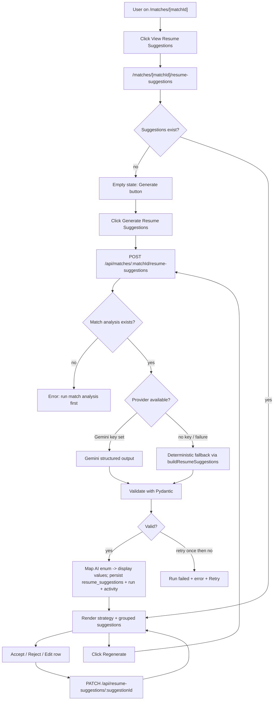
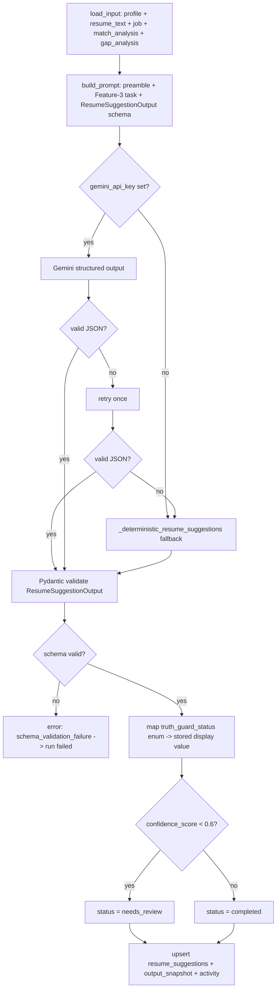
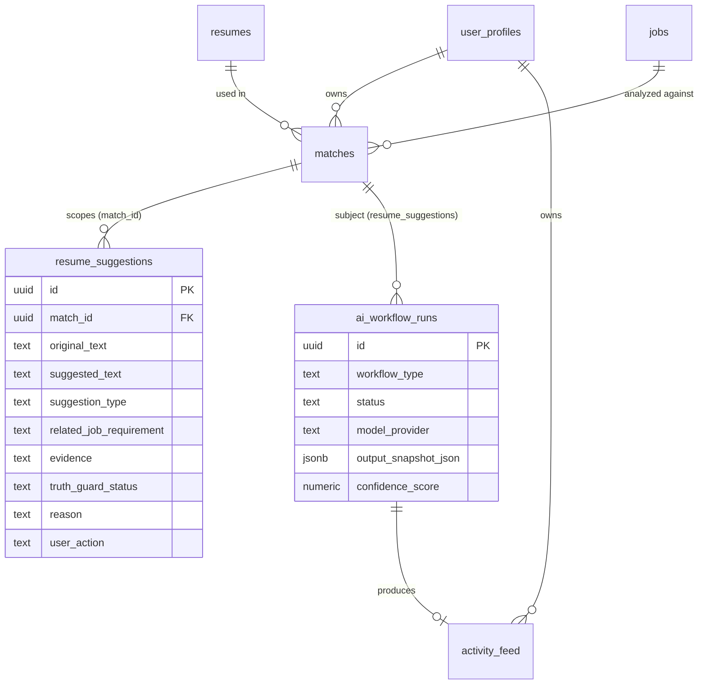

# US-031 — AI Resume Suggestions · Dev Flow

> **Feature 3** of `applywise_ai_assistant_update_tasks.md`. Depends on
> US-027 (BaseAIWorkflow, ai_workflow_runs, activity_feed, error taxonomy,
> prompt preamble, envelope), US-028 (match analysis — provides scored match
> context), and US-029 (missing skill analysis — provides gap classification
> used as AI input). Reads the match-centric route convention from
> `docs/decisions/0012-ai-workflow-standards.md`. Do not re-decide provider
> selection, envelope format, or error codes — inherit from US-027.
>
> **Upgrades US-008.** The deterministic file
> `apps/web/src/lib/resume-suggestion-generator.mjs` (function
> `buildResumeSuggestions`) becomes the typed fallback; it is NOT removed.

---

## 1. Feature Summary

- **What it does:** For a scored match, ApplyWise generates a full set of
  tailored resume suggestions — section by section — using only verified or
  user-confirmed experience. Every suggestion carries a Truth Guard status
  (`safe_to_use` / `needs_confirmation` / `do_not_use_yet`) that determines
  whether it may appear in a generated resume draft (US-032). The AI also
  produces a resume strategy narrative, a keyword inclusion list, and an
  explicit list of claims not to make. Results are persisted to the existing
  `resume_suggestions` table, regenerable on demand, and displayed on the
  match-scoped `/matches/[matchId]/resume-suggestions` page grouped by Truth
  Guard classification.
- **Why the user needs it:** A match score and gap list tell the user what is
  missing but not how to rewrite the resume honestly. This feature converts
  the match + gap analysis into concrete, evidence-backed, section-specific
  wording — while Truth Guard prevents the user from adding unsupported claims
  that could backfire in an interview.
- **Problem it solves:** The current page at
  `apps/web/src/app/(app)/matches/[matchId]/resume-suggestions/page.tsx`
  shows deterministic suggestions built by
  `apps/web/src/lib/resume-suggestion-generator.mjs` with no AI reasoning,
  no keyword strategy, no claims-to-avoid list, and no per-row Accept/Reject/
  Edit actions. There is also no run history or regeneration capability.
- **MVP connection:** Reuses `BaseAIWorkflow` (US-027), the Gemini provider
  and fallback already wired for US-028/US-029, the existing `resume_suggestions`
  table (`apps/web/supabase/migrations/0003_period3_resume_suggestions.sql`),
  `SupabaseDataClient` in `apps/api/app/services/supabase_data.py`, and
  `apps/api/app/settings.py` Gemini config. The existing
  `/matches/[matchId]/resume-suggestions` page is upgraded in place; no new
  route is needed.

---

## 2. User Flow

1. **Entry point:** `/matches/[matchId]` (match detail page from US-028) —
   shows a *View Resume Suggestions* link once a match analysis exists.
2. **Navigate:** user clicks through to `/matches/[matchId]/resume-suggestions`.
3. **Empty state:** if no AI suggestion run has been completed, the page shows
   an empty state with a *Generate Resume Suggestions* button.
4. **Dependency guard:** backend checks that a completed `match_analysis` run
   exists (and ideally a `missing_skills` run). If match analysis is absent,
   the UI shows a prompt to run match analysis first.
5. **User action:** clicks *Generate Resume Suggestions*.
6. **System response:** web calls `POST /api/matches/{matchId}/resume-suggestions`;
   backend runs `ResumeSuggestionsWorkflow` (extends `BaseAIWorkflow`).
7. **AI processing:** loads candidate profile, resume text, job requirements,
   match analysis, and missing skill analysis; calls Gemini (or deterministic
   fallback); validates output; maps AI enum values to stored display values;
   persists individual suggestion rows to `resume_suggestions` and stores the
   full output snapshot in `ai_workflow_runs.output_snapshot_json`.
8. **Result shown:** page renders the AI Resume Strategy narrative, then four
   grouped sections (Safe Suggestions / Needs Confirmation / Do Not Use Yet /
   Keywords to Include / Claims to Avoid), each with a row-level
   Accept / Reject / Edit action.
9. **User action (per row):** Accept, Reject, or Edit a suggestion — web
   calls `PATCH /api/resume-suggestions/{suggestionId}`; the `user_action`
   column is updated.
10. **Regenerate:** a *Regenerate* button calls
    `POST /api/matches/{matchId}/resume-suggestions/regenerate`; existing
    suggestion rows for this match are replaced, a new `ai_workflow_runs`
    row is created.



---

## 3. Technical Flow

- **Frontend:**
  - Existing page upgraded: `apps/web/src/app/(app)/matches/[matchId]/resume-suggestions/page.tsx`
  - Uses `apps/web/src/lib/ai-workflow-client.mjs` (US-027) for POST/GET
    envelope calls.
  - New action file: `apps/web/src/app/(app)/matches/[matchId]/resume-suggestions/actions.ts`
    — server actions for Generate, Regenerate, and PATCH per-row user_action.
  - New components (Assumption: directory `apps/web/src/components/resume-suggestions/`
    is new):
    - `apps/web/src/components/resume-suggestions/resume-strategy-card.tsx` —
      displays `resume_strategy` + `assistant_summary` narrative.
    - `apps/web/src/components/resume-suggestions/suggestion-row.tsx` — single
      suggestion with Original / Suggested / Evidence / Related requirement /
      Truth Guard badge / Accept-Reject-Edit controls.
    - `apps/web/src/components/resume-suggestions/suggestion-section.tsx` —
      collapsible section grouping rows by Truth Guard classification.
    - `apps/web/src/components/resume-suggestions/keywords-table.tsx` —
      renders `keywords_to_include[]` with status badges.
    - `apps/web/src/components/resume-suggestions/claims-to-avoid-list.tsx` —
      renders `do_not_claim[]`.
  - Existing form component `apps/web/src/components/forms/resume-suggestions-form.tsx`
    is upgraded to trigger the AI generation action instead of the deterministic
    path.
- **API endpoints:** added to `apps/api/app/routers/matches.py` (created in
  US-027/US-028; this story adds four new routes). Mounted via
  `apps/api/app/main.py`.
  - `POST /api/matches/{matchId}/resume-suggestions`
  - `GET /api/matches/{matchId}/resume-suggestions`
  - `POST /api/matches/{matchId}/resume-suggestions/regenerate`
  - `PATCH /api/resume-suggestions/{suggestionId}` — match-independent;
    Assumption: mounted as a separate router prefix `/api/resume-suggestions`
    in `apps/api/app/main.py`.
- **Backend workflow:** new `apps/api/app/services/ai/resume_suggestions_workflow.py`
  — `ResumeSuggestionsWorkflow(BaseAIWorkflow)`. Mirrors the structure of the
  match analysis and missing skill workflows.
- **Pydantic schema:** new `apps/api/app/schemas/resume_suggestions.py` —
  `ResumeSuggestionOutput` (full AI response model) and
  `SuggestionItem`, `KeywordItem` sub-models.
- **Persistence:** new methods on `SupabaseDataClient` in
  `apps/api/app/services/supabase_data.py`:
  - `get_match_with_full_context(match_id, user_profile_id)` — loads resume
    raw_text, candidate_profile_json, job structured_json, match scores/analysis
    snapshot, and the latest missing-skills output_snapshot_json.
  - `upsert_resume_suggestions(match_id, suggestions)` — deletes existing rows
    for the match and bulk-inserts fresh rows.
  - `get_resume_suggestions_for_match(match_id)` — returns ordered rows.
  - `patch_suggestion_user_action(suggestion_id, user_profile_id, user_action, suggested_text)`.
- **Deterministic fallback:** `apps/api/app/services/ai/resume_suggestions_workflow.py`
  calls `buildResumeSuggestions` logic re-implemented in Python as
  `_deterministic_resume_suggestions(match_data)`. The canonical JS source
  `apps/web/src/lib/resume-suggestion-generator.mjs` remains unchanged and
  continues to work for any remaining non-AI code paths.
- **External integration:** Gemini via `settings.gemini_api_key`,
  `settings.gemini_model`, `settings.gemini_max_attempts`,
  `settings.gemini_retry_base_delay_seconds` (all from
  `apps/api/app/settings.py`).
- **Error handling:** inherits US-027 typed taxonomy; adds
  `match_analysis_required` (422, not retryable).
- **Response:** standard US-027 envelope `{ workflow_run, result }` where
  `result` is the `ResumeSuggestionOutput`.

```mermaid
sequenceDiagram
    actor U as User (web)
    participant W as "Next.js action (actions.ts)"
    participant API as "FastAPI /matches/:id/resume-suggestions"
    participant WF as ResumeSuggestionsWorkflow
    participant DB as Supabase
    participant P as AIProvider

    U->>W: Click Generate Resume Suggestions
    W->>API: POST resume-suggestions (Clerk JWT)
    API->>WF: run(match_id, user_id)
    WF->>DB: assert ownership of match
    WF->>DB: insert ai_workflow_runs (queued -> running)
    WF->>DB: load profile + resume + job + match analysis + gap analysis
    WF->>WF: check match_analysis run exists; error if not
    WF->>P: generate(prompt, ResumeSuggestionOutput schema)
    alt Gemini available
        P->>P: Gemini structured output (retry once on invalid JSON)
    else no key / terminal error
        P->>P: _deterministic_resume_suggestions(match_data)
    end
    P-->>WF: raw output
    WF->>WF: Pydantic validate ResumeSuggestionOutput
    alt valid
        WF->>WF: map AI enum -> stored display values
        WF->>DB: upsert_resume_suggestions (delete old rows; bulk insert)
        WF->>DB: update ai_workflow_runs (completed | needs_review) + output_snapshot_json
        WF->>DB: insert activity_feed
        WF-->>API: envelope { workflow_run, result }
        API-->>W: 200 envelope
    else invalid after retry
        WF->>DB: update ai_workflow_runs (failed, error_code)
        WF-->>API: error envelope
        API-->>W: 502 error envelope
    end
    W-->>U: render strategy + grouped suggestions OR error + Retry

    U->>W: Accept / Reject / Edit row
    W->>API: PATCH /api/resume-suggestions/:suggestionId
    API->>DB: patch_suggestion_user_action
    DB-->>API: updated row
    API-->>W: 200 { suggestion }
    W-->>U: row updates in place
```

---

## 4. AI Behavior

### Prompt Preamble (shared, from US-027)

```text
Role: You are ApplyWise, an AI job hunting assistant for software engineers
      targeting AI roles in the US market.
Source of truth: Use only the provided candidate profile, resume, and job
      description.
Truthfulness: Do not invent experience, skills, projects, companies, dates,
      metrics, or certifications.
Output: Return valid JSON matching the provided schema.
Tone: Clear, direct, helpful, professional.
```

### Feature-3 Task Instruction (appended to preamble)

```text
Task: Generate a complete set of tailored resume suggestions for this candidate
      and job. Use the match analysis and missing skill analysis as context.

For each suggestion:
- Cite only resume evidence that actually exists.
- Assign truth_guard_status:
    safe_to_use          — claim is clearly supported by resume/profile evidence.
    needs_confirmation   — may be true based on nearby evidence, but profile
                           does not prove it clearly; user must confirm.
    do_not_use_yet       — would add unsupported or invented experience.
- Do not mark any suggestion safe_to_use unless you can quote supporting
  evidence from the resume text.
- do_not_use_yet suggestions must explain what real evidence the user would
  need before the claim could become safe.
- For keywords_to_include, only mark a keyword "supported" when the resume
  text clearly uses or demonstrates that keyword.
- For do_not_claim, list any skills, tools, or achievements that the job
  requires but the resume does not prove.
```

### AI Input Object

```json
{
  "original_resume_text": "string — resumes.raw_text",
  "candidate_profile": "object — user_profiles.candidate_profile_json",
  "job_requirements": "object — jobs.structured_json",
  "match_analysis": "object — ai_workflow_runs.output_snapshot_json (workflow_type=match_analysis)",
  "missing_skill_analysis": "object | null — ai_workflow_runs.output_snapshot_json (workflow_type=missing_skills); null if not yet run"
}
```

### AI Output Schema (§3.4 verbatim)

```json
{
  "resume_strategy": "string",
  "assistant_summary": "string",
  "suggestions": [
    {
      "section": "summary | skills | experience | projects | education | other",
      "original_text": "string | null",
      "suggested_text": "string",
      "related_job_requirement": "string",
      "reason": "string",
      "evidence": "string | null",
      "truth_guard_status": "safe_to_use | needs_confirmation | do_not_use_yet"
    }
  ],
  "keywords_to_include": [
    {
      "keyword": "string",
      "status": "supported | needs_confirmation | unsupported",
      "evidence": "string | null"
    }
  ],
  "do_not_claim": ["string"],
  "confidence_score": 0.0
}
```

### Truth Guard Rules (§3.5 verbatim)

```
safe_to_use:
  The claim is clearly supported by resume/profile evidence.

needs_confirmation:
  The claim may be true based on nearby evidence, but the profile does not prove it clearly.

do_not_use_yet:
  The suggestion would add unsupported or invented experience.
```

`do_not_use_yet` suggestions must NOT be auto-included in resume drafts
(US-032). They are shown on the page with a distinct visual treatment but
are never written into generated Markdown without explicit user acceptance.

### Example Assistant Summary (§3.6 verbatim)

```
ApplyWise found several ways to reposition your existing backend experience
for this role. You can safely emphasize API development, database work, and
production debugging. Do not claim RAG or vector database experience unless
you have a real project to support it.
```

### Validation and Failure Handling

- Parse AI response JSON → Pydantic `ResumeSuggestionOutput`. On invalid JSON
  retry once (mirrors US-027/US-028/US-029 pattern).
- On second invalid JSON or terminal provider error, call the deterministic
  fallback (`_deterministic_resume_suggestions`), which mirrors
  `buildResumeSuggestions` from
  `apps/web/src/lib/resume-suggestion-generator.mjs` and returns a minimal
  but schema-valid `ResumeSuggestionOutput` with `model_provider = deterministic`.
- If the fallback output also fails Pydantic validation, set run `failed`,
  write activity event, return error envelope.
- `confidence_score < 0.6` → run status `needs_review`; result still persisted.
- Never log `original_resume_text` or raw job description content (redacting
  logger in `apps/api/app/services/ai/logging.py`).

### AI Processing Flow



---

## 5. Data Model Impact

### Reused Table: `resume_suggestions`

No schema changes are required to the existing table
(`apps/web/supabase/migrations/0003_period3_resume_suggestions.sql`). All AI
output fields map directly to existing columns.

| Column | Type | Notes |
| --- | --- | --- |
| id | uuid pk | |
| match_id | uuid fk → matches(id) on delete cascade | ownership anchor |
| original_text | text | `suggestion.original_text`; nullable |
| suggested_text | text not null | `suggestion.suggested_text` |
| suggestion_type | text | maps to `suggestion.section` |
| related_job_requirement | text | `suggestion.related_job_requirement` |
| evidence | text | `suggestion.evidence`; nullable |
| truth_guard_status | text not null | stored display value (see mapping below) |
| reason | text | `suggestion.reason` |
| user_action | text default 'pending' | `pending | accepted | rejected` |
| created_at / updated_at | timestamptz | |

### Truth Guard Enum Mapping

The AI returns snake_case values in `truth_guard_status`; the existing
`resume_suggestions` table stores TITLE-CASE display values. The workflow
layer performs the mapping before INSERT:

| AI output (snake_case) | Stored display value | `ai-workflows.md` label |
| --- | --- | --- |
| `safe_to_use` | `Safe to use` | Safe to use |
| `needs_confirmation` | `Needs confirmation` | Needs confirmation |
| `do_not_use_yet` | `Do not use yet` | Do not use yet |

The existing `truthVariant()` function in the page component already reads
the stored display values, so no UI changes are needed for the Truth Guard
badge rendering.

### Additive Storage for `resume_strategy`, `keywords_to_include`, `do_not_claim` (Tentative)

The `resume_suggestions` table stores individual suggestion rows but has no
column for the top-level `resume_strategy`, `assistant_summary`,
`keywords_to_include[]`, or `do_not_claim[]` fields produced by the AI.

**Tentative choice A (preferred):** Store these fields in
`ai_workflow_runs.output_snapshot_json` for the `resume_suggestions` run.
The page reads the snapshot via `GET /api/matches/{matchId}/resume-suggestions`
alongside the individual rows. No schema migration needed.

Assumption: the GET endpoint returns both the snapshot (for strategy/keywords/
claims) and the individual rows (for Accept/Reject/Edit). If output_snapshot_json
ever needs to be purged independently, fields would need their own column.

**Tentative choice B (alternative):** Add columns to `matches`
(`resume_strategy text`, `assistant_summary text`, `keywords_json jsonb`,
`do_not_claim_json jsonb`) or create a small new `resume_suggestion_metadata`
table scoped to `match_id`. This is cleaner if multiple suggestion runs per
match need independent snapshots.

The implementation should default to choice A and document the migration path
to choice B if a future story requires it.

### Example Persisted Row

```json
{
  "id": "uuid",
  "match_id": "uuid",
  "original_text": "Built REST APIs with FastAPI.",
  "suggested_text": "Designed and deployed production FastAPI services handling 10k+ daily requests, with Pydantic schema validation and async background tasks.",
  "suggestion_type": "experience",
  "related_job_requirement": "Production API development",
  "evidence": "Resume mentions FastAPI and backend engineering across two roles.",
  "truth_guard_status": "Safe to use",
  "reason": "Candidate has clear FastAPI experience; suggestion adds specificity without inventing new facts.",
  "user_action": "pending"
}
```

### Example output_snapshot_json (stored in `ai_workflow_runs`)

```json
{
  "resume_strategy": "Lead with backend API expertise and highlight production debugging. Defer LLM-native claims until you have a deployed project.",
  "assistant_summary": "ApplyWise found several ways to reposition your existing backend experience for this role. You can safely emphasize API development, database work, and production debugging. Do not claim RAG or vector database experience unless you have a real project to support it.",
  "keywords_to_include": [
    { "keyword": "FastAPI", "status": "supported", "evidence": "Used in two roles per resume." },
    { "keyword": "RAG", "status": "unsupported", "evidence": null }
  ],
  "do_not_claim": ["RAG pipelines", "vector database design", "LLM fine-tuning"],
  "confidence_score": 0.81
}
```

---

## 6. API Requirements

All routes are match-centric. Auth: Clerk JWT resolved to `user_profiles.id`;
ownership asserted on every request.

### `POST /api/matches/{matchId}/resume-suggestions`

Trigger generation. Request body: none (subject is path param). Optional
`{ "force": true }` to regenerate even if suggestions exist.

Response `200`: standard US-027 envelope, `workflow_type: resume_suggestions`.

```json
{
  "workflow_run": {
    "id": "uuid",
    "workflow_type": "resume_suggestions",
    "status": "completed",
    "model_provider": "gemini",
    "model_name": "gemini-2.5-flash",
    "latency_ms": 2340,
    "confidence_score": 0.81,
    "error_message": null
  },
  "result": {
    "resume_strategy": "...",
    "assistant_summary": "...",
    "suggestions": [...],
    "keywords_to_include": [...],
    "do_not_claim": [...],
    "confidence_score": 0.81
  }
}
```

### `GET /api/matches/{matchId}/resume-suggestions`

Return saved suggestions and latest workflow run metadata.

Response `200`:

```json
{
  "workflow_run": { "...latest run for resume_suggestions..." },
  "suggestions": [ { "...resume_suggestions rows..." } ],
  "resume_strategy": "string | null",
  "assistant_summary": "string | null",
  "keywords_to_include": [...],
  "do_not_claim": [...]
}
```

If no suggestions have been generated, returns `{ "suggestions": [], "workflow_run": null }`.

### `POST /api/matches/{matchId}/resume-suggestions/regenerate`

Replace existing suggestion rows and create a new workflow run. Behaves
identically to the POST trigger but always runs generation even if suggestions
already exist. Old `resume_suggestions` rows for this match are deleted before
new rows are inserted.

Response `200`: same envelope as POST.

### `PATCH /api/resume-suggestions/{suggestionId}`

Update `user_action` and/or `suggested_text` (for the edit flow). The
`suggestionId` path param is a `resume_suggestions.id`. Ownership is asserted
by joining through `matches.user_id`.

Request body:

```json
{
  "user_action": "accepted | rejected",
  "suggested_text": "string (optional — only when user edits the text)"
}
```

Response `200`:

```json
{ "suggestion": { "...updated resume_suggestions row..." } }
```

### Error Table (inherits US-027 taxonomy; adds feature-specific codes)

| Code | HTTP | retryable | When |
| --- | --- | --- | --- |
| unauthorized | 403 | false | match not owned by requesting user |
| missing_profile | 422 | false | no candidate_profile_json on user_profiles |
| missing_job_requirements | 422 | false | job.structured_json is null (job not parsed) |
| match_analysis_required | 422 | false | no completed match_analysis run for this match |
| invalid_json | 502 | true | model output unparseable after retry |
| schema_validation_failure | 502 | true | parsed but fails Pydantic ResumeSuggestionOutput |
| model_timeout | 503 | true | provider did not respond in time |
| network_failure | 503 | true | provider unreachable |
| provider_rate_limit | 503 | true | 429 from Gemini |

Error envelope example:

```json
{
  "error": {
    "code": "match_analysis_required",
    "message": "Run match analysis before generating resume suggestions.",
    "retryable": false
  }
}
```

---

## 7. UI Requirements

### Page: `apps/web/src/app/(app)/matches/[matchId]/resume-suggestions/page.tsx`

The existing page is upgraded in place. No new route is created.

#### Page Sections (§3.7 order)

1. **AI Resume Strategy** — `resume-strategy-card.tsx`; shows `resume_strategy`
   paragraph and `assistant_summary` from the output snapshot. Displays the
   workflow run badge (`completed` / `needs_review` / `failed`) and model
   provider.
2. **Safe Suggestions** — `suggestion-section.tsx` filtering `truth_guard_status = "Safe to use"`.
3. **Needs Confirmation** — `suggestion-section.tsx` filtering `truth_guard_status = "Needs confirmation"`.
4. **Do Not Use Yet** — `suggestion-section.tsx` filtering `truth_guard_status = "Do not use yet"`;
   rendered with a visually distinct warning treatment; Accept button is disabled
   (rows in this section cannot be accepted without first moving to the edit
   flow where the user supplies their own text).
5. **Keywords to Include** — `keywords-table.tsx`; columns: Keyword / Status badge
   (`supported` → success, `needs_confirmation` → warning, `unsupported` → muted)
   / Evidence.
6. **Claims to Avoid** — `claims-to-avoid-list.tsx`; `do_not_claim[]` rendered
   as a bulleted list with a warning-colored icon.

#### Per-Row Layout (`suggestion-row.tsx`)

Each row in sections 2–4 shows:

| Field | Source |
| --- | --- |
| Original text | `original_text` (muted; "—" when null) |
| Suggested text | `suggested_text` (primary) |
| Evidence | `evidence` (muted; "No evidence recorded." when null) |
| Related job requirement | `related_job_requirement` |
| Truth Guard status | badge using existing `truthVariant()` |
| Accept button | sets `user_action = accepted`; disabled for `do_not_use_yet` rows |
| Reject button | sets `user_action = rejected` |
| Edit button | opens inline edit field for `suggested_text`; on save calls PATCH with edited text and `user_action = accepted` |

Accepted rows display a visual accepted state (e.g. green border / checkmark);
rejected rows are dimmed or collapsible.

#### Page States

| State | Trigger | Rendered content |
| --- | --- | --- |
| **Empty** | No suggestions generated | Hero empty-state card: description + *Generate Resume Suggestions* button |
| **Loading** | Generation in progress | Spinner + "ApplyWise is analyzing your resume…" skeleton |
| **Success** | Suggestions loaded | Full section layout above |
| **needs_review** | `workflow_run.status = needs_review` | Yellow badge on strategy card + "Low-confidence output — review carefully." note |
| **Error** | `workflow_run.status = failed` or HTTP error | Friendly message from `error.message` + *Retry* button (shown only when `error.retryable`) |

#### Buttons

- **Generate Resume Suggestions** (primary, empty state only) — triggers POST.
- **Regenerate** (secondary, top-right when suggestions exist) — triggers POST
  regenerate; requires confirmation modal ("This will replace existing
  suggestions and reset all Accept/Reject decisions.").
- **Open Resume Draft** (existing link to `/matches/[matchId]/resume-draft`,
  retained from current page).

---

## 8. Acceptance Criteria

**Generation — base case**

- **Given** a match I own with a completed match_analysis run, **when** I call
  `POST /api/matches/{matchId}/resume-suggestions`, **then** an
  `ai_workflow_runs` row is created with `workflow_type = resume_suggestions`
  (status: queued → running → completed), `resume_suggestions` rows are
  inserted for every suggestion in the AI output, and an `activity_feed` row
  is written.

**Truth Guard classification**

- **Given** the AI output contains a suggestion with `truth_guard_status = safe_to_use`,
  **then** the stored row has `truth_guard_status = "Safe to use"` (TITLE-CASE
  display value), and the row appears in the "Safe Suggestions" section of the UI.
- **Given** a suggestion with `truth_guard_status = needs_confirmation`,
  **then** stored as `"Needs confirmation"`, shown in "Needs Confirmation" section.
- **Given** a suggestion with `truth_guard_status = do_not_use_yet`, **then**
  stored as `"Do not use yet"`, shown in "Do Not Use Yet" section with a
  warning treatment, and the Accept button is disabled.

**do_not_use_yet exclusion from resume drafts**

- **Given** the suggestions page has `do_not_use_yet` rows with `user_action = pending`
  or `user_action = rejected`, **when** US-032 generates a resume draft,
  **then** none of those rows are included in the generated Markdown output.

**Accept / Reject / Edit persistence**

- **Given** suggestions exist, **when** I click Accept on a row, **then**
  `PATCH /api/resume-suggestions/{id}` sets `user_action = accepted` and the
  row displays a visual accepted state.
- **Given** I click Reject, **then** `user_action = rejected` is persisted and
  the row is visually dimmed.
- **Given** I edit the suggested text and save, **then** the edited text is
  stored as `suggested_text` and `user_action = accepted`, representing
  user-approved content.

**Dependency guard**

- **Given** no completed match_analysis run exists, **when** I call the
  generate endpoint, **then** I receive a `match_analysis_required` (422) error
  envelope and the UI shows a friendly prompt to run match analysis first.
  No `ai_workflow_runs` row or `resume_suggestions` rows are written.

**Deterministic fallback**

- **Given** `gemini_api_key` is unset, **when** I generate suggestions, **then**
  `_deterministic_resume_suggestions` produces schema-valid output, suggestion
  rows are persisted, and the run records `model_provider = deterministic`.
  The output is structurally identical (same Pydantic model) to the Gemini path.

**Regenerate**

- **Given** suggestions already exist with `user_action = accepted` on some
  rows, **when** I confirm and click Regenerate, **then** the old
  `resume_suggestions` rows for this match are deleted, new rows are inserted,
  a new `ai_workflow_runs` row is created, and the UI shows the fresh results.

**Ownership**

- **Given** a match I do not own, **when** I call any of the four endpoints,
  **then** I receive `unauthorized` (403) and no rows are written or modified.

**Privacy**

- **Given** a successful or failed run, **then** no raw resume text or raw
  job description content appears in emitted server logs.

**Low-confidence run**

- **Given** the AI returns `confidence_score < 0.6`, **then** the run status
  is `needs_review`, the result is still persisted, and the UI shows a
  `needs_review` badge on the strategy card.

---

## 9. Mermaid Diagrams

User flow (§2), technical sequence (§3), AI processing flow (§4) are defined
above and render as-is. The data-flow diagram below shows how tables relate
for this feature.



---

## 10. Development Tasks

### Database

1. Confirm `apps/web/supabase/migrations/0003_period3_resume_suggestions.sql`
   covers the existing `resume_suggestions` table. No new migration is required
   for this table unless tentative choice B (§5) is adopted.
2. Verify migration `0010_period8_ai_workflow_foundation.sql` includes
   `resume_suggestions` as a valid `workflow_type` in the enum or check
   constraint on `ai_workflow_runs.workflow_type`. Add if missing via a new
   additive migration (e.g. `0012_period8_resume_suggestions_workflow_type.sql`).

### Backend

3. `apps/api/app/schemas/resume_suggestions.py` — define `SuggestionItem`,
   `KeywordItem`, and `ResumeSuggestionOutput(BaseModel)` matching the §3.4
   schema exactly. Include `confidence_score: float`.
4. `apps/api/app/services/ai/resume_suggestions_workflow.py` — implement
   `ResumeSuggestionsWorkflow(BaseAIWorkflow)`:
   - `load_input()`: call `db.get_match_with_full_context()` to load
     `raw_text`, `candidate_profile_json`, `job.structured_json`,
     match analysis snapshot, and missing-skills snapshot.
   - `build_prompt()`: US-027 preamble + Feature-3 task + serialized input +
     `ResumeSuggestionOutput` JSON schema.
   - `output_model`: `ResumeSuggestionOutput`.
   - `deterministic_fallback()`: `_deterministic_resume_suggestions(match_data)`
     — Python port of `apps/web/src/lib/resume-suggestion-generator.mjs`
     `buildResumeSuggestions()`. Returns a `ResumeSuggestionOutput` with
     `model_provider = deterministic`.
   - `persist()`: call `db.upsert_resume_suggestions()` with enum-mapped rows;
     store full output in `output_snapshot_json`.
5. `apps/api/app/services/supabase_data.py` — add:
   - `get_match_with_full_context(match_id, user_profile_id)`.
   - `upsert_resume_suggestions(match_id, suggestions)` (delete + bulk insert).
   - `get_resume_suggestions_for_match(match_id)`.
   - `patch_suggestion_user_action(suggestion_id, user_profile_id, user_action, suggested_text)`.
6. `apps/api/app/routers/matches.py` — add four routes (POST generate, GET,
   POST regenerate for `/api/matches/{matchId}/resume-suggestions`). Add a
   separate router file `apps/api/app/routers/resume_suggestions.py` for
   `PATCH /api/resume-suggestions/{suggestionId}`.
7. `apps/api/app/main.py` — mount the new `resume_suggestions` router with
   prefix `/api/resume-suggestions`.

### AI Integration

8. Wire the Truth Guard enum mapping (`safe_to_use` → `"Safe to use"`, etc.)
   as a module-level constant dict in
   `apps/api/app/services/ai/resume_suggestions_workflow.py`. Apply before
   any DB insert.
9. Add `match_analysis_required` to the error taxonomy in
   `apps/api/app/services/ai/errors.py` (HTTP 422, retryable = false) if not
   already present from US-029.

### Frontend

10. `apps/web/src/components/resume-suggestions/resume-strategy-card.tsx` —
    displays `resume_strategy`, `assistant_summary`, workflow run badge,
    and model provider label.
11. `apps/web/src/components/resume-suggestions/suggestion-row.tsx` — per-row
    display with Original / Suggested / Evidence / Requirement / Truth Guard
    badge / Accept / Reject / Edit controls; calls server actions in
    `actions.ts`.
12. `apps/web/src/components/resume-suggestions/suggestion-section.tsx` —
    collapsible section title + count badge + list of `suggestion-row` items.
    "Do Not Use Yet" section disables Accept button at the section level.
13. `apps/web/src/components/resume-suggestions/keywords-table.tsx` —
    tabular display of `keywords_to_include[]`.
14. `apps/web/src/components/resume-suggestions/claims-to-avoid-list.tsx` —
    bulleted `do_not_claim[]` list.
15. `apps/web/src/app/(app)/matches/[matchId]/resume-suggestions/actions.ts` —
    server actions: `generateSuggestions(matchId)`,
    `regenerateSuggestions(matchId)`, `patchSuggestion(id, payload)`.
16. `apps/web/src/app/(app)/matches/[matchId]/resume-suggestions/page.tsx` —
    upgrade in place: replace the existing deterministic render with the new
    section layout. Retain the *Open Resume Draft* link. Add *Regenerate*
    button with confirmation modal.
17. Upgrade `apps/web/src/components/forms/resume-suggestions-form.tsx` to
    call `generateSuggestions()` server action instead of the old deterministic
    path.

### Testing

18. `apps/api/tests/test_resume_suggestions_workflow.py` — unit tests (fake
    provider, no live Gemini calls):
    - Provider selection (Gemini key set vs. unset).
    - Retry + fallback chain on invalid JSON.
    - Truth Guard enum mapping for all three values.
    - Ownership denial (match not owned by user).
    - `match_analysis_required` error when no completed match_analysis run.
    - Persistence: `upsert_resume_suggestions` called with correct rows;
      `output_snapshot_json` stored; activity_feed written.
    - Log redaction: `original_resume_text` absent from emitted log lines.
    - `do_not_use_yet` rows persist with correct display value and can be
      patched to `accepted` via PATCH (user override path for US-032).
19. `apps/web/tests/resume-suggestions.test.mjs` — client-side tests:
    - Envelope parsing (success, needs_review, failed, retryable error).
    - Truth Guard section grouping logic.
    - Accept/Reject/Edit action round-trip against a mock PATCH endpoint.
    - Regenerate confirmation modal prevents accidental regeneration.
