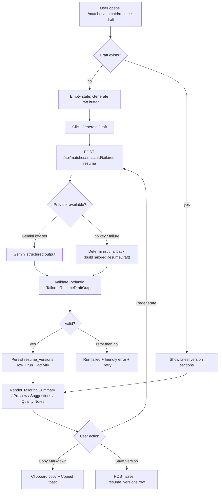
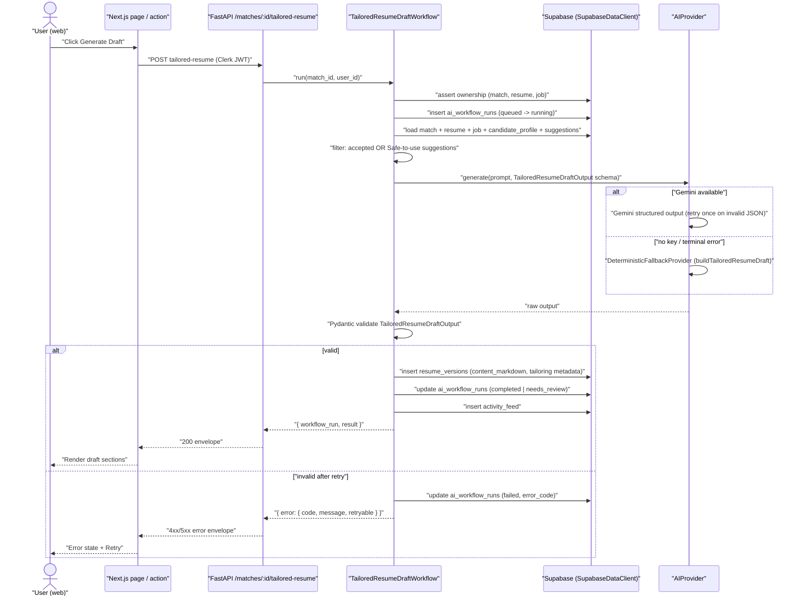
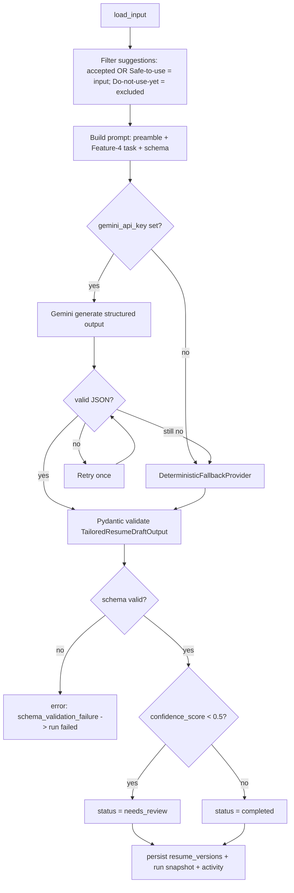
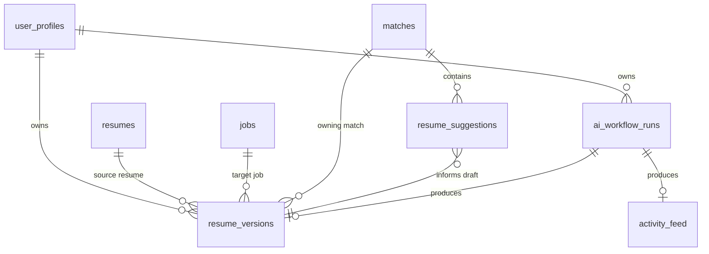
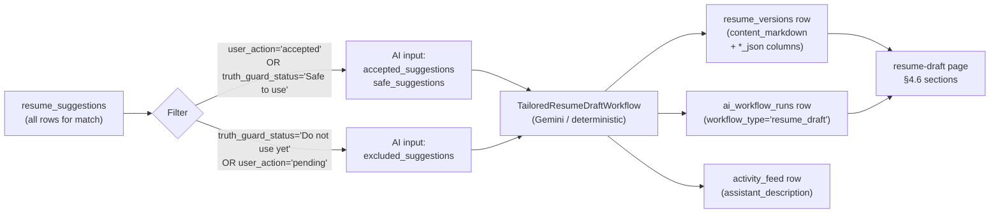

# US-032 — AI Tailored Resume Markdown Draft · Dev Flow

> **Feature 4** of `applywise_ai_assistant_update_tasks.md` (lines 668–819).
> Upgrades **US-009**. All shared conventions (envelope, `BaseAIWorkflow`,
> `ai_workflow_runs`, `activity_feed`, error taxonomy, prompt preamble,
> provider/fallback, `workflow_type` enum) are defined in
> `docs/stories/period-8/flows/US-027-ai-workflow-foundation-flow.md` and
> `docs/decisions/0012-ai-workflow-standards.md`. This document references but
> does not redefine them.

---

## 1. Feature Summary

- **What it does:** Generates a job-specific Markdown resume draft using the
  candidate's original resume, structured candidate profile, and the
  accepted/safe suggestions produced by US-031 (Truth Guard). The AI produces
  `resume_markdown`, a `tailoring_summary`, `included_suggestions`,
  `excluded_suggestions` (with reasons), `quality_notes`, and a
  `confidence_score`. The draft is persisted to the existing `resume_versions`
  table and displayed on the match-centric resume-draft page.
- **Why the user needs it:** Writing a tailored resume from scratch for every
  job is tedious. ApplyWise automates the adaptation while strictly honouring
  Truth Guard — only suggestions the user accepted (US-031 `user_action =
  'accepted'`) or that are Safe to use (`truth_guard_status = 'Safe to use'`)
  are incorporated. Unsupported or pending suggestions are excluded by default
  with an explanation.
- **Problem it solves:** The existing deterministic generator
  (`apps/web/src/lib/resume-draft-generator.mjs`, `buildTailoredResumeDraft`)
  produces a minimal scaffold. It does not rewrite bullet points, does not
  synthesise the full resume structure, does not rank content by job
  relevance, and does not explain its decisions. The AI upgrade replaces the
  heavy lifting while keeping the deterministic function as the typed fallback.
- **MVP connection:** Match-centric routing only (`/matches/[matchId]/resume-draft`).
  The brief's `/jobs/:id/tailored-resume` route is a brief-level alias — the
  system uses the existing
  `apps/web/src/app/(app)/matches/[matchId]/resume-draft/page.tsx` upgraded to
  the §4.6 sections. Output is Markdown/text. PDF/DOCX export is post-MVP
  (noted in §7).

---

## 2. User Flow

1. **Entry point:** User opens `/matches/[matchId]/resume-draft` (existing
   page). They may arrive from the match detail card or the resume-draft
   sidebar link.
2. **Pre-condition:** Match exists and is owned by the user; the underlying job
   has been parsed (`parse_status = 'parsed'`); at least one `resume_suggestions`
   row exists for the match.
3. **Empty state:** Page shows "No AI draft yet" with a *Generate Draft* button.
   Existing deterministic `resume_versions` rows (if any) are shown below.
4. **User action:** Clicks *Generate Draft*.
5. **Loading state:** Spinner + "ApplyWise is generating your tailored resume…"
6. **AI processing:** Backend runs `TailoredResumeDraftWorkflow` → Gemini (or
   deterministic fallback) → validated output → persisted `resume_versions` row
   + `ai_workflow_runs` row + `activity_feed` row.
7. **Success state:** Page renders (a) **Tailoring Summary**, (b) **Markdown
   Resume Preview**, (c) **Included Suggestions** list, (d) **Excluded
   Suggestions** list with reasons, (e) **Quality Notes**, (f) **Copy Markdown**
   button, (g) **Save Version** button, (h) **Regenerate** button.
8. **Copy Markdown:** Copies `content_markdown` to clipboard; button shows
   "Copied!" for 2 s.
9. **Save Version:** Saves the current draft as a named `resume_versions` row
   (user may provide a title or accept the auto-generated title). On success,
   shows a toast.
10. **Regenerate:** Posts to the regenerate endpoint; same loading/success/error
    cycle. Previous versions remain in the database.
11. **Error state:** Friendly message from `error.message` + *Retry* button when
    `error.retryable`.



---

## 3. Technical Flow

- **Frontend page:** `apps/web/src/app/(app)/matches/[matchId]/resume-draft/page.tsx`
  — upgraded to the §4.6 section layout.
- **Frontend client:** `apps/web/src/lib/ai-workflow-client.mjs` (US-027) —
  `runWorkflow(path)` + typed `AIWorkflowError`.
- **API endpoints (match-centric):**
  - `POST /api/matches/{matchId}/tailored-resume`
  - `GET  /api/matches/{matchId}/tailored-resume`
  - `POST /api/matches/{matchId}/tailored-resume/regenerate`
  - New router file: `apps/api/app/routers/resume_draft.py`. Mounted in
    `apps/api/app/main.py`.
- **Backend service:** `apps/api/app/services/ai/tailored_resume_draft_workflow.py`
  — subclass of `BaseAIWorkflow`
  (`apps/api/app/services/ai/base_workflow.py`, US-027). Implements
  `load_input()`, `build_prompt()`, `output_model` → `TailoredResumeDraftOutput`,
  `deterministic_fallback()` → calls into logic mirroring `buildTailoredResumeDraft`,
  `persist()` → writes `resume_versions` row.
- **Pydantic schema:**
  `apps/api/app/schemas/resume_draft.py` — `TailoredResumeDraftOutput`.
- **Input loading:** reads match → joins `resume`, `job`, candidate profile,
  and `resume_suggestions` rows from `SupabaseDataClient`
  (`apps/api/app/services/supabase_data.py`). Filters suggestions:
  `user_action = 'accepted'` OR `truth_guard_status = 'Safe to use'`. Excludes
  `truth_guard_status = 'Do not use yet'` by default.
- **Persistence:** new `SupabaseDataClient` methods —
  `insert_resume_version(...)`, `get_latest_resume_version(match_id)`,
  `list_resume_versions(match_id)`. Run + activity persisted via existing
  US-027 methods.
- **Deterministic fallback:** wraps `buildTailoredResumeDraft` logic
  reimplemented in Python (same filtering rules). Returns a
  `TailoredResumeDraftOutput`-compatible dict; `confidence_score = 0.0`,
  `quality_notes = ["Generated by deterministic fallback."]`.
- **External provider:** Gemini via `settings.gemini_api_key`,
  `settings.gemini_model` (default `gemini-2.5-flash`),
  `settings.gemini_max_attempts`, `settings.gemini_retry_base_delay_seconds`.



---

## 4. AI Behavior

### Prompt Preamble

Every prompt begins with the standard US-027 preamble (Feature 12.4):

```text
Role: You are ApplyWise, an AI job hunting assistant for software engineers
      targeting AI roles in the US market.
Source of truth: Use only the provided candidate profile, resume, and job
      description.
Truthfulness: Do not invent experience, skills, projects, companies, dates,
      metrics, or certifications.
Output: Return valid JSON matching the provided schema.
Tone: Clear, direct, helpful, professional.
```

### Feature-4 Task Appended to Preamble

```text
Task: Generate a tailored Markdown resume for the target job.
      You are given the original resume text, the structured candidate
      profile, the parsed job requirements, and the lists of accepted and
      safe suggestions.

Rules:
- Emphasize job-relevant experience and impact.
- Use concise US software-engineer resume style with clear bullet points.
- Prioritize technical evidence and measurable outcomes.
- Preserve the candidate's identity and contact data verbatim.
- Include only skills and claims supported by the provided data.
- Do not invent metrics, dates, companies, certifications, or technologies.
- Incorporate ALL accepted_suggestions and safe_suggestions where they
  strengthen the narrative.
- For each suggestion in excluded_suggestions, provide a reason:
    "unsupported"    — the claim lacks evidence in the source data
    "not_selected"   — the suggestion was not accepted by the user
    "low_confidence" — truth guard or model confidence is below threshold
- Include quality_notes for any sections that needed significant rewriting
  or that the model is less certain about.
- Set confidence_score between 0.0 and 1.0 reflecting overall output quality.
```

### Input Payload (sent to provider)

```json
{
  "original_resume_text": "string — resumes.raw_text",
  "candidate_profile": {},
  "job_requirements": {},
  "accepted_suggestions": [],
  "safe_suggestions": [],
  "excluded_suggestions": []
}
```

`accepted_suggestions`: rows where `user_action = 'accepted'` (US-031).
`safe_suggestions`: rows where `truth_guard_status = 'Safe to use'` AND
`user_action != 'accepted'` (not double-counted).
`excluded_suggestions`: rows where `truth_guard_status = 'Do not use yet'` OR
`user_action = 'pending'` (neither accepted nor safe). Passed so the model can
explain exclusions.

### Output Schema (§4.4 — exact)

```json
{
  "resume_markdown": "string",
  "tailoring_summary": "string",
  "included_suggestions": ["string"],
  "excluded_suggestions": [
    {
      "suggestion": "string",
      "reason": "unsupported | not_selected | low_confidence"
    }
  ],
  "quality_notes": ["string"],
  "confidence_score": 0.0
}
```

Pydantic model `TailoredResumeDraftOutput` in
`apps/api/app/schemas/resume_draft.py` enforces this schema. Field
`confidence_score` must be `ge=0.0, le=1.0`. `included_suggestions` and
`quality_notes` are `list[str]`. `excluded_suggestions` is
`list[ExcludedSuggestion]` where `ExcludedSuggestion` has `suggestion: str`
and `reason: Literal['unsupported', 'not_selected', 'low_confidence']`.

### Validation

Parse JSON → `TailoredResumeDraftOutput`. On invalid JSON, retry once. On a
second failure, fall back to `DeterministicFallbackProvider`. If even
fallback validation fails, run is `failed`.

Threshold: `confidence_score < 0.5` → run status `needs_review`; result is
still persisted and displayed with a badge.

### Failure Handling

Map to typed error codes (see §6 error table). Run row always written. No raw
resume or JD text in emitted logs (redacting logger from US-027
`apps/api/app/services/ai/logging.py`).

### UI Display

- `tailoring_summary` → **Tailoring Summary** card.
- `resume_markdown` → **Markdown Resume Preview** (rendered + raw toggle).
- `included_suggestions` → **Included Suggestions** list.
- `excluded_suggestions` → **Excluded Suggestions** list with reason badge.
- `quality_notes` → **Quality Notes** list.
- `workflow_run.status` → status badge (`completed` / `needs_review` / `failed`).
- `workflow_run.model_provider` → shown as `AI` or `Fallback` chip.
- `workflow_run.confidence_score` → shown only when `needs_review`.

### Assistant Description (§4.5 — exact)

```text
ApplyWise generated a tailored Markdown resume draft for this role. It emphasizes your backend engineering strengths and includes only supported claims. Unsupported AI experience was excluded from the draft.
```

This text is stored in `activity_feed.assistant_description` for the
`resume_draft` activity row.

### AI Processing Flowchart



---

## 5. Data Model Impact

### Existing Table: `resume_versions` (REUSE — no structural changes)

Defined in migration `0004_period3_resume_versions.sql`. All existing columns
are unchanged.

| Column | Type | Notes |
|---|---|---|
| id | uuid pk | |
| user_id | uuid fk → user_profiles(id) cascade | ownership |
| resume_id | uuid fk → resumes(id) cascade | source resume |
| job_id | uuid fk → jobs(id) cascade | target job |
| match_id | uuid fk → matches(id) cascade | owning match |
| title | text not null | e.g. "Resume tailored for Senior ML Engineer at Acme" |
| content_markdown | text not null | full Markdown resume text |
| created_at / updated_at | timestamptz | |

### Additive jsonb Columns (tentative migration `0014`)

To store the AI tailoring metadata without breaking the existing schema, four
nullable jsonb columns are added to `resume_versions`.

**Assumption:** next free migration number is 0014; mark file tentative until
confirmed against the team's migration sequence.

| New Column | Type | Contents |
|---|---|---|
| tailoring_summary_json | jsonb null | `{ "text": "..." }` |
| included_suggestions_json | jsonb null | `["suggestion text", ...]` |
| excluded_suggestions_json | jsonb null | `[{ "suggestion": "...", "reason": "..." }, ...]` |
| quality_notes_json | jsonb null | `["note text", ...]` |

These columns are nullable so existing rows (created by the deterministic
generator) remain valid. AI-generated rows always populate them.

Migration file (tentative): `apps/web/supabase/migrations/0014_period8_resume_versions_ai_columns.sql`

### Relationships



### Example `resume_versions` Row (AI-generated)

```json
{
  "id": "rv-uuid-001",
  "user_id": "user-uuid-001",
  "resume_id": "res-uuid-001",
  "job_id": "job-uuid-001",
  "match_id": "match-uuid-001",
  "title": "Resume tailored for Senior ML Engineer at Acme Corp",
  "content_markdown": "# Jane Smith\nSan Francisco, CA · jane@example.com\n\n## Experience\n...",
  "tailoring_summary_json": { "text": "Emphasized Python and ML pipeline experience aligned to the JD. Promoted LLM fine-tuning project to top bullet. Removed unrelated DevOps sections." },
  "included_suggestions_json": ["Reframe 'built data pipelines' as 'engineered low-latency ML pipelines processing 50M events/day'"],
  "excluded_suggestions_json": [{ "suggestion": "Add Kubernetes orchestration experience", "reason": "unsupported" }],
  "quality_notes_json": ["Education section preserved verbatim; no changes needed.", "Skills section condensed to job-relevant subset."],
  "created_at": "2026-06-08T10:15:00Z",
  "updated_at": "2026-06-08T10:15:00Z"
}
```

---

## 6. API Requirements

All endpoints are **match-centric**. Auth: Clerk JWT → resolve
`user_profiles.id`; assert match ownership before any data access.

### `POST /api/matches/{matchId}/tailored-resume`

Generates a new AI resume draft. Creates an `ai_workflow_runs` row, runs
`TailoredResumeDraftWorkflow`, persists a `resume_versions` row.

Request body: none (match is the subject). Optional:
```json
{ "custom_title": "string | null" }
```

Response `200` — standard US-027 envelope:
```json
{
  "workflow_run": {
    "id": "uuid",
    "workflow_type": "resume_draft",
    "status": "completed | needs_review | failed",
    "model_provider": "gemini | deterministic",
    "model_name": "gemini-2.5-flash | deterministic-baseline",
    "latency_ms": 2340,
    "confidence_score": 0.87,
    "error_message": null
  },
  "result": {
    "resume_version_id": "uuid",
    "resume_markdown": "# Jane Smith\n...",
    "tailoring_summary": "...",
    "included_suggestions": ["..."],
    "excluded_suggestions": [{ "suggestion": "...", "reason": "unsupported" }],
    "quality_notes": ["..."],
    "confidence_score": 0.87
  }
}
```

### `GET /api/matches/{matchId}/tailored-resume`

Returns the latest AI-generated `resume_versions` row for the match, plus the
latest `ai_workflow_runs` row with `workflow_type = 'resume_draft'`. Returns
`null` result fields when no draft exists.

Response `200`:
```json
{
  "workflow_run": { "...latest run or null..." },
  "result": {
    "resume_version_id": "uuid | null",
    "resume_markdown": "string | null",
    "tailoring_summary": "string | null",
    "included_suggestions": [],
    "excluded_suggestions": [],
    "quality_notes": [],
    "confidence_score": null
  }
}
```

### `POST /api/matches/{matchId}/tailored-resume/regenerate`

Triggers a new generation run. Previous `resume_versions` rows are NOT deleted
(history is preserved). Equivalent to the generate endpoint; intended for the
*Regenerate* button.

Request body: same optional `{ "custom_title": "string | null" }`.

Response: same `200` envelope as generate.

### Error Table

All error codes follow the US-027 taxonomy. `retryable` drives the *Retry*
button in the UI.

| Code | HTTP | retryable | When |
|---|---|---|---|
| `unauthorized` | 403 | false | Match not owned by requesting user |
| `missing_profile` | 422 | false | No `candidate_profile_json` on `user_profiles` |
| `missing_job_requirements` | 422 | false | Job `parse_status != 'parsed'` |
| `no_suggestions` | 422 | false | No `resume_suggestions` rows for match |
| `invalid_json` | 502 | true | Model output unparseable after retry |
| `schema_validation_failure` | 502 | true | Parsed but fails `TailoredResumeDraftOutput` |
| `model_timeout` | 503 | true | Gemini call timed out |
| `network_failure` | 503 | true | Network error reaching Gemini |
| `provider_rate_limit` | 503 | true | Gemini rate-limited |

Error envelope example:
```json
{ "error": { "code": "missing_job_requirements", "message": "This job has not been parsed yet. Parse the job before generating a resume draft.", "retryable": false } }
```

---

## 7. UI Requirements

**Page:** `apps/web/src/app/(app)/matches/[matchId]/resume-draft/page.tsx`
(existing file — upgrade, do not create new).

**Sections (§4.6 layout):**

| Section | Component | Notes |
|---|---|---|
| Tailoring Summary | Card with paragraph text | `result.tailoring_summary` |
| Markdown Resume Preview | Card with raw Markdown + rendered toggle | `result.resume_markdown` |
| Included Suggestions | Bulleted list | `result.included_suggestions` |
| Excluded Suggestions | List with reason badge | `result.excluded_suggestions[].suggestion + reason` |
| Quality Notes | Bulleted list | `result.quality_notes` |
| Copy Markdown | Button (clipboard) | Copies `result.resume_markdown`; shows "Copied!" 2 s |
| Save Version | Button | Writes `resume_versions` row; toast on success |
| Regenerate | Button | Posts to regenerate endpoint; same loading cycle |

**States:**

- **Empty:** "No AI draft generated yet" + *Generate Draft* button. Show
  suggestion count from `resume_suggestions` to orient user.
- **Loading:** Full-width spinner + "ApplyWise is generating your tailored
  resume…" Disable all action buttons.
- **Success (`completed`):** Render all §4.6 sections. Show `model_provider`
  chip (`AI` or `Fallback`).
- **Needs review (`needs_review`):** Render sections + amber badge "Needs
  review" + `confidence_score` displayed.
- **Error:** Friendly message from `error.message`. Show *Retry* button if
  `error.retryable = true`.

**Markdown Preview:** Two-tab toggle — "Preview" (rendered HTML via a
Markdown renderer) and "Raw" (monospace textarea for copying). The *Copy
Markdown* button always copies raw Markdown regardless of active tab.

**Save Version:** Opens a small inline form (or dialog) allowing the user to
optionally set a custom title before saving. Default title:
`"{resume.title} tailored for {job.title} at {job.company}"`.

**Post-MVP note:** PDF and DOCX export are explicitly deferred. The Save
Version button is the MVP save path. Design the Markdown Preview component so
a "Download PDF" button can be added without layout changes.

---

## 8. Acceptance Criteria

### AC-1 — Generate with accepted/safe suggestions

**Given** a match with at least one `resume_suggestions` row where
`user_action = 'accepted'` OR `truth_guard_status = 'Safe to use'`,
**when** the user clicks *Generate Draft*,
**then** the API returns a `200` envelope with a non-empty `resume_markdown`,
an `ai_workflow_runs` row is created with `workflow_type = 'resume_draft'` and
`status = 'completed'` or `'needs_review'`, and a `resume_versions` row is
inserted.

### AC-2 — Unsupported suggestions excluded by default

**Given** `resume_suggestions` rows with `truth_guard_status = 'Do not use yet'`,
**when** a draft is generated,
**then** those suggestions appear in `excluded_suggestions` with
`reason = 'unsupported'` and their content does NOT appear in `resume_markdown`.

### AC-3 — Copy Markdown

**Given** a draft has been generated,
**when** the user clicks *Copy Markdown*,
**then** the raw `resume_markdown` is placed on the clipboard and the button
shows "Copied!" for 2 seconds.

### AC-4 — Save Version

**Given** a draft is displayed,
**when** the user clicks *Save Version* and confirms,
**then** a new `resume_versions` row is written with the user's chosen (or
auto-generated) title and the AI metadata columns populated, and a success
toast is shown.

### AC-5 — Explain included suggestions

**Given** a draft is displayed,
**when** the user views the *Included Suggestions* section,
**then** each incorporated suggestion text is listed clearly.

### AC-6 — Explain excluded suggestions

**Given** a draft is displayed,
**when** the user views the *Excluded Suggestions* section,
**then** each excluded suggestion is shown with a human-readable reason
(`Unsupported claim`, `Not selected`, or `Low confidence`).

### AC-7 — Regenerate preserves history

**Given** a draft exists,
**when** the user clicks *Regenerate*,
**then** a new generation run starts, a new `resume_versions` row is created,
the previous row is preserved, and the latest draft is shown on success.

### AC-8 — Deterministic fallback

**Given** `GEMINI_API_KEY` is unset,
**when** a draft is generated,
**then** the deterministic fallback runs, the output is schema-valid,
`model_provider = 'deterministic'`, and a `resume_versions` row is saved.

### AC-9 — No suggestions error

**Given** a match has no `resume_suggestions` rows,
**when** the user attempts to generate,
**then** the API returns `{ error: { code: 'no_suggestions', retryable: false } }`
and no run or version row is created.

### AC-10 — Needs review badge

**Given** the model returns `confidence_score < 0.5`,
**when** the draft is displayed,
**then** an amber "Needs review" badge is visible and `confidence_score` is
shown to the user.

### AC-11 — Ownership enforcement

**Given** a match I do not own,
**when** I call any tailored-resume endpoint,
**then** I receive `{ error: { code: 'unauthorized' } }` and no row is written.

### AC-12 — Log redaction

**Given** any generation run succeeds or fails,
**then** no raw resume text, JD text, or prompt body appears in emitted logs.

---

## 9. Mermaid Diagrams

User flow (§2), technical sequence (§3), AI processing flowchart (§4), and the
ER diagram (§5) are rendered inline in their respective sections above.

### Data Flow: suggestion filtering → draft → storage



---

## 10. Development Tasks

### Database

1. Write tentative migration
   `apps/web/supabase/migrations/0014_period8_resume_versions_ai_columns.sql`:
   add four nullable jsonb columns to `resume_versions` —
   `tailoring_summary_json`, `included_suggestions_json`,
   `excluded_suggestions_json`, `quality_notes_json`. No existing column
   changes. Mark file header `-- TENTATIVE: confirm migration number before
   applying`.

### Backend

2. **`apps/api/app/schemas/resume_draft.py`** — define `ExcludedSuggestion`
   and `TailoredResumeDraftOutput` Pydantic models matching the §4.4 schema
   exactly. Extend the US-027 base model carrying `confidence_score` and model
   metadata.

3. **`apps/api/app/services/ai/tailored_resume_draft_workflow.py`** — subclass
   `BaseAIWorkflow` (`apps/api/app/services/ai/base_workflow.py`). Implement:
   - `load_input()`: fetch match, resume (`raw_text`), job (`structured_json`),
     `candidate_profile_json`, and filtered `resume_suggestions` via
     `SupabaseDataClient`.
   - `build_prompt()`: US-027 preamble + Feature-4 task + serialised input
     payload + `TailoredResumeDraftOutput` JSON schema.
   - `output_model`: `TailoredResumeDraftOutput`.
   - `deterministic_fallback()`: Python port of `buildTailoredResumeDraft`
     from `apps/web/src/lib/resume-draft-generator.mjs`. Returns a
     `TailoredResumeDraftOutput`-compatible dict with `confidence_score = 0.0`.
   - `persist()`: call `supabase_data.insert_resume_version(...)` with
     `content_markdown` and the four metadata json fields.

4. **`apps/api/app/services/supabase_data.py`** — add:
   - `get_resume_suggestions_for_match(match_id)` → list of suggestion dicts.
   - `insert_resume_version(user_id, resume_id, job_id, match_id, title, content_markdown, tailoring_summary_json, included_suggestions_json, excluded_suggestions_json, quality_notes_json)`.
   - `get_latest_resume_version(match_id)` → latest row or None.
   - `list_resume_versions(match_id)` → all rows ordered by `created_at desc`.

5. **`apps/api/app/routers/resume_draft.py`** — FastAPI router with:
   - `POST /api/matches/{matchId}/tailored-resume` → generate.
   - `GET  /api/matches/{matchId}/tailored-resume` → fetch latest.
   - `POST /api/matches/{matchId}/tailored-resume/regenerate` → regenerate.
   Each handler: resolve `user_id` from Clerk JWT, assert ownership, delegate
   to `TailoredResumeDraftWorkflow`, return standard envelope.

6. **`apps/api/app/main.py`** — mount the new `resume_draft` router.

### AI Integration

7. Wire the standard US-027 prompt preamble constant (from
   `apps/api/app/services/ai/base_workflow.py`) into
   `TailoredResumeDraftWorkflow.build_prompt()`. Confirm Feature-4 task text
   matches §4 above exactly.

8. Ensure `activity_feed.assistant_description` is set to the §4.5 verbatim
   text for all `resume_draft` activity rows.

### Frontend

9. **`apps/web/src/app/(app)/matches/[matchId]/resume-draft/page.tsx`** —
   upgrade existing page to call `GET /api/matches/{matchId}/tailored-resume`
   on load and render the §4.6 sections (Tailoring Summary, Markdown Resume
   Preview, Included Suggestions, Excluded Suggestions, Quality Notes).
   Implement empty / loading / success / needs-review / error states.

10. Add *Generate Draft* and *Regenerate* buttons wired via
    `apps/web/src/lib/ai-workflow-client.mjs` `runWorkflow(...)`.

11. Implement *Copy Markdown* button: `navigator.clipboard.writeText(result.resume_markdown)`
    + 2 s "Copied!" state.

12. Implement *Save Version* flow: prompt for optional title, `POST` to a
    Next.js server action that calls `insert_resume_version` (or re-uses the
    generate endpoint response), show success toast.

13. **Markdown Preview component:** two-tab toggle (Preview / Raw) rendering
    `result.resume_markdown`. Design so a "Download PDF" button can be added
    post-MVP without layout changes.

### Testing

14. **`apps/api/tests/test_tailored_resume_draft_workflow.py`** (new) — pytest
    with a fake provider (no live Gemini calls):
    - Suggestion filtering (accepted, safe, excluded).
    - Valid output → `resume_versions` + `ai_workflow_runs` + `activity_feed`
      rows written.
    - Invalid JSON → retry → fallback → valid output.
    - Fallback path: `confidence_score = 0.0`, `model_provider = deterministic`.
    - `no_suggestions` → 422 before run is created.
    - Ownership denial → 403, no rows written.
    - Log redaction: no raw resume text in log output.

15. **`apps/web/tests/resume-draft-flow.test.mjs`** (new) — node `--test`
    runner (matching existing `apps/web/tests/*.test.mjs` convention):
    - Envelope parsing for generate / GET / regenerate.
    - `AIWorkflowError` thrown on error envelope.
    - Copy Markdown clipboard interaction (mock `navigator.clipboard`).
    - Empty / loading / success / needs-review / error state rendering.
