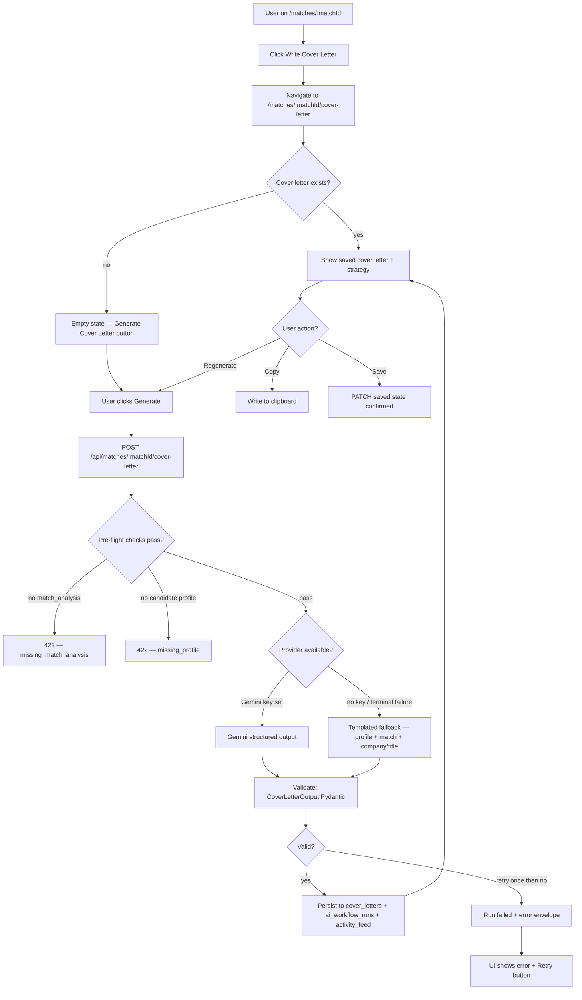
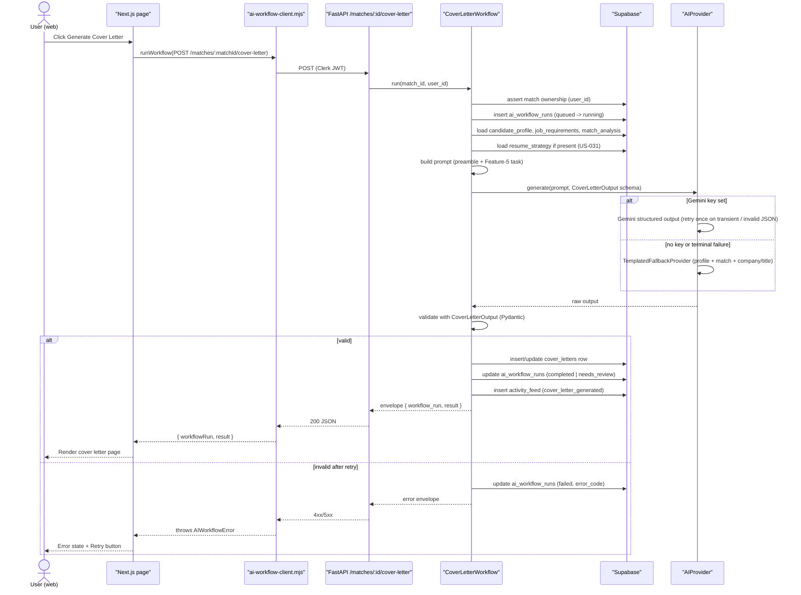
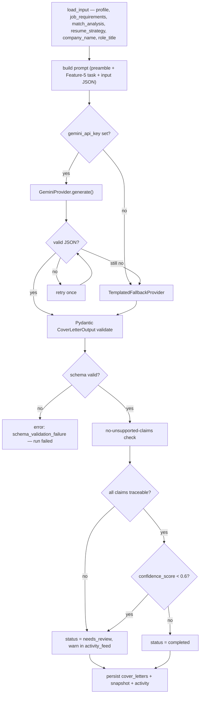
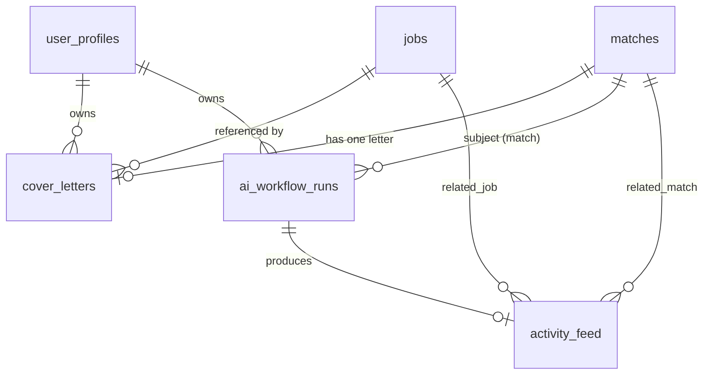
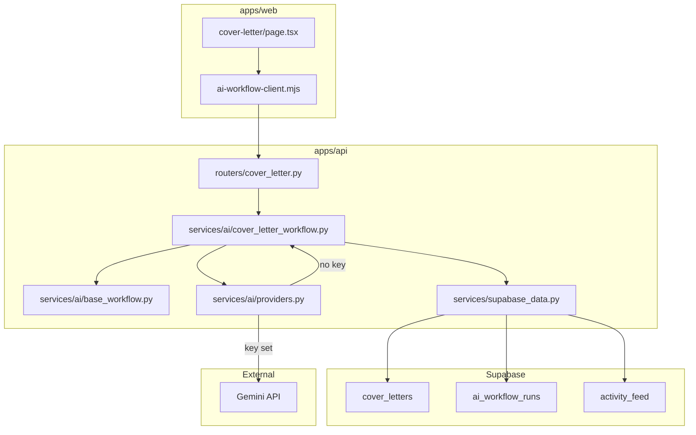

# US-033 — AI Cover Letter Generation · Dev Flow

> **Feature 5** of `applywise_ai_assistant_update_tasks.md`. This story adds
> AI-powered personalized cover letter generation built on the US-027
> `BaseAIWorkflow` foundation. Conventions defined in US-027 (envelope,
> `BaseAIWorkflow`, `ai_workflow_runs`, `activity_feed`, error taxonomy, prompt
> preamble, provider/fallback rule, `workflow_type` enum) are reused here without
> redefinition. Direction: `docs/decisions/0012-ai-workflow-standards.md`.

---

## 1. Feature Summary

- **What it does:** Adds a `CoverLetterWorkflow` that accepts candidate profile,
  job requirements, match analysis, optional resume strategy (from US-031 if
  present), company name, and role title — and returns a personalized cover
  letter, the strategy behind it, the key points used, claims deliberately
  avoided, a tone classification, and a confidence score. Results persist to a
  new `cover_letters` table. A new page at
  `apps/web/src/app/(app)/matches/[matchId]/cover-letter/page.tsx` lets users
  read, copy, save, and regenerate the letter.
- **Why the user needs it:** Cover letters are the first manual writing task
  after a match is scored. Without this feature the user must draft from
  scratch, risking generic language and unsupported claims. With it, ApplyWise
  provides a personalized, evidence-grounded starting point that also explains
  what it chose to include and what it chose to omit.
- **Problem it solves:** No cover letter generation exists anywhere in the
  codebase today — this is a net-new feature. The closest prior output is the
  deterministic match analysis, which produces fit reasoning but no prose
  letter.
- **MVP connection:** Extends the existing match-centric routing pattern (same
  router directory as `apps/api/app/routers/matches.py`), reuses
  `SupabaseDataClient` from `apps/api/app/services/supabase_data.py`, reads
  `settings.gemini_*` from `apps/api/app/settings.py`, and mounts in
  `apps/api/app/main.py`. The fallback is a templated letter assembled from
  US-028 match analysis + candidate profile + job company/title, producing no
  unsupported claims.

---

## 2. User Flow

1. **Entry point:** `/matches/[matchId]` (existing match detail page) — user
   sees a *Write Cover Letter* button after match analysis has run (US-028).
2. **Navigation:** clicking the button navigates to
   `/matches/[matchId]/cover-letter`.
3. **Empty state:** if no cover letter exists for this match, the page shows an
   empty state with a *Generate Cover Letter* button.
4. **Generation:** user clicks *Generate Cover Letter*; a loading state appears
   ("ApplyWise is writing your cover letter…").
5. **AI processing:** `POST /api/matches/{matchId}/cover-letter` triggers
   `CoverLetterWorkflow`; Gemini generates cover letter + strategy + key points
   + claims avoided + tone + confidence score; result persists to
   `cover_letters`.
6. **Result displayed:** page renders the Cover Letter Strategy panel, Generated
   Cover Letter panel, Key Points Used list, and Claims Avoided list.
7. **Copy:** user clicks *Copy* — letter text is written to clipboard.
8. **Save:** cover letter is auto-saved on generation; user can click *Save* to
   confirm or save edits.
9. **Regenerate:** user clicks *Regenerate*; `POST
   /api/matches/{matchId}/cover-letter/regenerate` creates a new run; the
   previous letter is overwritten; run history is preserved in
   `ai_workflow_runs`.



---

## 3. Technical Flow

- **Frontend page:** `apps/web/src/app/(app)/matches/[matchId]/cover-letter/page.tsx`
  (new). Uses the existing envelope client from
  `apps/web/src/lib/ai-workflow-client.mjs` (built in US-027). Navigation link
  added to `apps/web/src/app/(app)/matches/[matchId]/page.tsx`.
- **API endpoints:** three new routes in
  `apps/api/app/routers/cover_letter.py` (new file) — `POST
  /api/matches/{matchId}/cover-letter`, `GET
  /api/matches/{matchId}/cover-letter`, `POST
  /api/matches/{matchId}/cover-letter/regenerate`. Router mounted in
  `apps/api/app/main.py`.
- **Backend service:** `apps/api/app/services/ai/cover_letter_workflow.py`
  (new, `CoverLetterWorkflow` extending `BaseAIWorkflow` from
  `apps/api/app/services/ai/base_workflow.py`).
- **AI helper:** reuses `generate_structured(...)` extracted in US-027 from
  `job_extractor.py` / `candidate_profile_extractor.py`; inherits the retry and
  backoff logic already validated there.
- **DB persistence:** new `cover_letters` table (§5); new
  `SupabaseDataClient` methods `insert_cover_letter`, `get_cover_letter_by_match`,
  `update_cover_letter` added to
  `apps/api/app/services/supabase_data.py`.
- **Settings:** reuses `settings.gemini_api_key`, `settings.gemini_model`,
  `settings.gemini_max_attempts`, `settings.gemini_retry_base_delay_seconds`
  from `apps/api/app/settings.py` — no new config keys.
- **Error handling:** inherits typed taxonomy from
  `apps/api/app/services/ai/errors.py` (US-027); adds `missing_match_analysis`
  guard (§6).
- **Response:** standard US-027 envelope `{ workflow_run, result }`.



---

## 4. AI Behavior

**Standard prompt preamble** (US-027, Feature 12.4 — used verbatim):

```text
Role: You are ApplyWise, an AI job hunting assistant for software engineers
      targeting AI roles in the US market.
Source of truth: Use only the provided candidate profile, resume, and job
      description.
Truthfulness: Do not invent experience, skills, projects, companies, dates,
      metrics, or certifications.
Output: Return valid JSON matching the provided schema.
Tone: Clear, direct, helpful, professional.
```

**Feature 5 task appended after preamble:**

```text
Task: Generate a personalized cover letter for the candidate applying to the
      given role at the given company.

The cover letter MUST:
- Reference the company name and role title when provided.
- Draw exclusively on the candidate_profile, job_requirements, and
  match_analysis supplied below.
- Explain why the candidate is a fit using relevant technical evidence
  from their actual experience.
- Highlight transferable experience where a direct match is absent.
- Close professionally.
- Never state a skill, project, metric, or certification that is not
  evidenced in the candidate profile or match analysis.

The cover_letter_strategy MUST explain in plain language what angle was
chosen and why — so the candidate understands the reasoning.

claims_avoided MUST list any claims the candidate might expect to see
that were deliberately omitted because there is no supporting evidence.

Return valid JSON matching the schema exactly.
```

**Input the model receives** (§5.2 from brief):

```json
{
  "candidate_profile": {},
  "job_requirements": {},
  "match_analysis": {},
  "resume_strategy": "string",
  "company_name": "string",
  "role_title": "string"
}
```

**Output schema** (§5.4 from brief — verbatim):

```json
{
  "cover_letter": "string",
  "cover_letter_strategy": "string",
  "key_points_used": ["string"],
  "claims_avoided": ["string"],
  "tone": "professional | concise | enthusiastic",
  "confidence_score": 0.0
}
```

**No-unsupported-claims rule:** `CoverLetterWorkflow.validate()` checks that
every skill, company, metric, and certification mentioned in `cover_letter` can
be traced to `candidate_profile` or `match_analysis.top_strengths`. If a claim
cannot be traced, the run is flagged `needs_review` rather than `failed` (it
has a valid schema), and the `activity_feed` description includes a warning.

**Validation and failure path:**

1. Parse JSON — on invalid JSON, retry once (same pattern as `job_extractor.py`
   `_generate_with_retry`).
2. Pydantic `CoverLetterOutput` validate — on schema failure, fall back to
   `TemplatedFallbackProvider`.
3. `TemplatedFallbackProvider` assembles a safe letter from profile + match +
   company/title fields only, guaranteed to make no unsupported claims. It
   always passes validation.
4. If even the fallback fails Pydantic (internal logic error), run is `failed`
   with `error_code = schema_validation_failure`.

**UI display:** consumers render `result.cover_letter`; `result.cover_letter_strategy`
goes in the Strategy panel; `result.key_points_used` and `result.claims_avoided`
go in their respective lists; `workflow_run.status` drives the badge;
`confidence_score` is shown as a percentage in the strategy panel header.

**User-facing assistant description example** (§5.5 from brief — used verbatim
in `activity_feed.assistant_description`):

```text
ApplyWise wrote this cover letter around your strongest supported angle:
backend engineering experience that can transfer into AI product engineering.
It avoids claiming production RAG or vector database experience because that
evidence is not present in your profile.
```



---

## 5. Data Model Impact

**New table** `cover_letters` (migration tentative: `0015_period8_cover_letter.sql`).
Existing tables unchanged.

`cover_letters`

| Column | Type | Notes |
| --- | --- | --- |
| id | uuid pk | default gen_random_uuid() |
| user_id | uuid not null fk → user_profiles(id) on delete cascade | ownership |
| match_id | uuid not null fk → matches(id) on delete cascade | one letter per match (upsert) |
| job_id | uuid not null fk → jobs(id) on delete cascade | denormalized for fast lookup |
| cover_letter | text not null | generated prose |
| cover_letter_strategy | text not null | strategy explanation |
| key_points_json | jsonb not null default '[]' | key_points_used array |
| claims_avoided_json | jsonb not null default '[]' | claims_avoided array |
| tone | text not null | `professional \| concise \| enthusiastic` |
| confidence_score | numeric not null | 0.0–1.0 |
| provider | text not null | `gemini \| deterministic` |
| created_at | timestamptz not null default now() | |
| updated_at | timestamptz not null default now() | updated on regenerate |

Index: `(user_id, match_id)` unique (one active letter per match; regenerate
overwrites). Index: `(user_id, job_id)` for job-centric lookups.

**Relationships:**

- `cover_letters.user_id → user_profiles.id` (cascade delete — letter deleted
  if user is deleted).
- `cover_letters.match_id → matches.id` (cascade delete — letter deleted if
  match is deleted).
- `cover_letters.job_id → jobs.id` (cascade delete — letter deleted if job is
  deleted).
- `ai_workflow_runs` records each generation attempt with `workflow_type =
  cover_letter` and `subject_type = match`, `subject_id = match_id`.
- `activity_feed` receives one row per successful generation with
  `related_match_id` and `related_job_id` set and `assistant_description`
  matching §5.5.

Assumption: `matches` already carries `job_id` as a column (confirmed by
migration `0002_period2_matches.sql`). `CoverLetterWorkflow.load_input()` reads
`job_id` from the match row to denormalize into `cover_letters`.

**Example persisted JSON** (what `cover_letters` row looks like after a
successful Gemini run):

```json
{
  "id": "cl-uuid",
  "user_id": "user-uuid",
  "match_id": "match-uuid",
  "job_id": "job-uuid",
  "cover_letter": "Dear Hiring Manager at Acme AI,\n\nI am applying for the Senior Backend Engineer role...",
  "cover_letter_strategy": "Led with backend systems depth and Python/FastAPI alignment. Positioned LLM integration work as transferable AI product experience. Omitted RAG claim — no production evidence.",
  "key_points_json": ["5 years Python/FastAPI", "Led real-time data pipeline at prior company", "Built internal LLM tooling"],
  "claims_avoided_json": ["Production RAG deployment", "Vector database experience"],
  "tone": "professional",
  "confidence_score": 0.84,
  "provider": "gemini",
  "created_at": "2026-06-08T10:00:00Z",
  "updated_at": "2026-06-08T10:00:00Z"
}
```



---

## 6. API Requirements

All endpoints require Clerk JWT. The user_id resolved from the JWT must match
`matches.user_id`; failure returns `unauthorized`.

### `POST /api/matches/{matchId}/cover-letter`

Trigger cover letter generation for a match the caller owns.

Request body: none (match is the path param). Optional
`{ "tone_preference": "professional | concise | enthusiastic" }` — passed as a
hint in the prompt; model may deviate if other signals suggest a different tone.

Response `200`: standard US-027 envelope with `workflow_type: cover_letter`.

```json
{
  "workflow_run": {
    "id": "wf-uuid",
    "workflow_type": "cover_letter",
    "status": "completed",
    "model_provider": "gemini",
    "model_name": "gemini-2.5-flash",
    "latency_ms": 2340,
    "confidence_score": 0.84,
    "error_message": null
  },
  "result": {
    "cover_letter": "Dear Hiring Manager at Acme AI,\n\n...",
    "cover_letter_strategy": "Led with backend systems depth...",
    "key_points_used": ["5 years Python/FastAPI", "LLM tooling"],
    "claims_avoided": ["Production RAG deployment"],
    "tone": "professional",
    "confidence_score": 0.84
  }
}
```

### `GET /api/matches/{matchId}/cover-letter`

Return the saved cover letter (and latest `ai_workflow_runs` row) for the match,
or `404` if none has been generated.

Response `200`:

```json
{
  "workflow_run": { "...latest run for cover_letter workflow_type..." },
  "result": { "...cover_letters row fields..." }
}
```

### `POST /api/matches/{matchId}/cover-letter/regenerate`

Create a new run; overwrite the `cover_letters` row; retain prior
`ai_workflow_runs` rows for history.

Request body: optional `{ "tone_preference": "..." }`.

Response `200`: same envelope as the generate endpoint.

### Error table

| Code | HTTP | retryable | When |
| --- | --- | --- | --- |
| unauthorized | 403 | false | match not owned by caller |
| missing_profile | 422 | false | no candidate profile on record |
| missing_job_requirements | 422 | false | job not parsed (no job_requirements) |
| missing_match_analysis | 422 | false | US-028 match analysis not yet run for this match |
| invalid_json | 502 | true | model output unparseable after one retry |
| schema_validation_failure | 502 | true | parsed but fails CoverLetterOutput Pydantic |
| model_timeout | 503 | true | Gemini request exceeds timeout |
| network_failure | 503 | true | provider unreachable |
| provider_rate_limit | 503 | true | Gemini 429 exhausted after retries |

Error envelope (US-027 format):

```json
{ "error": { "code": "missing_match_analysis", "message": "Run match analysis first before generating a cover letter.", "retryable": false } }
```

The `missing_match_analysis` guard is the cover-letter-specific pre-flight:
`CoverLetterWorkflow.load_input()` checks that `match_analysis` is non-null on
the match row before building the prompt.

---

## 7. UI Requirements

### Page: `apps/web/src/app/(app)/matches/[matchId]/cover-letter/page.tsx` (new)

**Sections** (§5.6 from brief):

1. **Cover Letter Strategy** — renders `result.cover_letter_strategy` as a card.
   Shows `confidence_score` as a percentage badge. Shows `tone` as a tag.
2. **Generated Cover Letter** — renders `result.cover_letter` in a read-only
   textarea or formatted prose block. Preserves newlines.
3. **Key Points Used** — bulleted list from `result.key_points_used`.
4. **Claims Avoided** — bulleted list from `result.claims_avoided` with a brief
   explanatory label ("ApplyWise intentionally omitted these because they are not
   supported by your profile").
5. **Copy button** — calls `navigator.clipboard.writeText(result.cover_letter)`;
   shows "Copied!" confirmation for 2 seconds.
6. **Save button** — disabled when no edits; triggers `PUT
   /api/matches/{matchId}/cover-letter` with edited text. Assumption: editing is
   in-place within the cover letter textarea.
7. **Regenerate button** — calls `POST
   /api/matches/{matchId}/cover-letter/regenerate` via `ai-workflow-client.mjs`;
   confirmation dialog ("This will replace your current cover letter.") before
   sending.

**States:**

- **Loading:** spinner + "ApplyWise is writing your cover letter…" centered in
  the page. Buttons disabled.
- **Empty (not generated):** empty state illustration + "No cover letter yet"
  heading + *Generate Cover Letter* button.
- **Success (`completed`):** all sections rendered; Copy, Save, Regenerate
  buttons active.
- **needs_review:** success layout + amber badge "Review recommended — some
  claims may need verification."
- **Error (`failed`):** error message from `error.message` + *Retry* button
  (only when `error.retryable`). Prior saved letter (if any) remains visible
  with a "Previous version" label.

**Navigation entry point:** `apps/web/src/app/(app)/matches/[matchId]/page.tsx`
— add a *Write Cover Letter* button/link after the match analysis section,
visible only when `match_analysis` has been run (i.e., match status is not
empty).

---

## 8. Acceptance Criteria

- **Given** a match I own with completed match analysis, **when** I call
  `POST /api/matches/{matchId}/cover-letter`, **then** an `ai_workflow_runs` row
  is created (`queued→running→completed`), a `cover_letters` row is persisted,
  and an `activity_feed` row is written with the §5.5 assistant description
  pattern.
- **Given** `company_name` and `role_title` are present on the job record,
  **then** `cover_letter` text references both explicitly.
- **Given** the candidate's profile lacks evidence for a required skill, **then**
  that skill appears in `claims_avoided` and does not appear as a stated
  capability in `cover_letter`.
- **Given** a successful generation, **when** I view
  `/matches/[matchId]/cover-letter`, **then** I see the Cover Letter Strategy
  panel, the Generated Cover Letter, Key Points Used list, and Claims Avoided
  list.
- **Given** I click *Copy*, **then** the cover letter text is written to the
  clipboard and a "Copied!" confirmation appears.
- **Given** a cover letter has been generated, **then** it is saved to
  `cover_letters` without requiring a manual save action (auto-save on
  generation).
- **Given** I click *Regenerate* and confirm, **then** `POST regenerate` is
  called, a new `ai_workflow_runs` row is created, the `cover_letters` row is
  overwritten, and the page re-renders the new letter.
- **Given** the Cover Letter Strategy section is visible, **then** I can read the
  AI's reasoning in plain language (not JSON, not raw field names).
- **Given** `gemini_api_key` is unset, **when** generation runs, **then** the
  templated fallback produces a schema-valid cover letter that makes no
  unsupported claims, and `provider = deterministic` is recorded.
- **Given** the model returns invalid JSON, **when** generation runs, **then** it
  retries once, then falls back to the templated provider; if both fail,
  `run = failed` with `error_code = schema_validation_failure` and the API
  returns a retryable error envelope.
- **Given** a match I do not own, **when** I call any cover-letter endpoint,
  **then** I receive `unauthorized` (403) and no run or letter is written.
- **Given** match analysis has not been run for this match, **when** I call
  generate, **then** I receive `missing_match_analysis` (422) with a message
  directing me to run analysis first.
- **Given** a successful or failed run, **then** no raw resume text, candidate
  PII, or prompt body appears in emitted server logs.

---

## 9. Mermaid Diagrams

User flow (§2), technical sequence (§3), AI processing flowchart (§4), and the
ER diagram (§5) are embedded in their respective sections and render as-is.

**Data-flow summary:**



---

## 10. Development Tasks

### Database

1. Write `apps/web/supabase/migrations/0015_period8_cover_letter.sql`
   (tentative number — renumber if migrations 0012–0014 are created first):
   - Create `cover_letters` table with all columns in §5.
   - Add unique index `(user_id, match_id)`.
   - Add index `(user_id, job_id)`.
   - Add FK constraints with cascade-delete to `user_profiles`, `matches`,
     and `jobs`.
   - Add `updated_at` trigger (reuse pattern from existing migrations).

### Backend

2. `apps/api/app/services/ai/cover_letter_workflow.py` (new):
   - `CoverLetterWorkflow(BaseAIWorkflow)` subclass.
   - `load_input()`: fetch `candidate_profile`, `job_requirements` (from
     `jobs`), `match_analysis` (from `matches`), `resume_strategy` if present,
     `company_name`, `role_title`; raise `missing_match_analysis` guard if
     `match_analysis` is null.
   - `build_prompt()`: standard preamble + Feature-5 task text + input JSON.
   - `output_model`: `CoverLetterOutput` (Pydantic, §5.4 schema).
   - `deterministic_fallback()`: `TemplatedFallbackProvider` — assembles prose
     letter from profile skills + match strengths + company/title only.
   - `persist()`: upsert `cover_letters` row; write `activity_feed` with §5.5
     description pattern.
   - `validate()`: no-unsupported-claims check; flag `needs_review` if any
     claim cannot be traced; always pass (never `failed`) if schema is valid.

3. `apps/api/app/routers/cover_letter.py` (new):
   - `POST /matches/{matchId}/cover-letter` → `CoverLetterWorkflow.run()`.
   - `GET /matches/{matchId}/cover-letter` → `SupabaseDataClient.get_cover_letter_by_match()`.
   - `POST /matches/{matchId}/cover-letter/regenerate` → `CoverLetterWorkflow.run(regenerate=True)`.
   - Auth via Clerk JWT; ownership assertion before any DB write.
   - Mount in `apps/api/app/main.py` (add `app.include_router(cover_letter_router)`).

4. `apps/api/app/services/supabase_data.py` — add methods:
   - `insert_cover_letter(data: dict) -> dict`
   - `get_cover_letter_by_match(match_id: str, user_id: str) -> dict | None`
   - `update_cover_letter(match_id: str, user_id: str, data: dict) -> dict`

5. `apps/api/app/services/ai/errors.py` — add `missing_match_analysis` to the
   error taxonomy (HTTP 422, retryable=False).

### AI Integration

6. `apps/api/app/services/ai/cover_letter_workflow.py` — wire the standard
   prompt preamble constant (from `base_workflow.py`) + append Feature-5 task
   string; bind `CoverLetterOutput` Pydantic model to `GeminiProvider`
   structured-output config (`response_schema=CoverLetterOutput`).

7. `TemplatedFallbackProvider` inside `cover_letter_workflow.py` (or in
   `apps/api/app/services/ai/providers.py`): pulls `top_strengths` from
   `match_analysis`, formats them into a safe prose template, fills in
   `company_name` / `role_title` if present, sets `confidence_score = 0.5`,
   `provider = deterministic`, `tone = professional`.

### Frontend

8. `apps/web/src/app/(app)/matches/[matchId]/cover-letter/page.tsx` (new):
   - Server component shell + client island for interactive copy/regenerate.
   - Initial data fetched via `GET /api/matches/{matchId}/cover-letter`; empty
     state if 404.
   - All seven sections from §7 (Strategy, Letter, Key Points, Claims Avoided,
     Copy, Save, Regenerate).
   - Loading, success, `needs_review`, error, and empty states (§7).

9. `apps/web/src/app/(app)/matches/[matchId]/page.tsx` — add *Write Cover
   Letter* navigation button after the match analysis section; link to
   `./cover-letter`; visible only when `match_analysis` is non-null.

### Testing

10. `apps/api/tests/test_cover_letter_workflow.py` (new):
    - Provider selection (Gemini key set vs. unset → deterministic).
    - Retry on invalid JSON → falls back to templated.
    - `missing_match_analysis` guard: no match_analysis → 422.
    - Ownership denial: wrong user_id → 403, no DB writes.
    - No-unsupported-claims flag: mock claim not in profile → `needs_review`.
    - Persist: `cover_letters` row upserted, `ai_workflow_runs` updated,
      `activity_feed` written.
    - Log redaction: no raw cover letter text or prompt body in emitted logs.
    - All tests use a fake provider; no live Gemini calls.

11. `apps/web/tests/cover-letter-page.test.mjs` (new):
    - Empty state renders when GET returns 404.
    - Loading state shown while generate is in flight.
    - Result sections render after successful generation.
    - Copy button writes to `navigator.clipboard`.
    - Regenerate button shows confirmation dialog; calls regenerate endpoint on
      confirm; cancels on dismiss.
    - `needs_review` badge shown when `workflow_run.status = needs_review`.
    - Error + Retry shown when run is `failed` and `error.retryable = true`.
