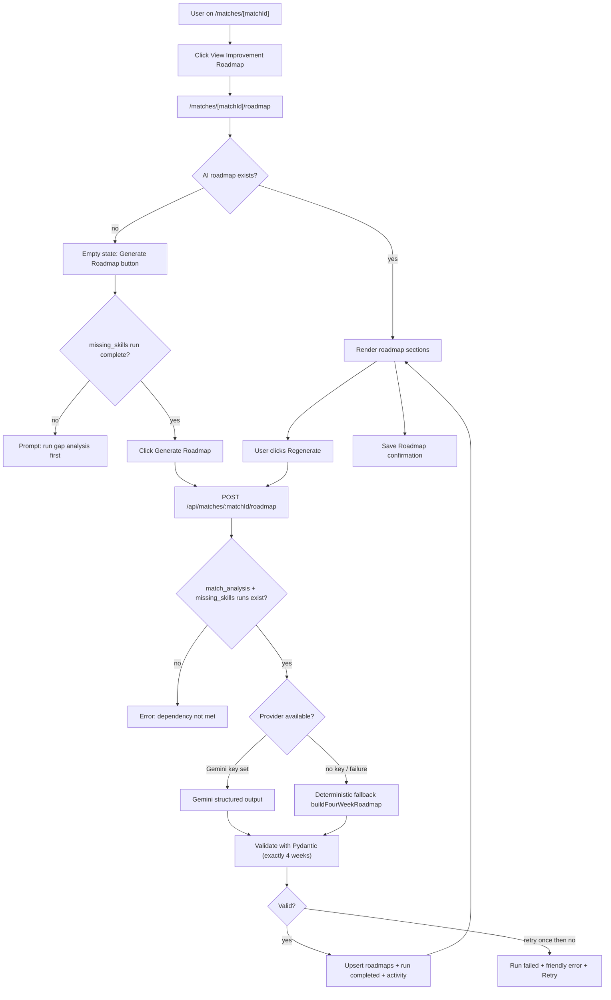
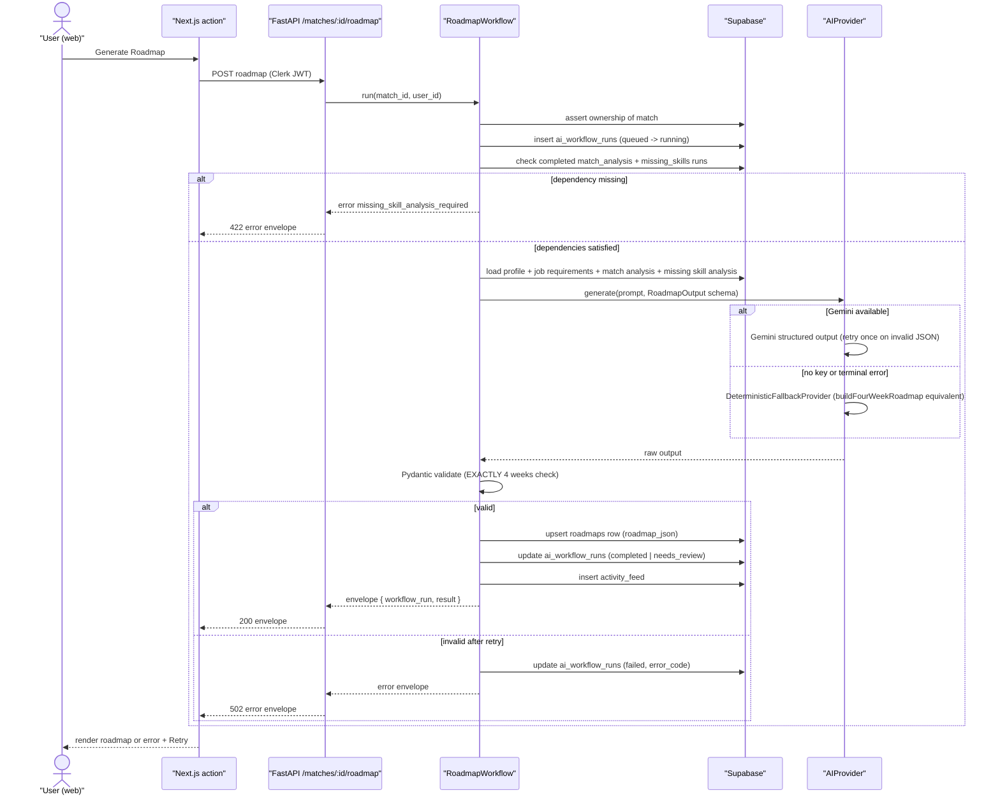
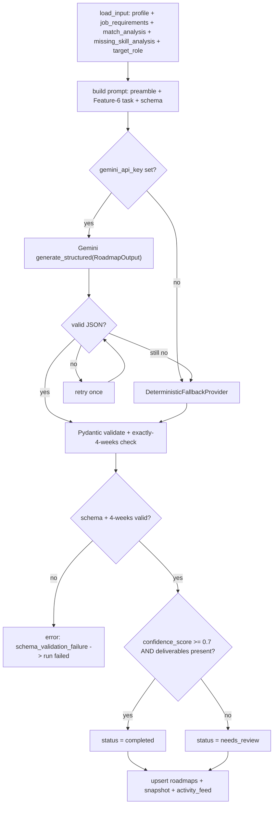
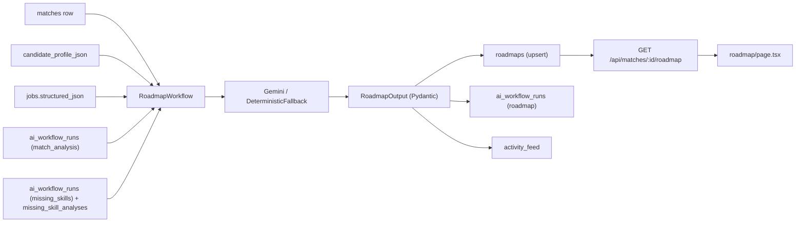
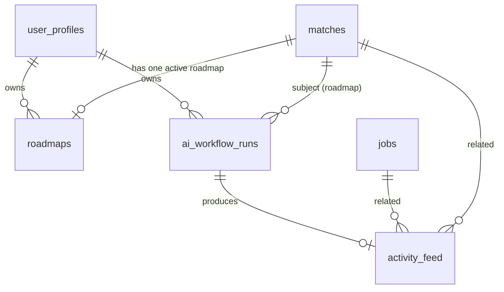

# US-034 — AI 4-Week Improvement Roadmap · Dev Flow

> **Feature 6** of `applywise_ai_assistant_update_tasks.md`. Depends on
> US-027 (BaseAIWorkflow, ai_workflow_runs, activity_feed, error taxonomy,
> prompt preamble, envelope), US-028 (match analysis — provides match context),
> and US-029 (missing skill analysis — provides missing_skill_analysis input).
> Reads the match-centric route convention from
> `docs/decisions/0012-ai-workflow-standards.md`. Do not re-decide provider
> selection, envelope format, or error codes — inherit from US-027.
>
> **Upgrades:** US-010 (deterministic roadmap). The deterministic file
> `apps/web/src/lib/roadmap-generator.mjs` (`buildFourWeekRoadmap`) becomes the
> typed fallback; do not delete it.

---

## 1. Feature Summary

- **What it does:** For a scored match, ApplyWise generates a structured 4-week
  improvement roadmap that closes the most critical skill gaps the user must
  address to compete for the target role. Each week has a concrete goal, skills
  to cover, tasks, deliverables, a project feature to build, a future-use resume
  bullet, and an interview talking point. The result is saved to the existing
  `roadmaps` table, regenerable on demand, and displayed on the existing
  `/matches/[matchId]/roadmap` page (upgraded from its current deterministic
  form).
- **Why the user needs it:** A gap analysis (US-029) tells users what is missing.
  This feature tells them how to close those gaps in a realistic timeframe with
  visible, portfolio-ready output — turning ApplyWise into a career improvement
  assistant, not just a scoring tool.
- **Problem it solves:** The current roadmap page uses the deterministic
  `buildFourWeekRoadmap` (no Gemini, no missing_skill_analysis input, no
  `roadmap_summary`, no `recommended_project_theme`, no `success_criteria`, no
  `confidence_score`). The result is generic. This story replaces the generation
  path with a Gemini-backed workflow that uses the full AI context available
  after US-028 and US-029 run.
- **MVP connection:** Reuses `BaseAIWorkflow` (US-027), the Gemini provider and
  fallback already wired, `SupabaseDataClient`, `apps/api/app/settings.py`
  Gemini config, and the existing `roadmaps` table
  (`0005_period3_roadmaps.sql`). The existing page
  `apps/web/src/app/(app)/matches/[matchId]/roadmap/page.tsx` is upgraded in
  place; no new route is created.

---

## 2. User Flow

1. **Entry point:** `/matches/[matchId]/gaps` (US-029 page) shows a
   *View Improvement Roadmap* link/button once a missing-skill analysis exists.
   Alternatively, the user reaches `/matches/[matchId]/roadmap` via the match
   detail sidebar.
2. **Navigate:** user lands on `/matches/[matchId]/roadmap`.
3. **Empty state:** if no AI-generated roadmap exists, the page shows an empty
   state card with a *Generate Roadmap* button (same `RoadmapForm` component,
   upgraded action).
4. **Dependency guard:** before calling the backend, the UI checks whether a
   completed `missing_skills` workflow run exists. If not, it shows a message
   prompting the user to run gap analysis first.
5. **User action:** clicks *Generate Roadmap*.
6. **System response:** web calls `POST /api/matches/{matchId}/roadmap`; backend
   runs `RoadmapWorkflow` (extends `BaseAIWorkflow`).
7. **Backend dependency guard:** backend checks that completed `match_analysis`
   and `missing_skills` workflow runs exist. Returns `missing_skill_analysis_required`
   if not.
8. **AI processing:** loads candidate profile, job requirements, match analysis,
   missing skill analysis, and target role; calls Gemini (or deterministic
   fallback `buildFourWeekRoadmap`); validates output; upserts `roadmaps` row.
9. **Result shown:** page renders the roadmap sections described in §7.
10. **Regenerate:** *Regenerate* button calls
    `POST /api/matches/{matchId}/roadmap/regenerate`; a new `ai_workflow_runs`
    row is written and the `roadmaps` row is replaced.
11. **Save:** *Save Roadmap* button is already satisfied by auto-persistence on
    generate; the button re-confirms the last-saved timestamp and can trigger an
    explicit upsert if the user has edited notes locally.



---

## 3. Technical Flow

- **Frontend:**
  - Page: `apps/web/src/app/(app)/matches/[matchId]/roadmap/page.tsx` (upgraded
    in place — reads from `roadmaps` table and `ai_workflow_runs`).
  - Form: `apps/web/src/components/forms/roadmap-form.tsx` (upgraded action to
    call `/api/matches/{matchId}/roadmap` instead of inline deterministic).
  - Client: `apps/web/src/lib/ai-workflow-client.mjs` (US-027 standard envelope
    client — reuse `runWorkflow`).
  - Dependency check: reads latest `ai_workflow_runs` status for
    `workflow_type = missing_skills` before enabling the Generate button.

- **API router:** `apps/api/app/routers/matches.py` (new or extended) —
  `POST /api/matches/{matchId}/roadmap`,
  `GET /api/matches/{matchId}/roadmap`,
  `POST /api/matches/{matchId}/roadmap/regenerate`.
  Mounted in `apps/api/app/main.py`.

- **Backend service:**
  - `apps/api/app/services/ai/roadmap_workflow.py` (new) — `RoadmapWorkflow`
    extends `BaseAIWorkflow` (US-027).
  - `apps/api/app/schemas/roadmap.py` (new) — `RoadmapOutput` Pydantic model
    mirroring the 6.4 schema; extends shared base with `confidence_score`.
  - Deterministic fallback wraps the existing `buildFourWeekRoadmap` logic
    (translated to Python) producing schema-valid `RoadmapOutput`.

- **AI helper:** reuses `generate_structured(...)` from
  `apps/api/app/services/ai/providers.py` (US-027).

- **DB persistence:** `SupabaseDataClient` new methods in
  `apps/api/app/services/supabase_data.py`:
  - `upsert_roadmap(user_id, match_id, title, roadmap_json)` — upserts the
    `roadmaps` row (one active roadmap per match).
  - `get_roadmap_for_match(match_id)` — returns the latest `roadmaps` row.
  - Reuses `insert_workflow_run`, `update_workflow_run`, `insert_activity`,
    `get_match_with_resume_and_job` (all US-027).

- **External integration:** Gemini via `settings.gemini_api_key`,
  `settings.gemini_model` (`gemini-2.5-flash`), `settings.gemini_max_attempts`,
  `settings.gemini_retry_base_delay_seconds`.

- **Error handling:** typed taxonomy (US-027) → error envelope
  `{ error: { code, message, retryable } }`. Run row always written.



---

## 4. AI Behavior

### Prompt Preamble (US-027 standard — do not alter)

```text
Role: You are ApplyWise, an AI job hunting assistant for software engineers
      targeting AI roles in the US market.
Source of truth: Use only the provided candidate profile, resume, and job
      description.
Truthfulness: Do not invent experience, skills, projects, companies, dates,
      metrics, or certifications.
Output: Return valid JSON matching the provided schema.
Tone: Clear, direct, helpful, professional.
```

### Feature-6 Task Prompt (appended after preamble)

```text
Task: Generate a 4-week improvement roadmap for the candidate based on the
      provided match analysis, missing skill analysis, candidate profile,
      job requirements, and target role.

Roadmap rules (enforce strictly):
- Generate EXACTLY 4 weeks. No more, no fewer.
- Critical gaps (severity = "critical") must appear in Week 1 or Week 2.
- Every week must produce a visible, concrete deliverable.
- Resume bullets must be phrased as future-use after completion —
  NOT as current experience. The UI will label them "Use after completion."
- Do not make unrealistic claims such as "master ML in 4 weeks."
- Favor practical AI engineering skills: LLM API integration, structured
  output, RAG, pgvector, evaluation pipelines, and deployment.
- recommended_project_theme should be a single coherent project the
  candidate can build across all 4 weeks, extending it each week.
- success_criteria should describe observable outcomes the candidate can
  verify at the end of week 4.
- confidence_score (0.0–1.0) reflects how well the roadmap matches the
  candidate's actual gaps and the job requirements.
```

### Output Schema (Feature 6.4 — verbatim)

```json
{
  "roadmap_summary": "string",
  "recommended_project_theme": "string",
  "weeks": [
    {
      "week": 1,
      "goal": "string",
      "skills_covered": ["string"],
      "tasks": ["string"],
      "deliverables": ["string"],
      "project_feature": "string",
      "resume_bullet_after_completion": "string",
      "interview_talking_point": "string"
    }
  ],
  "success_criteria": ["string"],
  "confidence_score": 0.0
}
```

`weeks` must contain exactly 4 elements with `week` values 1, 2, 3, 4.

### Roadmap Rules (Feature 6.5 — verbatim)

```text
- Always generate exactly 4 weeks.
- Critical gaps should appear in Week 1 or Week 2.
- Every week must produce a visible deliverable.
- Resume bullets must be phrased as future-use after completion, not current experience.
- Avoid unrealistic claims like "master ML in 4 weeks."
- Favor practical AI engineering skills: LLM API, structured output, RAG, pgvector, evaluation, deployment.
```

### User-Facing Assistant Description (Feature 6.6 — verbatim example)

```text
ApplyWise recommends a 4-week roadmap focused on the gaps that matter most
for this role: RAG, vector databases, LLM structured output, and deployment.
Completing this roadmap would give you stronger evidence for future AI
Engineer applications.
```

This text is stored in `activity_feed.assistant_description` (filled by the
`activity_description` workflow run, US-037). In the interim, a static fallback
is acceptable.

### Validation

1. Parse Gemini response JSON.
2. Pydantic validate against `RoadmapOutput`.
3. **EXACTLY-4-weeks check:** assert `len(output.weeks) == 4` and
   `{w.week for w in output.weeks} == {1, 2, 3, 4}`. If this fails, treat as
   schema validation failure → retry once, then fallback.
4. **Critical-gap placement check:** if any incoming gap has severity
   `critical` and no week 1 or 2 `skills_covered` overlaps with it, set
   `confidence_score` floor to 0.5 and status to `needs_review` (do not fail;
   flag for human review).
5. **Deliverable presence check:** if any week has an empty `deliverables`
   list, set status to `needs_review`.
6. **confidence_score ≥ 0.7** → status `completed`; < 0.7 → `needs_review`.
7. On any unrecoverable failure → status `failed`, typed error code.

### Deterministic Fallback

The fallback is a Python port of `apps/web/src/lib/roadmap-generator.mjs`
(`buildFourWeekRoadmap`). It sorts `missing_skill_analysis` gaps by severity,
assigns one gap per week (using the same 4 fallback skills for surplus weeks),
and produces output conforming exactly to the 6.4 schema. `confidence_score`
is set to `0.5`; `recommended_project_theme` uses a generic portfolio project
template; `success_criteria` lists 3 generic observable outcomes.

### AI Processing Flowchart



---

## 5. Data Model Impact

### Reuse: `roadmaps` table (no schema migration required)

Defined in `apps/web/supabase/migrations/0005_period3_roadmaps.sql`. Do not
create a new table.

| Column | Type | Notes |
| --- | --- | --- |
| id | uuid pk | `gen_random_uuid()` |
| user_id | uuid fk → user_profiles(id) cascade | ownership — assert on every write |
| match_id | uuid fk → matches(id) cascade | one-to-one active roadmap per match |
| title | text not null | e.g. `"4-week AI Engineer improvement roadmap"` |
| roadmap_json | jsonb not null | full 6.4 output schema (see below) |
| created_at | timestamptz | |
| updated_at | timestamptz | |

Existing indexes (`roadmaps_user_id_created_at_idx`,
`roadmaps_match_id_created_at_idx`) are sufficient. No new indexes needed.

### `roadmap_json` shape

The `roadmap_json` column stores the complete 6.4 AI output verbatim:

```json
{
  "roadmap_summary": "string",
  "recommended_project_theme": "string",
  "weeks": [
    {
      "week": 1,
      "goal": "string",
      "skills_covered": ["string"],
      "tasks": ["string"],
      "deliverables": ["string"],
      "project_feature": "string",
      "resume_bullet_after_completion": "string",
      "interview_talking_point": "string"
    },
    { "week": 2, "...": "..." },
    { "week": 3, "...": "..." },
    { "week": 4, "...": "..." }
  ],
  "success_criteria": ["string"],
  "confidence_score": 0.82
}
```

The `title` column stores the human-readable title (e.g.
`"4-week AI Engineer improvement roadmap for Acme Corp"`).

### Tentative additive columns (optional migration)

**Assumption:** these columns do not exist yet. They may be added additively in
a new migration `apps/web/supabase/migrations/0012_period8_roadmap_ai_columns.sql`
if the team decides to surface them independently of `roadmap_json`.

| Column | Type | Default | Notes |
| --- | --- | --- | --- |
| confidence_score | numeric null | — | mirrors `roadmap_json.confidence_score` for SQL queries |
| model_provider | text null | — | `"gemini"` or `"deterministic"` |

These are informational duplicates; `roadmap_json` remains the source of truth.
Mark this migration tentative — skip if the team prefers reading from
`roadmap_json` only.

### Full example `roadmap_json`

```json
{
  "roadmap_summary": "This roadmap closes your three highest-severity gaps for the AI Engineer role at Acme Corp: RAG pipeline construction, pgvector-backed retrieval, and LLM structured output. Each week produces a portfolio-ready deliverable you can demo and reference in interviews.",
  "recommended_project_theme": "Build a multi-document Q&A assistant with a FastAPI backend, pgvector retrieval, and a structured-output evaluation harness.",
  "weeks": [
    {
      "week": 1,
      "goal": "Implement a working RAG retrieval pipeline with pgvector.",
      "skills_covered": ["RAG", "pgvector", "embedding APIs"],
      "tasks": [
        "Set up a local Postgres instance with pgvector extension.",
        "Chunk 3–5 documents and generate embeddings via OpenAI or Gemini embedding API.",
        "Implement cosine-similarity retrieval and return top-k chunks."
      ],
      "deliverables": [
        "Working pgvector retrieval endpoint with unit tests.",
        "README section explaining chunking strategy and retrieval accuracy trade-offs."
      ],
      "project_feature": "Document ingestion and vector retrieval service.",
      "resume_bullet_after_completion": "Built a pgvector-backed RAG retrieval pipeline ingesting multi-document corpora with configurable chunking, achieving sub-200 ms retrieval latency.",
      "interview_talking_point": "I can describe why cosine similarity is preferred over dot product for normalized embeddings and how chunk overlap affects retrieval recall."
    },
    {
      "week": 2,
      "goal": "Add LLM structured output to the Q&A assistant.",
      "skills_covered": ["LLM API", "structured output", "Pydantic"],
      "tasks": [
        "Integrate Gemini or OpenAI with response_format / function calling for typed JSON output.",
        "Define a Pydantic answer schema: answer text, sources[], confidence.",
        "Add retry logic for malformed JSON responses."
      ],
      "deliverables": [
        "Q&A endpoint returning validated structured JSON answers.",
        "Test suite covering schema validation and retry path."
      ],
      "project_feature": "Structured-output Q&A endpoint.",
      "resume_bullet_after_completion": "Extended a RAG assistant with Gemini structured output, enforcing a Pydantic answer schema and achieving 100% schema validity across 50 test queries.",
      "interview_talking_point": "I can explain the difference between function calling and native structured output modes and when to use each."
    },
    {
      "week": 3,
      "goal": "Build an evaluation harness to measure retrieval and answer quality.",
      "skills_covered": ["LLM evaluation", "metrics", "test datasets"],
      "tasks": [
        "Create a golden dataset of 20 Q&A pairs from the document corpus.",
        "Implement recall@k for retrieval and an LLM-as-judge answer scorer.",
        "Run the harness and log results to a CSV or JSON file."
      ],
      "deliverables": [
        "Evaluation harness script with documented metrics.",
        "Baseline report: retrieval recall@5 and answer quality scores."
      ],
      "project_feature": "Evaluation pipeline with LLM-as-judge scoring.",
      "resume_bullet_after_completion": "Designed and ran an LLM evaluation harness measuring retrieval recall@5 and answer quality, establishing a reproducible baseline for iterative improvement.",
      "interview_talking_point": "I can describe why LLM-as-judge evaluation requires controlling for position bias and how to build a balanced golden dataset."
    },
    {
      "week": 4,
      "goal": "Deploy the assistant and write a documented case study.",
      "skills_covered": ["deployment", "FastAPI", "documentation"],
      "tasks": [
        "Containerize the FastAPI service with Docker.",
        "Deploy to Fly.io or Render with environment-based config.",
        "Write a README case study: problem, design, metrics, lessons learned."
      ],
      "deliverables": [
        "Live public URL for the assistant.",
        "Case study README with architecture diagram and evaluation results."
      ],
      "project_feature": "Production-deployed assistant with public demo.",
      "resume_bullet_after_completion": "Deployed a production RAG assistant on Fly.io with a documented evaluation harness; publicly accessible with a written architecture case study.",
      "interview_talking_point": "I can walk through the full system end-to-end: ingestion, retrieval, generation, evaluation, and deployment — and discuss real failure modes I encountered."
    }
  ],
  "success_criteria": [
    "A publicly accessible Q&A assistant demo URL exists.",
    "The evaluation harness produces reproducible recall and quality scores.",
    "Four resume bullets drafted (one per week) ready to add after honest completion."
  ],
  "confidence_score": 0.87
}
```

---

## 6. API Requirements

All three endpoints are match-centric. Auth: Clerk JWT → resolve
`user_profiles.id`; assert match ownership before any DB read or write.

### `POST /api/matches/{matchId}/roadmap`

Generates (or replaces) the AI roadmap for a match.

**Request body:** none (subject is path param). Optional
`{ "regenerate": true }` to signal an intentional regeneration (routed to the
same handler; `regenerate` endpoint below is a semantic alias).

**Response `200`:** standard US-027 envelope:

```json
{
  "workflow_run": {
    "id": "uuid",
    "workflow_type": "roadmap",
    "status": "completed",
    "model_provider": "gemini",
    "model_name": "gemini-2.5-flash",
    "latency_ms": 2340,
    "confidence_score": 0.87,
    "error_message": null
  },
  "result": {
    "roadmap_id": "uuid",
    "title": "4-week AI Engineer improvement roadmap for Acme Corp",
    "roadmap_summary": "...",
    "recommended_project_theme": "...",
    "weeks": [ "...4 week objects..." ],
    "success_criteria": ["..."],
    "confidence_score": 0.87
  }
}
```

### `GET /api/matches/{matchId}/roadmap`

Returns the latest saved roadmap for the match plus the latest workflow run
metadata, without re-running generation.

**Response `200`:**

```json
{
  "workflow_run": {
    "id": "uuid",
    "workflow_type": "roadmap",
    "status": "completed",
    "model_provider": "gemini",
    "model_name": "gemini-2.5-flash",
    "latency_ms": 2340,
    "confidence_score": 0.87,
    "error_message": null
  },
  "result": {
    "roadmap_id": "uuid",
    "title": "...",
    "roadmap_summary": "...",
    "recommended_project_theme": "...",
    "weeks": ["..."],
    "success_criteria": ["..."],
    "confidence_score": 0.87,
    "saved_at": "2026-06-08T10:00:00Z"
  }
}
```

**Response `404`:** no roadmap exists yet — UI should show empty state.

### `POST /api/matches/{matchId}/roadmap/regenerate`

Semantic alias for `POST /api/matches/{matchId}/roadmap` with
`{ "regenerate": true }`. Creates a new `ai_workflow_runs` row; replaces
the `roadmaps` row via upsert. Returns the same envelope as the generate
endpoint.

### Error Table (US-027 codes — do not redefine)

| Code | HTTP | retryable | When |
| --- | --- | --- | --- |
| `unauthorized` | 403 | false | match not owned by authenticated user |
| `missing_profile` | 422 | false | no candidate profile found |
| `missing_job_requirements` | 422 | false | job has not been parsed (no `structured_json`) |
| `match_analysis_required` | 422 | false | no completed `match_analysis` run exists |
| `missing_skill_analysis_required` | 422 | false | no completed `missing_skills` run exists |
| `invalid_json` | 502 | true | Gemini output unparseable after one retry |
| `schema_validation_failure` | 502 | true | parsed JSON fails Pydantic or 4-weeks check |
| `model_timeout` | 503 | true | Gemini request timed out |
| `network_failure` | 503 | true | upstream connectivity error |
| `provider_rate_limit` | 503 | true | Gemini rate limit hit |

Error envelope (US-027 standard):

```json
{ "error": { "code": "missing_skill_analysis_required", "message": "Run gap analysis before generating a roadmap.", "retryable": false } }
```

---

## 7. UI Requirements

### Page

`apps/web/src/app/(app)/matches/[matchId]/roadmap/page.tsx` — upgraded in place.
The page is already a server component using `getRoadmapDetail`. Upgrade it to
also read the latest `ai_workflow_runs` row for `workflow_type = roadmap`.

### Sections (Feature 6.7 — upgraded layout)

The page must render the following sections in order when a roadmap exists:

1. **Roadmap Summary** — `roadmap_json.roadmap_summary` prose paragraph.
2. **Recommended Project Theme** — `roadmap_json.recommended_project_theme`
   in a highlighted card; sets the narrative thread for all 4 weeks.
3. **Week 1 / Week 2 / Week 3 / Week 4** — one card per week (§ Week Cards
   below). 2-column grid on lg screens.
4. **Success Criteria** — bulleted list from `roadmap_json.success_criteria`.
5. **Resume Bullets After Completion** — one bullet per week extracted from
   `weeks[].resume_bullet_after_completion`, labeled **"Use after completion"**
   (badge or italic note). Must not be labeled as current experience.
6. **Save Roadmap** — button confirming persistence; shows last-saved timestamp
   from `roadmaps.updated_at`. On click, calls
   `POST /api/matches/{matchId}/roadmap` if no roadmap exists, else is a no-op
   confirmation (roadmap already persisted on generate).
7. **Regenerate** — button calling
   `POST /api/matches/{matchId}/roadmap/regenerate`; shows confirmation dialog
   warning that the existing roadmap will be replaced.

### Week Cards

Each week card (`apps/web/src/components/ui/card.tsx`) renders:

- **Header:** "Week N" title + goal as description.
- **Skills Covered:** badge row from `skills_covered[]`.
- **Tasks:** bulleted list from `tasks[]`.
- **Deliverables:** bulleted list from `deliverables[]`.
- **Project Feature:** prose block — the feature to build this week
  (`project_feature`).
- **Resume Bullet:** prose block labeled **"Use after completion"** (badge
  `variant="outline"` or equivalent) — `resume_bullet_after_completion`.
- **Interview Talking Point:** prose block from `interview_talking_point`.

### States

| State | What to render |
| --- | --- |
| **Empty** | Card: "No roadmap yet" + dependency check message if `missing_skills` run not complete; else *Generate Roadmap* button. |
| **Loading** | Spinner + "ApplyWise is building your roadmap…" (optimistic UI during POST). |
| **success (`completed`)** | Full roadmap sections; `confidence_score` badge optional. |
| **needs_review** | Full roadmap sections + `needs_review` badge + note: "This roadmap may need a closer look before following it." |
| **failed** | Error card with `error.message` + *Retry* button if `error.retryable`. |

### Dependency Guard (UI)

Before rendering the *Generate Roadmap* button, the page fetches the latest
`ai_workflow_runs` status for `workflow_type = missing_skills` via
`GET /api/matches/{matchId}/ai-workflow` (US-027). If the status is not
`completed`, show:

> "Run gap analysis first — the roadmap uses your missing skill analysis as
> input." (with a link to `/matches/[matchId]/gaps`).

---

## 8. Acceptance Criteria

### Generate

- **Given** a match I own with completed `match_analysis` and `missing_skills`
  runs, **when** I call `POST /api/matches/{matchId}/roadmap`, **then** an
  `ai_workflow_runs` row is created (`queued → running → completed`), a
  `roadmaps` row is upserted, and an `activity_feed` row is written.

### Exactly 4 Weeks

- **Given** a roadmap is generated (Gemini or deterministic), **when** the
  output is validated, **then** `weeks` contains exactly 4 elements with
  `week` values 1, 2, 3, 4. If the model returns fewer or more, validation
  fails and the fallback runs.

### Critical Gaps in Week 1 or 2

- **Given** the `missing_skill_analysis` input contains at least one gap with
  `severity = critical`, **when** the AI roadmap is generated, **then** at
  least one of `weeks[0].skills_covered` or `weeks[1].skills_covered` overlaps
  with that gap's skill name. If not, `confidence_score` is capped at `< 0.7`
  and status is `needs_review`.

### Deliverable per Week

- **Given** a generated roadmap, **when** validated, **then** every week has a
  non-empty `deliverables` array. An empty deliverables array for any week
  sets status to `needs_review`.

### Future-Use Resume Bullets

- **Given** a roadmap is displayed, **then** each `resume_bullet_after_completion`
  is labeled **"Use after completion"** in the UI and is not presented as
  current experience.

### Deterministic Fallback

- **Given** `gemini_api_key` is unset, **when** roadmap generation runs,
  **then** the deterministic provider (Python port of `buildFourWeekRoadmap`)
  produces schema-valid output with exactly 4 weeks and the run records
  `model_provider = deterministic`.

### Dependency Guard

- **Given** no completed `missing_skills` run exists for the match, **when** I
  call the generate endpoint, **then** the API returns `422` with code
  `missing_skill_analysis_required` and no run/roadmap/activity row is written.

### Regenerate

- **Given** a roadmap already exists, **when** I click *Regenerate* and confirm,
  **then** `POST /api/matches/{matchId}/roadmap/regenerate` creates a new
  `ai_workflow_runs` row and replaces the `roadmaps` row (upsert); the page
  renders the new roadmap.

### Ownership

- **Given** a match I do not own, **when** I call any roadmap endpoint,
  **then** I get `unauthorized` (403) and no run/roadmap/activity row is
  written.

### Log Redaction

- **Given** any roadmap run (success or failure), **then** no raw resume text,
  raw job description, or prompt body appears in emitted logs (US-027 redacting
  logger).

### Persistence

- **Given** a roadmap was successfully generated, **when** I reload the page,
  **then** `GET /api/matches/{matchId}/roadmap` returns the persisted result
  without re-calling the model.

---

## 9. Mermaid Diagrams

User flow (§2), technical sequence (§3), and AI processing (§4) are above.

### Data Flow



### Entity Relationship



---

## 10. Development Tasks

### Database

1. Confirm `roadmaps` table exists via
   `apps/web/supabase/migrations/0005_period3_roadmaps.sql` (no migration
   needed for core columns). Optionally write
   `apps/web/supabase/migrations/0012_period8_roadmap_ai_columns.sql` to
   add `confidence_score numeric` and `model_provider text` columns
   additively (tentative — skip if reading from `roadmap_json` is sufficient).

### Backend

2. `apps/api/app/schemas/roadmap.py` (new): `RoadmapWeek` and `RoadmapOutput`
   Pydantic models matching the 6.4 schema. Add a shared base field
   `confidence_score: float`. Include the EXACTLY-4-weeks validator
   (`@model_validator` asserting `len(weeks) == 4`).

3. `apps/api/app/services/ai/roadmap_workflow.py` (new): `RoadmapWorkflow`
   extends `BaseAIWorkflow` (US-027). Implement:
   - `load_input()`: fetch match → assert ownership; check completed
     `match_analysis` + `missing_skills` runs; load candidate profile, job
     `structured_json`, match analysis output snapshot, missing skill analysis
     output snapshot, `target_role`.
   - `build_prompt()`: preamble + Feature-6 task text + schema.
   - `output_model`: `RoadmapOutput`.
   - `deterministic_fallback()`: Python port of `buildFourWeekRoadmap` from
     `apps/web/src/lib/roadmap-generator.mjs` producing valid `RoadmapOutput`.
   - `persist()`: call `supabase_data.upsert_roadmap(...)`.

4. `apps/api/app/services/supabase_data.py` (extend): add
   `upsert_roadmap(user_id, match_id, title, roadmap_json)` and
   `get_roadmap_for_match(match_id)` methods mirroring the pattern of
   existing `_request` helpers.

5. `apps/api/app/routers/matches.py` (new or extend):
   - `POST /api/matches/{matchId}/roadmap` → `RoadmapWorkflow.run()`
   - `GET /api/matches/{matchId}/roadmap` → read `roadmaps` + latest run
   - `POST /api/matches/{matchId}/roadmap/regenerate` → `RoadmapWorkflow.run(regenerate=True)`
   Mount in `apps/api/app/main.py`.

### AI Integration

6. Wire US-027 standard prompt preamble constant (already defined in
   `apps/api/app/services/ai/base_workflow.py`) into `RoadmapWorkflow.build_prompt()`.

7. Verify `DeterministicFallbackProvider` (US-027) can dispatch to
   `RoadmapWorkflow.deterministic_fallback()` without modification; the
   provider interface is already defined.

### Frontend

8. `apps/web/src/app/(app)/matches/[matchId]/roadmap/page.tsx` (upgrade):
   - Fetch roadmap via `GET /api/matches/{matchId}/roadmap` (replace direct
     Supabase read or augment `getRoadmapDetail`).
   - Add sections: Roadmap Summary, Recommended Project Theme, Success Criteria,
     Resume Bullets After Completion (labeled "Use after completion").
   - Upgrade week cards: replace `suggested_project_work` + `priority` fields
     with `project_feature` + `interview_talking_point` from 6.4 schema.
   - Add dependency guard: call `GET /api/matches/{matchId}/ai-workflow` to
     check `missing_skills` run status; show prompt if not complete.
   - Wire *Regenerate* button to
     `POST /api/matches/{matchId}/roadmap/regenerate` via
     `apps/web/src/lib/ai-workflow-client.mjs`.
   - Update `RoadmapWeek` TypeScript type to match 6.4 schema.

9. `apps/web/src/components/forms/roadmap-form.tsx` (upgrade): replace inline
   deterministic call with `runWorkflow('POST', `/api/matches/${matchId}/roadmap`)`.
   Remove any direct import of `buildFourWeekRoadmap` (that function stays in
   `roadmap-generator.mjs` as the JS reference but is no longer called from
   the frontend).

### Testing

10. `apps/api/tests/test_roadmap_workflow.py` (new): fake provider tests (no
    live Gemini calls):
    - Exactly-4-weeks enforcement: model returns 3 weeks → retry → fallback.
    - Critical gap placement: gap in week 3 → `needs_review` status.
    - Empty deliverables: week with `deliverables: []` → `needs_review`.
    - Dependency guard: missing `missing_skills` run → `missing_skill_analysis_required`.
    - Ownership denial: wrong `user_id` → `unauthorized`, no DB writes.
    - Deterministic fallback: no Gemini key → valid 4-week output, `model_provider = deterministic`.
    - Run + activity persistence: success path writes `ai_workflow_runs` +
      `roadmaps` + `activity_feed`.
    - Log redaction: no raw resume/JD in emitted log lines.

11. `apps/web/tests/roadmap-workflow.test.mjs` (new, alongside existing
    `apps/web/tests/roadmap-generator.test.mjs`): envelope client integration
    tests using `ai-workflow-client.mjs`:
    - Success envelope parsed to `{ workflowRun, result }`.
    - Error envelope maps to `AIWorkflowError` with correct `retryable` flag.
    - `missing_skill_analysis_required` non-retryable error displayed correctly.

**Assumptions:**
- pytest is the `apps/api` test runner; the web app uses the node test runner
  (`node --test`), matching existing `apps/web/tests/*.test.mjs`.
- `BaseAIWorkflow`, `AIProvider`, `GeminiProvider`, `DeterministicFallbackProvider`,
  `ai_workflow_runs`, `activity_feed`, and the US-027 error taxonomy are all
  delivered as part of US-027 before this story begins implementation.
- US-029 (`missing_skill_analysis`) output is stored in `ai_workflow_runs.output_snapshot_json`
  and is readable by `RoadmapWorkflow.load_input()` without a separate domain table lookup.
- The `roadmap-generator.mjs` JS file is preserved; only the frontend call site
  is removed. The Python fallback is a port, not a JS import.
- `apps/web/supabase/migrations/0012_period8_roadmap_ai_columns.sql` for
  tentative additive columns is decided at implementation time based on team
  preference.
