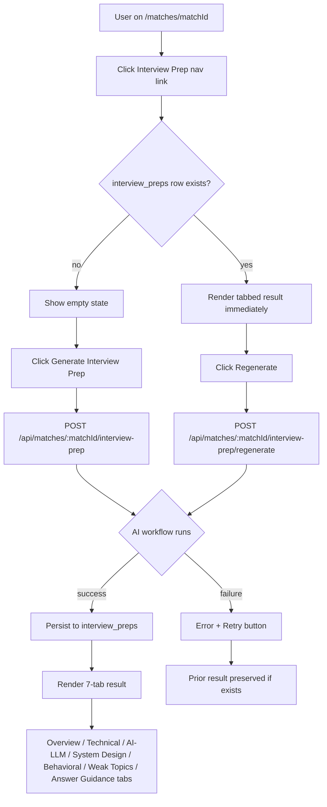
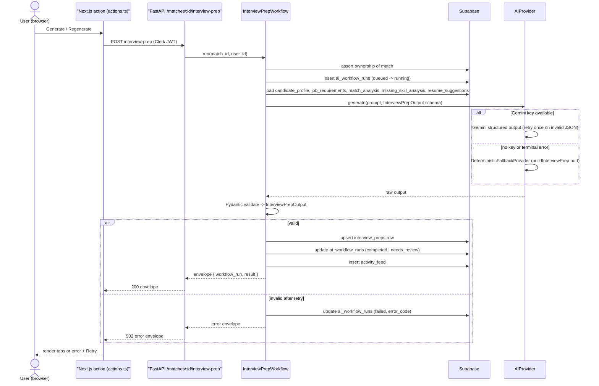
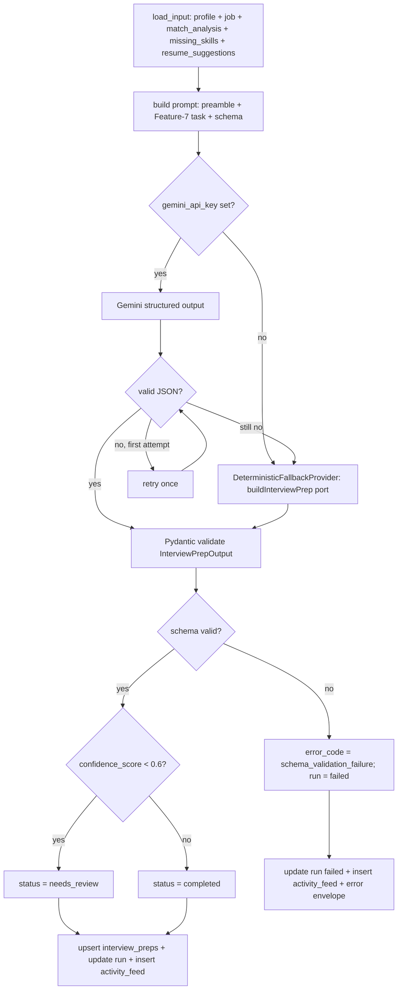
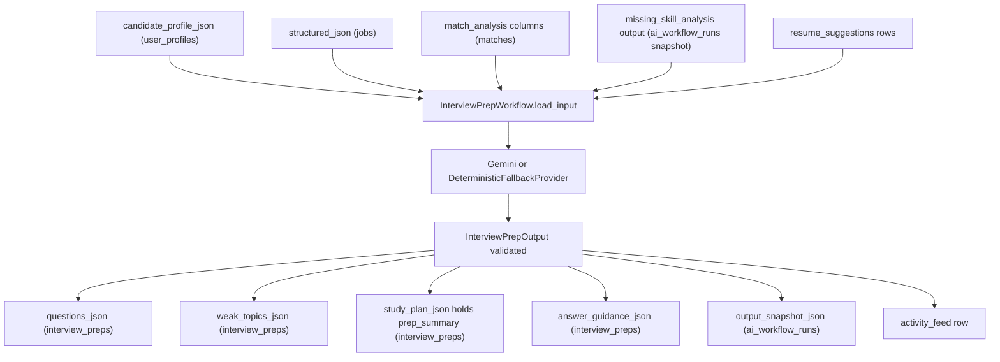
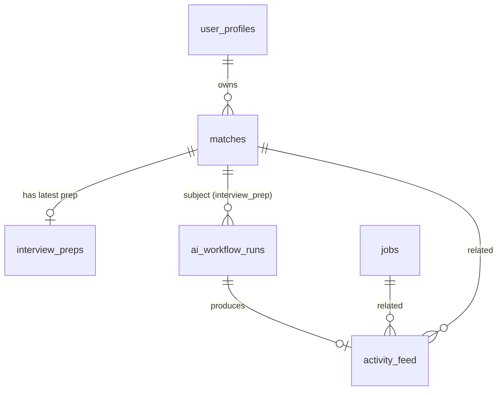

# US-035 — AI Interview Prep · Dev Flow

> **Feature 7** of `applywise_ai_assistant_update_tasks.md`. Upgrades US-011.
> Conventions (envelope, `BaseAIWorkflow`, `ai_workflow_runs`, `activity_feed`,
> error taxonomy, prompt preamble, provider/fallback, `workflow_type` enum) are
> defined in `docs/stories/period-8/flows/US-027-ai-workflow-foundation-flow.md`
> and `docs/decisions/0012-ai-workflow-standards.md`. This document only records
> what is feature-specific.

---

## 1. Feature Summary

- **What it does:** Generates a personalized interview preparation package for a
  match — job-specific technical, AI/LLM, system design, and behavioral
  questions; a ranked list of weak topics; per-question answer guidance (angle,
  resume evidence, warning when evidence is absent); and a prep summary. The AI
  result replaces the current deterministic output and is stored in the existing
  `interview_preps` table.
- **Why the user needs it:** Deterministic prep (US-011) cannot infer
  job-specific phrasing, real missing-skill context, or resume-grounded answer
  angles. The AI version consumes match analysis (US-028), missing-skill analysis
  (US-029), and resume suggestions (US-031) to produce interview prep that is
  directly actionable for the specific role.
- **Problem it solves:** Users preparing for interviews must infer what to
  practice from raw match scores. AI prep surfaces exactly which topics they will
  likely be asked about and whether their resume actually supports each answer —
  and warns them when it does not.
- **MVP connection:** Reuses `interview_preps` table, existing tabbed page at
  `apps/web/src/app/(app)/matches/[matchId]/interview-prep/page.tsx`,
  `BaseAIWorkflow`, `SupabaseDataClient`, and the Gemini client pattern in
  `apps/api/app/services/job_extractor.py` / `candidate_profile_extractor.py`.
  The deterministic function `buildInterviewPrep` in
  `apps/web/src/lib/interview-prep-generator.mjs` becomes the typed fallback.
- **Routing convention:** The brief's `/jobs/:id/interview-prep` maps to the
  existing match-centric route `/matches/[matchId]/interview-prep`. All endpoints
  and the page are match-centric only.

---

## 2. User Flow

1. **Entry point:** user navigates to a match detail page at
   `/matches/[matchId]` and clicks *Interview Prep* in the navigation.
2. **Page load:** `apps/web/src/app/(app)/matches/[matchId]/interview-prep/page.tsx`
   loads; if prep already exists the tabbed result renders immediately (no AI
   call). If not, an empty state is shown.
3. **Generate:** user clicks *Generate Interview Prep*. The web action calls
   `POST /api/matches/{matchId}/interview-prep`.
4. **Loading:** a spinner and "ApplyWise is preparing your interview plan…"
   message appear while the backend runs the AI workflow.
5. **Result:** on success the page reloads (or optimistically updates) and
   renders seven tabs — Overview, Technical, AI/LLM, System Design, Behavioral,
   Weak Topics, Answer Guidance — populated from the persisted `interview_preps`
   row.
6. **Answer Guidance tab:** each item shows the question, recommended angle,
   resume evidence to use, and a warning badge when evidence is weak or absent.
7. **Regenerate:** user clicks *Regenerate* which calls
   `POST /api/matches/{matchId}/interview-prep/regenerate`; the workflow reruns
   and the latest result replaces the previous one.
8. **Error:** if generation fails a friendly error message and *Retry* button
   appear. The prior prep result (if any) remains visible.



---

## 3. Technical Flow

- **Frontend page:** `apps/web/src/app/(app)/matches/[matchId]/interview-prep/page.tsx`
  — upgraded from US-011 layout to 7-tab layout (§7).
- **Web client:** `apps/web/src/lib/ai-workflow-client.mjs` (US-027) —
  `runWorkflow("POST /api/matches/:matchId/interview-prep")` returns
  `{ workflowRun, result }` or throws `AIWorkflowError`.
- **Web action:** new or updated action in
  `apps/web/src/lib/actions.ts` — `generateInterviewPrep(matchId)` and
  `regenerateInterviewPrep(matchId)`.
- **API router:** `apps/api/app/routers/interview_prep.py` (new) — three
  endpoints mounted in `apps/api/app/main.py`.
- **Backend workflow:** `apps/api/app/services/ai/interview_prep_workflow.py`
  (new) — `InterviewPrepWorkflow` extends `BaseAIWorkflow`
  (`apps/api/app/services/ai/base_workflow.py`).
- **Persistence:** `apps/api/app/services/supabase_data.py` (`SupabaseDataClient`)
  — new methods `upsert_interview_prep`, `get_interview_prep_by_match`.
- **Deterministic fallback:** adapted from
  `apps/web/src/lib/interview-prep-generator.mjs` → Python port in
  `apps/api/app/services/ai/interview_prep_workflow.py` as
  `InterviewPrepWorkflow.deterministic_fallback()`. The original `.mjs` file
  remains for the web layer; it is not deleted.
- **Settings:** `apps/api/app/settings.py` — `gemini_api_key`, `gemini_model`,
  `gemini_max_attempts`, `gemini_retry_base_delay_seconds` (existing, no new
  settings).
- **Error handling:** US-027 taxonomy (`apps/api/app/services/ai/errors.py`);
  adds feature-specific codes listed in §6.
- **Response:** standard US-027 envelope `{ workflow_run, result }`.



---

## 4. AI Behavior

### Prompt preamble (US-027 standard — do not modify)

```text
Role: You are ApplyWise, an AI job hunting assistant for software engineers
      targeting AI roles in the US market.
Source of truth: Use only the provided candidate profile, resume, and job
      description.
Truthfulness: Do not invent experience, skills, projects, companies, dates,
      metrics, or certifications.
Output: Return valid JSON matching the provided schema.
Tone: Clear, direct, helpful, professional.
```

### Feature 7 task instruction (appended after preamble)

```text
Task: Generate a complete interview preparation package for the candidate
      applying to this specific job.

Use the candidate_profile, job_requirements, match_analysis,
missing_skill_analysis, and resume_suggestions provided.

Produce:
- prep_summary: 2-4 sentence overview of what this interview will focus on and
  the candidate's key strengths and risks.
- technical_questions: 4-6 questions the interviewer is likely to ask about
  the technical stack and implementation experience.
- ai_llm_questions: 4-6 questions specific to AI, LLM usage, RAG, evaluation,
  and ML engineering for the role.
- system_design_questions: 2-4 questions about designing production AI systems.
- behavioral_questions: 3-5 questions about how the candidate works, learns,
  and handles gaps.
- weak_topics_to_study: topics from missing_skill_analysis the candidate must
  study or build proof for before claiming experience.
- answer_guidance: for each high-priority question, provide the recommended
  angle, the resume evidence the candidate should cite (or null if none), and
  a warning string if the candidate does not have supporting evidence for this
  question (tell them to study or build proof — do not pretend experience).
- confidence_score: 0.0–1.0 reflecting how complete and specific the output is
  given the available inputs.

IMPORTANT: When the candidate lacks evidence for a likely question, set
resume_evidence_to_use to null and set warning to a specific study/build-proof
instruction. Never imply the candidate has experience they do not have.
```

### Output schema (Feature 7.4 — verbatim)

```json
{
  "prep_summary": "string",
  "technical_questions": ["string"],
  "ai_llm_questions": ["string"],
  "system_design_questions": ["string"],
  "behavioral_questions": ["string"],
  "weak_topics_to_study": ["string"],
  "answer_guidance": [
    {
      "question": "string",
      "recommended_angle": "string",
      "resume_evidence_to_use": "string | null",
      "warning": "string | null"
    }
  ],
  "confidence_score": 0.0
}
```

### Pydantic model (`InterviewPrepOutput`)

```python
# apps/api/app/services/ai/interview_prep_workflow.py
from pydantic import BaseModel, Field
from typing import Optional

class AnswerGuidanceItem(BaseModel):
    question: str
    recommended_angle: str
    resume_evidence_to_use: Optional[str] = None
    warning: Optional[str] = None

class InterviewPrepOutput(BaseModel):
    prep_summary: str
    technical_questions: list[str] = Field(min_length=1)
    ai_llm_questions: list[str] = Field(min_length=1)
    system_design_questions: list[str] = Field(min_length=1)
    behavioral_questions: list[str] = Field(min_length=1)
    weak_topics_to_study: list[str]
    answer_guidance: list[AnswerGuidanceItem]
    confidence_score: float = Field(ge=0.0, le=1.0)
```

### Validation

- Parse Gemini response as JSON → Pydantic `InterviewPrepOutput`. On invalid
  JSON, retry once (US-027 retry rule). On second failure, invoke
  `DeterministicFallbackProvider`.
- `confidence_score < 0.6` → `workflow_run.status = needs_review`.
- `confidence_score >= 0.6` → `workflow_run.status = completed`.
- If even the deterministic fallback fails Pydantic validation, the run is
  `failed` with `error_code = schema_validation_failure`.

### Failure handling

On any terminal failure:
- Write `ai_workflow_runs` row with `status = failed`, `error_code`, and
  `error_message`.
- Write `activity_feed` row with `activity_type = interview_prep`.
- Return US-027 error envelope. Do **not** overwrite a previously persisted
  `interview_preps` row.
- UI keeps the prior result visible; shows error + *Retry* button if
  `error.retryable`.

### User-facing assistant description (Feature 7.5 — verbatim)

The `activity_feed.assistant_description` for a completed run is generated by
US-037 (`activity_description` workflow). The fallback populated at write time:

```text
ApplyWise expects this interview to focus on LLM application design, RAG
architecture, and backend API design. Your backend experience gives you a strong
base, but you should prepare carefully for questions about embeddings, vector
databases, and evaluation.
```

### AI processing flowchart



---

## 5. Data Model Impact

### Reuse `interview_preps` (no new table)

The existing `interview_preps` table (defined in `docs/product/data-model.md`)
is used without structural changes. The AI output fields map to columns as
follows:

| AI output field | `interview_preps` column | Notes |
| --- | --- | --- |
| `technical_questions`, `ai_llm_questions`, `system_design_questions`, `behavioral_questions` | `questions_json` | Stored as `{ "technical_questions": [...], "ai_llm_questions": [...], "system_design_questions": [...], "behavioral_questions": [...] }` |
| `weak_topics_to_study` | `weak_topics_json` | Stored as `["topic1", "topic2", ...]` |
| `prep_summary` | `study_plan_json` | Stored as `{ "prep_summary": "...", "study_plan": [] }` — Assumption: `study_plan_json` is repurposed to hold `prep_summary` and any future structured plan; no migration needed |
| `answer_guidance` | `answer_guidance_json` | Stored as the array from the AI output |

**Tentative additive columns** (mark `-- tentative` in migration comment;
add only if the team confirms before implementation):

| Column | Type | Notes |
| --- | --- | --- |
| `confidence_score` | `numeric` | Mirrors `ai_workflow_runs.confidence_score` for direct query |
| `model_provider` | `text` | `gemini \| deterministic` |

These are omitted from the initial migration. The authoritative
`confidence_score` and `model_provider` live in `ai_workflow_runs` and are
returned via the envelope.

### `ai_workflow_runs` usage

One row per generation event. `workflow_type = interview_prep`,
`subject_type = match`, `subject_id = match_id` (matches US-027 pattern).

### `activity_feed` usage

One row per generation event. `activity_type = interview_prep`,
`related_match_id = match_id`, `related_job_id` resolved from the match row.

### Example persisted `interview_preps` row (JSON columns)

**`questions_json`**
```json
{
  "technical_questions": [
    "How have you used FastAPI in a production AI service?",
    "Walk me through how you'd implement streaming for an LLM response."
  ],
  "ai_llm_questions": [
    "How would you design a RAG pipeline for a resume matching product?",
    "What evaluation strategy would you use for a retrieval-augmented answer system?"
  ],
  "system_design_questions": [
    "Design a scalable job-matching service that ranks resumes against job descriptions.",
    "How would you monitor latency and quality regressions for an LLM API?"
  ],
  "behavioral_questions": [
    "Tell me about a time you learned a missing skill quickly for a project.",
    "How would you address limited vector database experience if asked directly?"
  ]
}
```

**`weak_topics_json`**
```json
["vector databases", "embeddings evaluation", "production LLM cost management"]
```

**`study_plan_json`**
```json
{
  "prep_summary": "ApplyWise expects this interview to focus on LLM application design, RAG architecture, and backend API design. Your backend experience gives you a strong base, but prepare carefully for embeddings, vector databases, and evaluation.",
  "study_plan": []
}
```

**`answer_guidance_json`**
```json
[
  {
    "question": "How would you design a RAG pipeline for a resume matching product?",
    "recommended_angle": "Lead with your FastAPI and Python experience, describe a chunking and retrieval strategy, then acknowledge the embedding/vector-DB gap.",
    "resume_evidence_to_use": "Built document ingestion pipelines with Docling; FastAPI service in production.",
    "warning": null
  },
  {
    "question": "What is your hands-on experience with vector databases?",
    "recommended_angle": "Be honest that production experience is limited; describe your study plan and any prototype work.",
    "resume_evidence_to_use": null,
    "warning": "No production vector-DB experience found in resume. Study Pinecone or pgvector and build a small prototype before claiming hands-on depth."
  }
]
```

---

## 6. API Requirements

All endpoints are match-centric. Auth: Clerk JWT → resolve `user_profiles.id`;
assert match ownership. Router: `apps/api/app/routers/interview_prep.py`, mounted
in `apps/api/app/main.py`.

### `POST /api/matches/{matchId}/interview-prep`

Generates interview prep for the match. If a row already exists it is
overwritten (upsert). Use this endpoint for the first generation.

Request body: none. `matchId` is the path param.

Response `200`: standard US-027 envelope.

```json
{
  "workflow_run": {
    "id": "uuid",
    "workflow_type": "interview_prep",
    "status": "completed",
    "model_provider": "gemini",
    "model_name": "gemini-2.5-flash",
    "latency_ms": 2340,
    "confidence_score": 0.84,
    "error_message": null
  },
  "result": {
    "prep_summary": "...",
    "technical_questions": ["..."],
    "ai_llm_questions": ["..."],
    "system_design_questions": ["..."],
    "behavioral_questions": ["..."],
    "weak_topics_to_study": ["..."],
    "answer_guidance": [
      {
        "question": "...",
        "recommended_angle": "...",
        "resume_evidence_to_use": "...",
        "warning": null
      }
    ],
    "confidence_score": 0.84
  }
}
```

### `GET /api/matches/{matchId}/interview-prep`

Returns the latest persisted `interview_preps` row for the match plus the
latest `ai_workflow_runs` row for `workflow_type = interview_prep`. Used by the
page server component to avoid re-running the AI on every load.

Response `200`:

```json
{
  "workflow_run": { "...latest run..." },
  "result": { "...latest interview_preps columns mapped to output schema..." }
}
```

Response `404` if no prep exists yet (page renders empty state).

### `POST /api/matches/{matchId}/interview-prep/regenerate`

Re-runs the workflow unconditionally (same as POST but signals intent). Returns
the same envelope.

### Error table (US-027 codes)

| Code | HTTP | `retryable` | When |
| --- | --- | --- | --- |
| `unauthorized` | 403 | false | Match not owned by authenticated user |
| `missing_profile` | 422 | false | `user_profiles.candidate_profile_json` is null |
| `missing_job_requirements` | 422 | false | `jobs.structured_json` is null / job not parsed |
| `missing_match_analysis` | 422 | false | Match scores not yet generated (US-028 not run) |
| `invalid_json` | 502 | true | Model output unparseable after one retry |
| `schema_validation_failure` | 502 | true | JSON parsed but fails `InterviewPrepOutput` Pydantic validation |
| `model_timeout` | 503 | true | Gemini call exceeded timeout |
| `network_failure` | 503 | true | Network error reaching Gemini |
| `provider_rate_limit` | 503 | true | Gemini rate limit hit |

```json
{
  "error": {
    "code": "missing_match_analysis",
    "message": "Match analysis has not been generated yet. Run match analysis before generating interview prep.",
    "retryable": false
  }
}
```

---

## 7. UI Requirements

### Page: `apps/web/src/app/(app)/matches/[matchId]/interview-prep/page.tsx`

Upgrade from the US-011 card layout to a seven-tab layout. The existing server
component and data fetching pattern (via `getInterviewPrepDetail` in
`apps/web/src/lib/data/server`) are retained; the data shape it reads changes
to match the AI output column mapping (§5).

#### Tabs

| Tab | Content |
| --- | --- |
| **Overview** | `prep_summary` prose; `workflow_run` badge (provider, status, `confidence_score`); Generate / Regenerate button |
| **Technical** | List of `technical_questions` strings |
| **AI/LLM** | List of `ai_llm_questions` strings |
| **System Design** | List of `system_design_questions` strings |
| **Behavioral** | List of `behavioral_questions` strings |
| **Weak Topics** | List of `weak_topics_to_study` strings |
| **Answer Guidance** | Per-item cards (see below) |

#### Answer Guidance card display

Each `answer_guidance[]` item renders:

```
Question          [question text]
Recommended angle [recommended_angle text]
Resume evidence   [resume_evidence_to_use text]  OR  "No evidence found" (muted)
Warning           [warning badge + warning text]   (only rendered when warning ≠ null)
```

The warning is rendered as a destructive/amber badge + inline text so the user
cannot miss it. If `resume_evidence_to_use` is null and `warning` is present,
show the warning prominently in place of evidence.

#### State matrix

| State | Display |
| --- | --- |
| **Empty** | "No interview prep yet" card + Generate button |
| **Loading** | Spinner + "ApplyWise is preparing your interview plan…" |
| **needs_review** | Badge `Needs review` on Overview tab; result still fully rendered |
| **completed** | All tabs populated; status badge `AI-generated` with provider |
| **failed** | Error card with `error.message`; *Retry* button when `error.retryable`; prior result (if any) remains visible in tabs |

#### Buttons

- **Generate Interview Prep** — calls `generateInterviewPrep(matchId)` server
  action → `POST /api/matches/{matchId}/interview-prep`. Shown when no prep
  exists.
- **Regenerate** — calls `regenerateInterviewPrep(matchId)` server action →
  `POST /api/matches/{matchId}/interview-prep/regenerate`. Shown when prep
  exists. Placed on Overview tab and in the page header area.
- **Retry** — re-invokes the last action. Shown only on failure when
  `error.retryable = true`.

---

## 8. Acceptance Criteria

- **Given** a match I own with candidate profile, parsed job, and match analysis
  present, **when** I click Generate, **then** an `ai_workflow_runs` row
  transitions `queued → running → completed`, an `interview_preps` row is
  upserted, and an `activity_feed` row is written.

- **Given** generation succeeds, **then** the seven tabs render content sourced
  from `interview_preps` columns; the Overview tab shows the `prep_summary` and
  a provider badge.

- **Given** a Gemini API key is configured, **then** the questions in Technical,
  AI/LLM, System Design, and Behavioral tabs are specific to the job description
  and role (not generic templates), confirmed by inspecting `model_provider =
  gemini` in the run row.

- **Given** the `missing_skill_analysis` input contains weak topics, **then**
  `weak_topics_to_study` is populated and the Weak Topics tab shows at least
  those topics.

- **Given** the answer guidance for a question has `resume_evidence_to_use`
  present, **then** that evidence is displayed in the Answer Guidance card for
  that question.

- **Given** the candidate has no resume evidence for a topic, **then**
  `resume_evidence_to_use` is null and `warning` is a non-null string instructing
  the candidate to study or build proof; the UI renders this as a visible warning
  on the Answer Guidance card.

- **Given** `gemini_api_key` is unset, **when** I generate, **then** the
  deterministic fallback runs, the run records `model_provider = deterministic`,
  and the tabs still populate.

- **Given** a match I do not own, **when** I call any endpoint, **then** I
  receive `error.code = unauthorized` and no run or interview_preps row is
  written.

- **Given** generation fails after retry, **then** the run row is `failed` with
  a typed `error_code`; the API returns a retryable error envelope; any
  previously saved prep result remains visible in the UI.

- **Given** I click Regenerate, **then** the workflow re-runs, the old
  `interview_preps` row is replaced, a new `ai_workflow_runs` row is written,
  and the tabs update.

- **Given** `confidence_score < 0.6`, **then** the run is `needs_review`, a
  "Needs review" badge appears on the Overview tab, and the result is still
  persisted and shown.

---

## 9. Mermaid Diagrams

User flow (§2), technical sequence (§3), and AI processing flowchart (§4) are
embedded in those sections and render as-is.

### Data flow



### Entity relationships



---

## 10. Development Tasks

### Database

1. No new table migration required. `interview_preps` already exists.
2. If additive columns (`confidence_score`, `model_provider`) are confirmed, add
   a migration comment-marked `-- tentative` in a new file alongside other
   period-8 migrations (e.g. `0011_period8_interview_prep_additive.sql`).
   Assumption: tentative columns are deferred until the team signs off.

### Backend

3. **`apps/api/app/services/ai/interview_prep_workflow.py`** — create
   `InterviewPrepWorkflow(BaseAIWorkflow)`:
   - `output_model = InterviewPrepOutput`
   - `workflow_type = "interview_prep"`
   - `load_input()`: load `candidate_profile_json`, `jobs.structured_json`,
     match score columns, the latest `ai_workflow_runs.output_snapshot_json`
     for `workflow_type = missing_skills` and `workflow_type = resume_suggestions`,
     all via `SupabaseDataClient`.
   - `build_prompt()`: US-027 preamble + Feature-7 task instruction + schema.
   - `deterministic_fallback()`: Python port of `buildInterviewPrep` from
     `apps/web/src/lib/interview-prep-generator.mjs`, returning an
     `InterviewPrepOutput`-compatible dict.
   - `persist(output)`: call `SupabaseDataClient.upsert_interview_prep()` mapping
     AI output to `interview_preps` columns per §5.
4. **`apps/api/app/services/supabase_data.py`** — add methods:
   - `upsert_interview_prep(match_id, user_id, questions_json, weak_topics_json, study_plan_json, answer_guidance_json)`
   - `get_interview_prep_by_match(match_id, user_id)` → latest row or `None`.
5. **`apps/api/app/routers/interview_prep.py`** — create router with three
   endpoints per §6; inject `SupabaseDataClient`; validate ownership; delegate
   to `InterviewPrepWorkflow.run()`.
6. **`apps/api/app/main.py`** — mount `interview_prep.router` with prefix
   `/api/matches`.

### AI integration

7. Add `InterviewPrepOutput` and `AnswerGuidanceItem` Pydantic models (in
   `interview_prep_workflow.py` or a shared `apps/api/app/schemas/` file
   consistent with existing schema conventions).
8. Wire Feature-7 task instruction constant; add `confidence_score < 0.6`
   threshold check in `InterviewPrepWorkflow.run()` to set `needs_review`.

### Frontend

9. **`apps/web/src/app/(app)/matches/[matchId]/interview-prep/page.tsx`** —
   upgrade to 7-tab layout per §7. Replace current card sections with tab
   components. Implement the Answer Guidance card with warning display.
10. **`apps/web/src/lib/actions.ts`** — add `generateInterviewPrep(matchId)` and
    `regenerateInterviewPrep(matchId)` server actions; use
    `ai-workflow-client.mjs` `runWorkflow` helper.
11. **`apps/web/src/lib/data/server`** — update `getInterviewPrepDetail` to read
    the new column mapping (or add a dedicated `getInterviewPrepWithRun` that
    also fetches the latest `ai_workflow_runs` row).
12. Implement loading, error, empty, and `needs_review` states in the page per §7.

### Testing

13. **`apps/api/tests/test_interview_prep_workflow.py`** (new) — cover:
    - Provider selection (Gemini key set / unset).
    - Retry on invalid JSON → fallback.
    - Pydantic validation failure → run `failed`.
    - `confidence_score < 0.6` → `needs_review`.
    - Ownership denial → `unauthorized`, no DB write.
    - `missing_profile` / `missing_job_requirements` / `missing_match_analysis`
      validations.
    - Successful upsert maps output to columns correctly.
    - Log redaction: no `candidate_profile_json` or `raw_description` in emitted
      logs.
    - Use fake provider — no live Gemini calls in CI.
14. **`apps/web/tests/interview-prep.test.mjs`** (new) — cover tab rendering
    with fixture data, warning badge display when `warning ≠ null`, null
    evidence display, empty state, and error + Retry state.
