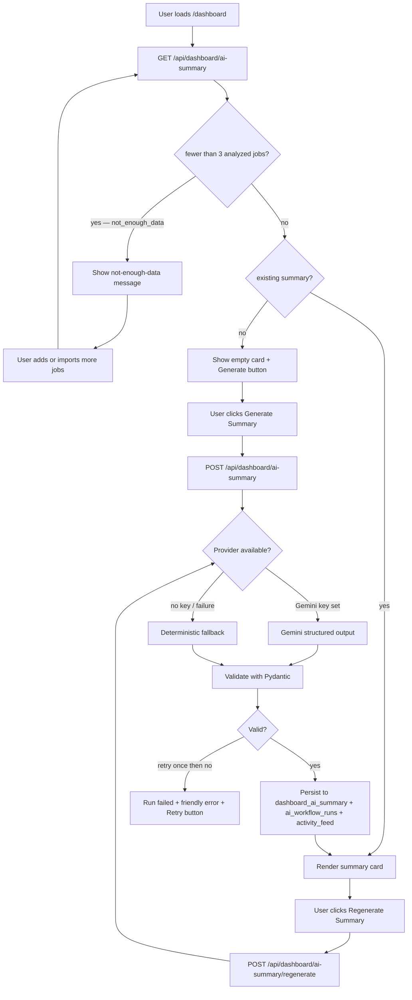
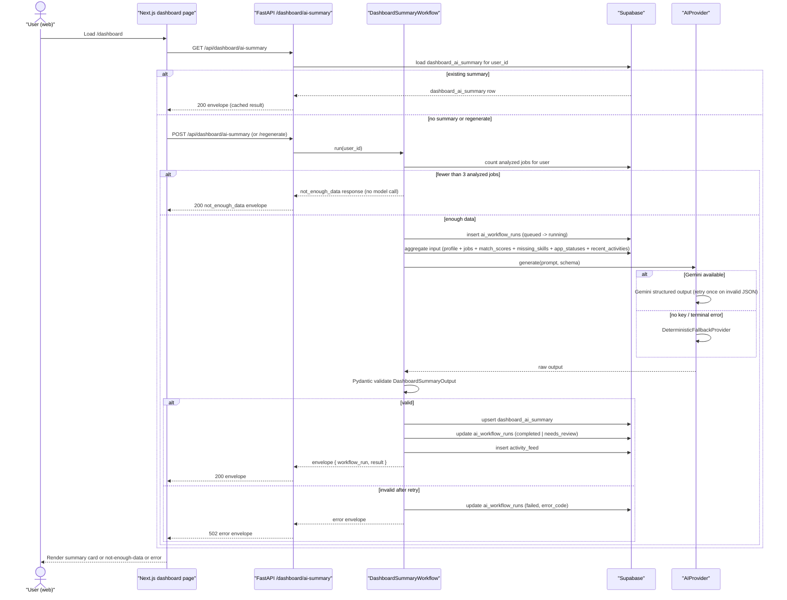
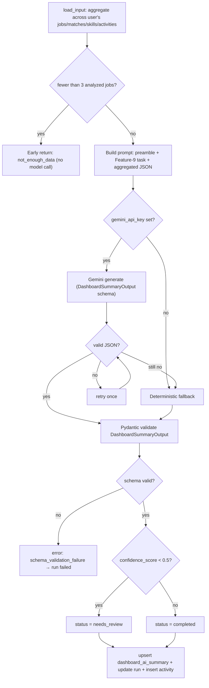
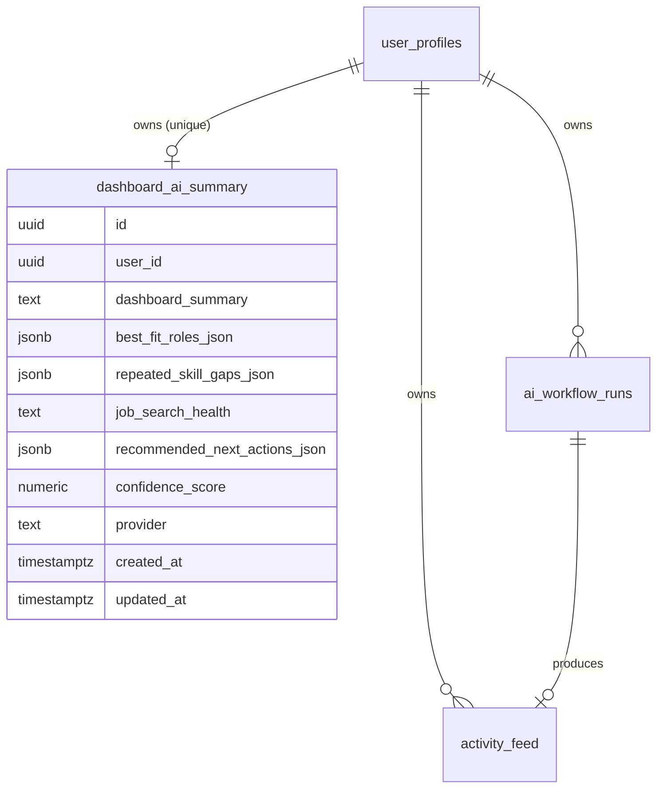
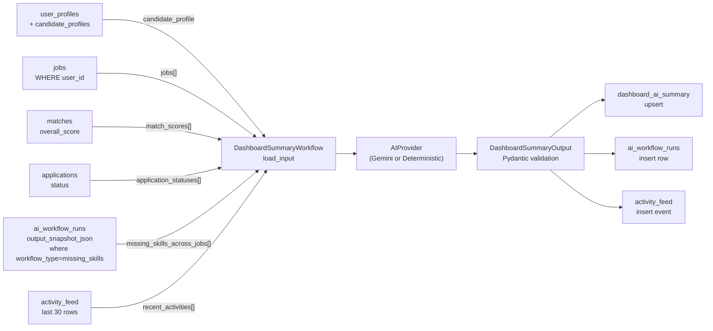

# US-036 — Dashboard AI Summary · Dev Flow

> **Feature 9** of `applywise_ai_assistant_update_tasks.md`. Depends on the
> shared pipeline shipped by **US-027** (`BaseAIWorkflow`, envelope, tables,
> error taxonomy, prompt preamble, provider/fallback rule). All conventions
> defined in US-027 are reused here without redefinition. Direction:
> `docs/decisions/0012-ai-workflow-standards.md`.

---

## 1. Feature Summary

- **What it does:** Generates a cross-job AI summary card on the dashboard that
  tells the user how their job search is going — which role types fit best, which
  skills keep appearing as gaps, what health band they are in
  (`strong|moderate|weak`), and what to do next. Persists one current summary per
  user in a new `dashboard_ai_summary` table; surfaces a *Regenerate* action.
- **Why the user needs it:** The existing dashboard shows per-job metrics in
  isolation. Users cannot see patterns across jobs (recurring skill gaps, best-fit
  role clusters, overall trajectory) without manually comparing rows. The AI
  summary makes ApplyWise feel like an assistant watching the whole search, not
  just a spreadsheet.
- **Problem it solves:** No aggregated view of search health exists today.
  Individual match scores and missing-skills analyses (US-028/US-029) already
  produce per-job signals; this feature synthesises those signals into one
  actionable narrative.
- **MVP connection:** Reads data already persisted by US-028 (match scores) and
  US-029 (missing-skills analysis) from `apps/api/app/services/supabase_data.py`.
  Adds one new backend router (`apps/api/app/routers/dashboard.py`) and one new
  UI card on the existing `apps/web/src/app/(app)/dashboard/page.tsx`. Follows
  the `BaseAIWorkflow` pattern established in US-027.
- **User-scoped workflow:** `subject_type = 'dashboard'`, `subject_id = null` in
  `ai_workflow_runs`; one current result row per user in `dashboard_ai_summary`.

---

## 2. User Flow

Entry point: `/dashboard` — the user's main landing page after login.

1. **Dashboard loads:** the frontend calls `GET /api/dashboard/ai-summary`.
2. **Not enough data (< 3 analyzed jobs):** the card renders the not-enough-data
   message verbatim; no AI call is made.
3. **No existing summary (≥ 3 analyzed jobs, none generated yet):** the card
   shows an *Generate Summary* prompt; user clicks to trigger generation.
4. **Generation in progress:** spinner with "ApplyWise is analyzing your job
   search…".
5. **Summary displayed:** all sections rendered (health badge, best-fit roles,
   repeated skill gaps, recommended next actions, narrative paragraph).
6. **Regenerate:** user clicks *Regenerate Summary* (e.g., after adding new
   jobs); the card re-enters loading state and overwrites the stored summary.



---

## 3. Technical Flow

- **Frontend:** `apps/web/src/app/(app)/dashboard/page.tsx` — existing page
  extended with a new `DashboardAISummaryCard` component
  (`apps/web/src/components/dashboard/dashboard-ai-summary-card.tsx`, new).
  Uses `apps/web/src/lib/ai-workflow-client.mjs` (US-027) for envelope
  handling.
- **API endpoints:** `apps/api/app/routers/dashboard.py` (new) — three endpoints
  mounted in `apps/api/app/main.py`.
- **Backend service:** `apps/api/app/services/ai/dashboard_summary_workflow.py`
  (new, extends `BaseAIWorkflow` from US-027).
- **Data aggregation:** `SupabaseDataClient` methods in
  `apps/api/app/services/supabase_data.py` — new helpers to load the aggregated
  input payload (match scores, missing skills, application statuses, recent
  activity) and to upsert `dashboard_ai_summary`.
- **Config:** `apps/api/app/settings.py` — existing `gemini_api_key`,
  `gemini_model`, `gemini_max_attempts`, `gemini_retry_base_delay_seconds` used
  unchanged.
- **Persistence:** new `dashboard_ai_summary` table (one row per user,
  `ON CONFLICT (user_id) DO UPDATE`); run history via existing `ai_workflow_runs`;
  event via existing `activity_feed`.
- **Error handling:** US-027 typed taxonomy; run row always written.



---

## 4. AI Behavior

### Prompt Preamble (US-027 standard — do not modify)

```text
Role: You are ApplyWise, an AI job hunting assistant for software engineers
      targeting AI roles in the US market.
Source of truth: Use only the provided candidate profile, resume, and job
      description.
Truthfulness: Do not invent experience, skills, projects, companies, dates,
      metrics, or certifications.
Output: Return valid JSON matching the provided schema.
Tone: Clear, direct, helpful, professional.
```

### Feature-9 Task (appended after preamble)

```text
Task: Generate a dashboard summary of the user's overall job search.

You are given:
- candidate_profile: the user's structured profile
- jobs: list of jobs the user has added
- match_scores: per-job overall match percentages
- application_statuses: current application state per job
- missing_skills_across_jobs: skill gaps identified per job (from missing-skills analysis)
- recent_activities: recent AI workflow events for this user

Answer these questions:
1. How is the user doing overall?
2. Which role types match their profile best?
3. Which skills appear repeatedly as gaps across jobs?
4. What is the user's job search health (strong, moderate, weak)?
5. What are the most important next actions?

Identify patterns across jobs — do not comment on individual jobs.
Be honest if the data is sparse. Confidence score = 0.0–1.0.
```

### Aggregated Input Payload (§9.2 verbatim)

```json
{
  "candidate_profile": {},
  "jobs": [],
  "match_scores": [],
  "application_statuses": [],
  "missing_skills_across_jobs": [],
  "recent_activities": []
}
```

The backend assembles this from `SupabaseDataClient` helpers that join:
- `user_profiles` + `candidate_profiles` for `candidate_profile`
- `jobs` WHERE `user_id = ?` for `jobs`
- `matches` with `overall_score` for `match_scores`
- `applications.status` for `application_statuses`
- `ai_workflow_runs.output_snapshot_json` WHERE `workflow_type = 'missing_skills'`
  for `missing_skills_across_jobs`
- `activity_feed` last 30 rows for `recent_activities`

### Output Schema (§9.4 verbatim)

```json
{
  "dashboard_summary": "string",
  "best_fit_roles": ["string"],
  "repeated_skill_gaps": ["string"],
  "job_search_health": "strong | moderate | weak | not_enough_data",
  "recommended_next_actions": ["string"],
  "confidence_score": 0.0
}
```

### not_enough_data Early-Return Rule

If the count of analyzed jobs (rows in `ai_workflow_runs` WHERE
`workflow_type IN ('match_analysis', 'missing_skills')` AND `status =
'completed'` AND `user_id = ?`) is **fewer than 3**, the workflow returns
immediately **without calling the model**:

```json
{
  "job_search_health": "not_enough_data",
  "dashboard_summary": "",
  "best_fit_roles": [],
  "repeated_skill_gaps": [],
  "recommended_next_actions": [],
  "confidence_score": 0.0
}
```

No `ai_workflow_runs` row is created. The UI displays the §9.6 message verbatim:

> ApplyWise needs more analyzed jobs before giving a strong pattern-based
> recommendation. Add or import at least 3 jobs to unlock a stronger dashboard
> summary.

### Deterministic Fallback (no Gemini key / terminal failure)

Same output schema; values derived from aggregated data without the model:

| Field | Fallback rule |
| --- | --- |
| `repeated_skill_gaps` | Skill strings appearing in ≥ 2 `missing_skills_across_jobs` entries, sorted by frequency desc |
| `best_fit_roles` | Job titles whose `match_score` ≥ 65%, deduplicated |
| `job_search_health` | avg match score ≥ 70 → `strong`; ≥ 50 → `moderate`; else `weak` |
| `dashboard_summary` | Template: "Based on {n} jobs, your top role fit is {best_fit_roles[0]}. Key gaps: {repeated_skill_gaps[:3]}." |
| `recommended_next_actions` | Hardcoded from top 3 repeated gaps: "Build a portfolio project demonstrating {gap}." |
| `confidence_score` | 0.4 (deterministic baseline) |

### Validation

`DashboardSummaryOutput` Pydantic model validates:
- `job_search_health` is one of `strong | moderate | weak | not_enough_data`
- `confidence_score` between 0.0 and 1.0
- `best_fit_roles`, `repeated_skill_gaps`, `recommended_next_actions` are
  non-null lists (may be empty)
- `dashboard_summary` is a non-null string

On invalid JSON: retry once. On second failure or terminal error: deterministic
fallback. If fallback validation also fails: run = `failed`.

### On Failure

Map to US-027 typed error code → `{ error: { code, message, retryable } }`.
Run row always updated. Activity event always written (even on failure).
No raw profile/resume text appears in emitted logs (US-027 redacting logger).

### User-Facing Assistant Description Example (§9.5 verbatim)

> Across your saved jobs, ApplyWise is seeing a consistent pattern: you match
> backend-heavy AI Engineer roles better than research-oriented ML roles. Your
> repeated gaps are RAG, vector databases, and LLM evaluation. Your next best
> move is to finish one portfolio project that proves those skills, then apply
> to roles with stronger API/product engineering focus.

This example text is the target quality bar for `dashboard_summary` output.

### AI Processing Flowchart



---

## 5. Data Model Impact

**New table** `dashboard_ai_summary` — migration
`0016_period8_dashboard_ai_summary.sql` _(tentative number; increment if
migrations 0012–0015 ship before this one)_.

Existing tables `ai_workflow_runs` and `activity_feed` (US-027) are unchanged —
this workflow writes new rows to both.

### `dashboard_ai_summary`

| Column | Type | Notes |
| --- | --- | --- |
| `id` | `uuid` PK default `gen_random_uuid()` | |
| `user_id` | `uuid` FK → `user_profiles(id)` ON DELETE CASCADE, UNIQUE | one current summary per user |
| `dashboard_summary` | `text` | narrative paragraph |
| `best_fit_roles_json` | `jsonb` | `["string", ...]` |
| `repeated_skill_gaps_json` | `jsonb` | `["string", ...]` |
| `job_search_health` | `text` | `strong\|moderate\|weak\|not_enough_data` |
| `recommended_next_actions_json` | `jsonb` | `["string", ...]` |
| `confidence_score` | `numeric(4,3)` | 0.000–1.000 |
| `provider` | `text` | `gemini\|deterministic` |
| `created_at` | `timestamptz` | default `now()` |
| `updated_at` | `timestamptz` | updated on regenerate |

Index: `(user_id)` (enforced by UNIQUE constraint).

Upsert strategy: `INSERT ... ON CONFLICT (user_id) DO UPDATE SET ...` — always
one live row per user, overwritten on Regenerate.

### `ai_workflow_runs` additions

No schema changes. New `workflow_type` value `dashboard_summary` is already in
the enum defined in US-027. `subject_type = 'dashboard'`, `subject_id = null`.

### Example persisted row

```json
{
  "id": "a1b2c3d4-...",
  "user_id": "u-abc123",
  "dashboard_summary": "Across your 5 saved jobs, your profile matches backend-heavy AI Engineer roles best. Repeated skill gaps are RAG pipelines, vector databases, and LLM evaluation. Focus on one portfolio project that closes those gaps.",
  "best_fit_roles_json": ["AI Engineer", "Backend Engineer - ML Platform"],
  "repeated_skill_gaps_json": ["RAG", "vector databases", "LLM evaluation"],
  "job_search_health": "moderate",
  "recommended_next_actions_json": [
    "Build a portfolio project demonstrating RAG pipeline implementation",
    "Complete a course on vector database internals",
    "Apply to roles with stronger API/product engineering focus"
  ],
  "confidence_score": 0.78,
  "provider": "gemini",
  "created_at": "2026-06-08T10:00:00Z",
  "updated_at": "2026-06-08T10:00:00Z"
}
```

### ER Diagram



---

## 6. API Requirements

All responses use the US-027 standard envelope. Auth: Clerk JWT → resolve
`user_profiles.id`. New router: `apps/api/app/routers/dashboard.py`, mounted in
`apps/api/app/main.py` under prefix `/api/dashboard`.

---

### `POST /api/dashboard/ai-summary`

Generate (or return existing) dashboard summary for the authenticated user.

**Request body:** none required. Optional `{ "force": false }` — if `false`
(default) and a current summary exists, return it without regenerating.

**not_enough_data response (HTTP 200, no model call):**

```json
{
  "workflow_run": null,
  "result": {
    "job_search_health": "not_enough_data",
    "dashboard_summary": "",
    "best_fit_roles": [],
    "repeated_skill_gaps": [],
    "recommended_next_actions": [],
    "confidence_score": 0.0
  }
}
```

**Success response `200` (standard envelope):**

```json
{
  "workflow_run": {
    "id": "uuid",
    "workflow_type": "dashboard_summary",
    "status": "completed",
    "model_provider": "gemini",
    "model_name": "gemini-2.5-flash",
    "latency_ms": 2340,
    "confidence_score": 0.78,
    "error_message": null
  },
  "result": {
    "dashboard_summary": "string",
    "best_fit_roles": ["string"],
    "repeated_skill_gaps": ["string"],
    "job_search_health": "strong | moderate | weak",
    "recommended_next_actions": ["string"],
    "confidence_score": 0.78
  }
}
```

---

### `GET /api/dashboard/ai-summary`

Return the current persisted summary for the authenticated user, or a
`not_enough_data` result if fewer than 3 analyzed jobs exist, or a `204` if no
summary has been generated yet.

**Response `200`:** same envelope as POST success (reads `dashboard_ai_summary`
table; no model call).

**Response `204`:** no current summary exists (≥ 3 analyzed jobs but never
generated). Frontend shows *Generate Summary* prompt.

**Response `200` (not_enough_data):** same not_enough_data envelope as POST.

---

### `POST /api/dashboard/ai-summary/regenerate`

Force-regenerate summary regardless of existing cached result. Overwrites
`dashboard_ai_summary` row. Semantics identical to `POST /api/dashboard/ai-summary`
with `{ "force": true }`.

**Response `200`:** standard envelope (new `workflow_run`, fresh `result`).

---

### Error Table (reuse US-027 codes)

| Code | HTTP | retryable | When |
| --- | --- | --- | --- |
| `unauthorized` | 403 | false | user_id mismatch / unauthenticated |
| `missing_profile` | 422 | false | no `candidate_profiles` row for user |
| `invalid_json` | 502 | true | model output unparseable after retry |
| `schema_validation_failure` | 502 | true | parsed but fails `DashboardSummaryOutput` Pydantic |
| `model_timeout` | 503 | true | Gemini call timed out |
| `network_failure` | 503 | true | provider network error |
| `provider_rate_limit` | 503 | true | Gemini 429 |

```json
{ "error": { "code": "missing_profile", "message": "Complete your candidate profile before generating a dashboard summary.", "retryable": false } }
```

---

## 7. UI Requirements

**Component:** `apps/web/src/components/dashboard/dashboard-ai-summary-card.tsx`
(new). Rendered inside `apps/web/src/app/(app)/dashboard/page.tsx`.

### Card Sections (§9.6 verbatim labels)

| Section | Content |
| --- | --- |
| **AI Job Search Summary** | `dashboard_summary` narrative text |
| **Job Search Health** | Badge: `strong` (green) / `moderate` (amber) / `weak` (red) |
| **Best-Fit Roles** | Pill list from `best_fit_roles` |
| **Repeated Skill Gaps** | Pill list from `repeated_skill_gaps` |
| **Recommended Next Actions** | Numbered list from `recommended_next_actions` |
| **Regenerate Summary** | Button — triggers `POST /api/dashboard/ai-summary/regenerate` |

### States

**not_enough_data state** (fewer than 3 analyzed jobs)

Display verbatim (§9.6):

> ApplyWise needs more analyzed jobs before giving a strong pattern-based
> recommendation. Add or import at least 3 jobs to unlock a stronger dashboard
> summary.

No *Regenerate* button shown. Show link: *Add a job →* (routes to `/jobs/new`).

**Loading state** (generation in progress)

- Spinner + text "ApplyWise is analyzing your job search…"
- *Regenerate* button disabled while loading.

**Empty state** (≥ 3 analyzed jobs, no summary yet; `GET` returns 204)

- Brief: "Your job search summary hasn't been generated yet."
- *Generate Summary* button → calls `POST /api/dashboard/ai-summary`.

**Success state** (summary rendered)

- All six card sections visible.
- `needs_review` badge shown alongside health badge when
  `workflow_run.status = 'needs_review'` (e.g., "AI result — needs review").
- `confidence_score` shown as a small subtext if desired (Assumption: render
  score only when `confidence_score < 0.6` to surface uncertainty).
- *Regenerate Summary* button always visible in success state.

**Error state**

- Friendly message from `error.message`.
- *Retry* button shown when `error.retryable = true`.
- No raw model output shown.

### Data Fetching

On dashboard mount:
1. `GET /api/dashboard/ai-summary` via `ai-workflow-client.mjs`.
2. 204 → empty state; 200 with `not_enough_data` → not-enough-data state;
   200 with result → success state.

*Generate* / *Regenerate* clicks:
1. `POST /api/dashboard/ai-summary` (first time) or
   `POST /api/dashboard/ai-summary/regenerate` (subsequent).
2. Set loading state; await envelope; transition to success or error.

---

## 8. Acceptance Criteria

- **Given** a user has at least 3 analyzed jobs, **when** the dashboard loads,
  **then** the AI Job Search Summary card is visible and can be generated.

- **Given** repeated skill gaps appear across 2 or more jobs' missing-skills
  analyses, **when** the summary is generated, **then** `repeated_skill_gaps`
  in the result and in the rendered card mentions those skills by name.

- **Given** a user has fewer than 3 analyzed jobs (or 0 jobs), **when** the
  dashboard loads, **then** the card displays the verbatim message
  "ApplyWise needs more analyzed jobs before giving a strong pattern-based
  recommendation. Add or import at least 3 jobs to unlock a stronger dashboard
  summary." and no AI call is made.

- **Given** a user has fewer than 3 analyzed jobs, **when** they add and analyze
  more jobs to reach 3, **then** the *Generate Summary* button appears and
  clicking it produces a valid summary.

- **Given** a user already has a summary, **when** they click *Regenerate
  Summary*, **then** the card re-enters loading state, a new `ai_workflow_runs`
  row is created, the `dashboard_ai_summary` row is overwritten with fresh
  output, and the updated summary is displayed.

- **Given** `gemini_api_key` is unset, **when** the summary is generated,
  **then** the deterministic fallback produces schema-valid output with
  `model_provider = 'deterministic'` and all required fields populated.

- **Given** the Gemini model returns invalid JSON, **when** the workflow runs,
  **then** it retries once, falls back to deterministic on second failure; if
  all fail the run is `failed`, `error_code` is set, and the UI shows a
  retryable error with a *Retry* button.

- **Given** a successful or failed run, **then** no raw candidate profile text
  or job description text appears in emitted server logs (redacting logger from
  US-027).

- **Given** generation succeeds, **when** the dashboard is loaded again in a
  new session, **then** the cached `dashboard_ai_summary` is returned by `GET`
  without re-calling the model.

- **Given** low model confidence (`confidence_score < 0.5`), **when** the run
  completes, **then** `workflow_run.status = 'needs_review'` and the UI shows a
  "needs review" badge.

- **Given** the user has no candidate profile, **when** they attempt generation,
  **then** the API returns `{ error: { code: "missing_profile", retryable: false } }`
  and no workflow run is created.

---

## 9. Mermaid Diagrams

User flow (§2), technical sequence (§3), AI processing flowchart (§4), and ER
diagram (§5) are defined above and render as-is in standard Mermaid renderers.

Additional **data-flow diagram** showing how the aggregated input is assembled:



---

## 10. Development Tasks

### Database

1. Write `apps/web/supabase/migrations/0016_period8_dashboard_ai_summary.sql`
   (tentative number) — create `dashboard_ai_summary` with UNIQUE constraint on
   `user_id`, FK to `user_profiles(id)` ON DELETE CASCADE, all columns from §5,
   and index on `(user_id)`.

### Backend

2. `apps/api/app/services/ai/dashboard_summary_workflow.py` (new) — extend
   `BaseAIWorkflow` (US-027):
   - `load_input()`: call new `SupabaseDataClient` helpers to aggregate
     candidate profile, jobs, match scores, application statuses, missing skills
     (from `ai_workflow_runs.output_snapshot_json` WHERE
     `workflow_type = 'missing_skills'`), and last 30 activity feed rows.
   - `build_prompt()`: US-027 preamble + Feature-9 task text (§4).
   - `output_model`: `DashboardSummaryOutput` Pydantic model.
   - `deterministic_fallback()`: aggregation rules from §4 fallback table.
   - `persist()`: upsert `dashboard_ai_summary`; update run; insert activity.
   - Not-enough-data guard: count analyzed jobs before building prompt; early
     return `not_enough_data` without creating a run row.

3. `apps/api/app/schemas/dashboard.py` (new) — `DashboardSummaryOutput` Pydantic
   model matching §9.4 schema; `DashboardSummaryResponse` envelope.

4. `apps/api/app/services/supabase_data.py` — add helpers:
   `count_analyzed_jobs(user_id)`, `get_dashboard_summary_input(user_id)`
   (aggregates all six input fields), `upsert_dashboard_summary(user_id, data)`,
   `get_dashboard_ai_summary(user_id)`.

5. `apps/api/app/routers/dashboard.py` (new) — three endpoints (§6):
   `POST /ai-summary`, `GET /ai-summary`, `POST /ai-summary/regenerate`. Auth
   middleware consistent with `apps/api/app/routers/jobs.py` pattern. Mount in
   `apps/api/app/main.py`.

6. `apps/api/app/main.py` — import and include `dashboard_router` with prefix
   `/api/dashboard`.

### AI Integration

7. Wire `DashboardSummaryWorkflow` into the US-027 provider selection: Gemini if
   `settings.gemini_api_key` is set; `DeterministicFallbackProvider` otherwise
   or on terminal failure. Reuse `generate_structured()` helper extracted in
   US-027.

8. Confirm `workflow_type = 'dashboard_summary'` is present in the
   `ai_workflow_runs` `workflow_type` text enum / check constraint (defined in
   US-027 migration `0010_period8_ai_workflow_foundation.sql` — verify the value
   is listed; add via `ALTER` in `0016` if missing).

### Frontend

9. `apps/web/src/components/dashboard/dashboard-ai-summary-card.tsx` (new) —
   React component implementing all states from §7 (not_enough_data, loading,
   empty, success, error). Uses `ai-workflow-client.mjs` for fetching.

10. `apps/web/src/app/(app)/dashboard/page.tsx` — import and render
    `DashboardAISummaryCard` in an appropriate position in the existing dashboard
    layout.

### Testing

11. `apps/api/tests/test_dashboard_summary.py` (new) — pytest tests:
    - not_enough_data early return (no run row created, correct response)
    - Gemini provider path: valid output → persisted summary + run + activity
    - Deterministic fallback path: schema-valid output, `provider = deterministic`
    - Schema validation failure → `run.status = failed`, typed error envelope
    - Regenerate: existing row overwritten, new run row created
    - Ownership: user A cannot fetch user B's summary
    - Log redaction: no raw profile text in log output
    - All tests use fake provider — no live Gemini calls.

12. `apps/web/tests/dashboard-ai-summary.test.mjs` (new) — node test runner:
    - Card renders not_enough_data message verbatim when `job_search_health = 'not_enough_data'`
    - Card renders all six sections on success state
    - *Regenerate* calls `/regenerate` endpoint and transitions to loading then success
    - Error state shows *Retry* button when `retryable = true`

**Assumptions:**
- Migration number 0016 is tentative; increment if US-030–US-035 migrations
  ship first and claim earlier numbers.
- `workflow_type = 'dashboard_summary'` was already included in the US-027
  enum list; if not, `0016` adds it via `ALTER TABLE`.
- `confidence_score < 0.5` is the `needs_review` threshold; align with the
  threshold used in US-027/US-028 if that value differs.
- The dashboard page (`apps/web/src/app/(app)/dashboard/page.tsx`) uses
  server components or a client boundary compatible with async data fetching;
  `DashboardAISummaryCard` is a client component.
- Application status aggregation reads from `applications.status` joined by
  `job_id`; the `applications` table exists from migration
  `0007_period4_applications.sql`.
