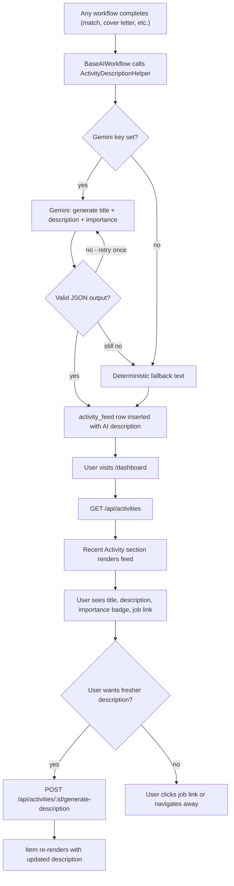
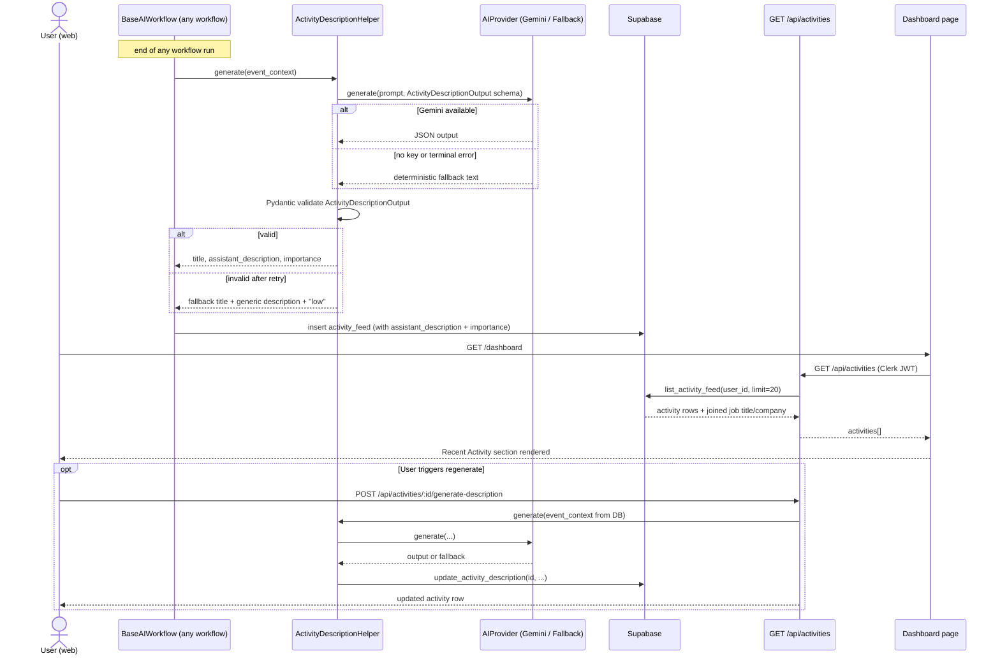
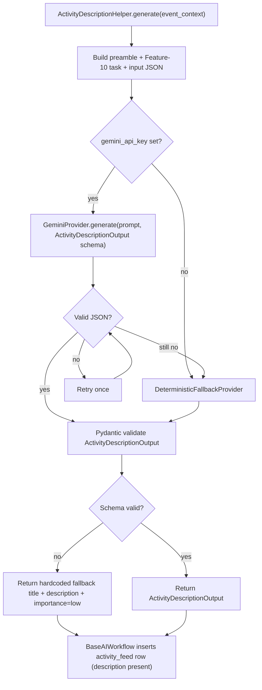
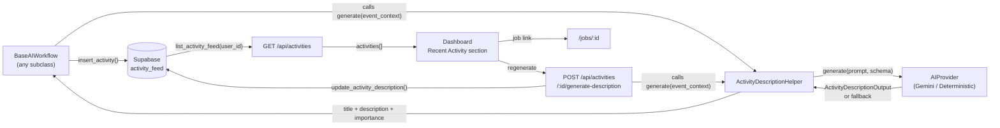
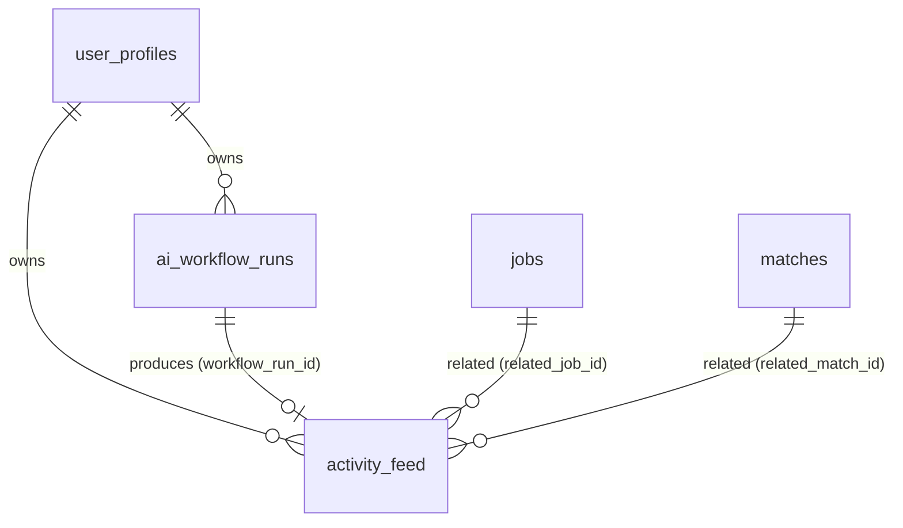

# US-037 — AI Activity Feed · Dev Flow

> **Feature 10** of `applywise_ai_assistant_update_tasks.md`. This story
> **enriches** the `activity_feed` table created in US-027: every row written
> by `BaseAIWorkflow` now carries an AI-generated `assistant_description` +
> `importance`, produced inline by a new `ActivityDescriptionHelper` called
> at the end of each originating workflow. A dedicated `activities.py` router
> surfaces the feed on the dashboard. Direction:
> `docs/decisions/0012-ai-workflow-standards.md`.

---

## 1. Feature Summary

- **What it does:** Adds an `ActivityDescriptionHelper`
  (`apps/api/app/services/ai/activity_description.py`) that is called by
  `BaseAIWorkflow` (`apps/api/app/services/ai/base_workflow.py`) immediately
  before it writes the `activity_feed` row. The helper calls Gemini (with the
  standard US-027 preamble) to produce a short `activity_title`,
  `assistant_description`, and `importance` level for that event. If AI
  generation fails for any reason, a deterministic fallback text is used and
  the activity is still saved — no event is ever dropped. A new router
  `apps/api/app/routers/activities.py` exposes the feed to the frontend.
  The dashboard page `apps/web/src/app/(app)/dashboard/page.tsx` gains a
  *Recent Activity* section.
- **Why the user needs it:** Raw event names (`match_analysis`, `cover_letter`)
  tell users what happened but not why it matters. An assistant-style
  description ("ApplyWise scored the Applied AI Engineer role at 78%…") makes
  the product feel like an active collaborator, not a log viewer.
- **Problem it solves:** `activity_feed` rows exist from US-027 but
  `assistant_description` is `null` for every row. The dashboard has no feed
  UI. This story fills both gaps with minimal new surface area — no new table,
  no new provider abstraction, no new workflow orchestration beyond a small
  helper.
- **MVP connection:** Reuses `BaseAIWorkflow`, `GeminiProvider`,
  `DeterministicFallbackProvider`, `SupabaseDataClient`, and `settings.py`
  exactly as defined in US-027. The only new backend surface is the helper
  class and the read router.

---

## 2. User Flow

1. **Entry point:** Any workflow that writes an `activity_feed` row (match
   analysis, cover letter generation, resume suggestions, etc.).
2. **Background enrichment (inline):** As each workflow completes,
   `BaseAIWorkflow` calls `ActivityDescriptionHelper.generate(event_context)`;
   the helper returns `{ activity_title, assistant_description, importance }`
   which is written into the `activity_feed` row before it is inserted.
3. **Dashboard view:** User visits `/dashboard`. The *Recent Activity* section
   calls `GET /api/activities` and renders up to 20 items, newest first.
4. **Item layout:** Each item shows the `title`, `assistant_description`,
   relative timestamp, importance indicator (badge), and a link to the related
   job when `related_job_id` is set.
5. **Optional regenerate:** A *Refresh description* action on any item calls
   `POST /api/activities/{activityId}/generate-description` and re-renders that
   item in place. This is a power-user escape hatch; it is not part of the main
   flow.



---

## 3. Technical Flow

- **Frontend feed client:** `apps/web/src/lib/ai-workflow-client.mjs` (existing
  from US-027) gains `fetchActivityFeed()` and `regenerateActivityDescription(id)`
  convenience wrappers.
- **Dashboard page:** `apps/web/src/app/(app)/dashboard/page.tsx` — server
  component that calls `fetchActivityFeed()` inside a `<Suspense>` boundary;
  renders `<RecentActivity>` (`apps/web/src/components/dashboard/recent-activity.tsx`,
  new).
- **API router:** `apps/api/app/routers/activities.py` (new). Two endpoints —
  `GET /api/activities` and `POST /api/activities/{activityId}/generate-description`.
  Mounted in `apps/api/app/main.py`.
- **AI helper:** `apps/api/app/services/ai/activity_description.py` (new,
  `ActivityDescriptionHelper`). Called synchronously inside `BaseAIWorkflow`
  after `persist()` and before `insert_activity()`. Uses the shared
  `GeminiProvider` / `DeterministicFallbackProvider` from
  `apps/api/app/services/ai/providers.py`.
- **BaseAIWorkflow patch:**
  `apps/api/app/services/ai/base_workflow.py` — the existing `insert_activity`
  call gains a `description_ctx` argument; a one-line pre-call to
  `ActivityDescriptionHelper.generate()` populates `assistant_description` and
  `importance` before the DB insert.
- **DB persistence:** `apps/api/app/services/supabase_data.py`
  (`SupabaseDataClient`) gains:
  - `list_activity_feed(user_id, limit)` — `SELECT … ORDER BY created_at DESC LIMIT ?`
    with a join to `jobs` for `related_job_title` / `related_job_company`.
  - `update_activity_description(activity_id, user_id, assistant_description, importance, title)`
    — used by the regenerate endpoint.
- **Settings:** no new keys. Uses existing `settings.gemini_api_key`,
  `settings.gemini_model`, `settings.gemini_max_attempts`,
  `settings.gemini_retry_base_delay_seconds`
  (`apps/api/app/settings.py`).
- **Auth:** Clerk JWT → resolved `user_profiles.id` via the existing pattern in
  every router.



---

## 4. AI Behavior

### Prompt Preamble (US-027 standard — Feature 12.4)

Every call to `ActivityDescriptionHelper` begins with the shared preamble:

```text
Role: You are ApplyWise, an AI job hunting assistant for software engineers
      targeting AI roles in the US market.
Source of truth: Use only the provided candidate profile, resume, and job
      description.
Truthfulness: Do not invent experience, skills, projects, companies, dates,
      metrics, or certifications.
Output: Return valid JSON matching the provided schema.
Tone: Clear, direct, helpful, professional.
```

### Feature 10 Task (appended after preamble)

```text
Task: Generate a short, assistant-style description of the activity event
      described below.
- Write as ApplyWise speaking to the user (e.g. "ApplyWise scored …").
- Maximum 2 sentences.
- Explain what happened AND why it matters for the job search.
- Set importance: "high" for events with a direct hiring signal (score ≥ 75,
  cover letter generated, interview prep completed); "medium" for useful but
  indirect signals; "low" for informational / system events.
```

### Input to AI

```json
{
  "activity_event": {
    "activity_type": "match_analysis",
    "workflow_run_id": "uuid",
    "related_job_id": "uuid | null"
  },
  "related_job": {
    "title": "Applied AI Engineer",
    "company": "Acme Corp",
    "location": "Remote"
  },
  "related_analysis": {
    "overall_score": 78,
    "confidence_score": 0.82,
    "top_gap": "RAG and evaluation experience"
  },
  "candidate_profile": {
    "target_role": "AI/ML Engineer",
    "years_experience": 5
  }
}
```

### Output Schema (brief 10.4 — verbatim)

```json
{
  "activity_title": "string",
  "assistant_description": "string",
  "importance": "low | medium | high"
}
```

Pydantic model: `ActivityDescriptionOutput` in
`apps/api/app/services/ai/activity_description.py`.

### Quality Bar (brief 10.3)

**Bad (do not produce):**
```
Match analysis completed.
```

**Good (target quality):**
```
ApplyWise scored the Applied AI Engineer role at 78%. Your backend experience
is relevant, but the role expects stronger RAG and evaluation experience.
```

### Inline vs Standalone Generation

- **Inline (primary path):** `ActivityDescriptionHelper.generate()` is called
  inside every `BaseAIWorkflow` subclass run, just before `insert_activity()`.
  No extra network round-trip from the user's perspective — the description is
  part of the same workflow latency budget.
- **Standalone (regenerate path):** `POST /api/activities/{activityId}/generate-description`
  reconstructs `event_context` from the DB row + joined job + stored
  `output_snapshot_json` on the originating `ai_workflow_runs` row, then calls
  the same helper. `workflow_type = activity_description` is written to a new
  `ai_workflow_runs` row for observability.

### Validation

Parse JSON → `ActivityDescriptionOutput` Pydantic validate. On invalid JSON
retry once (same provider). On second failure, fall back to
`DeterministicFallbackProvider`.

### Failure Rule (brief 10.1 / Story 10.1)

If AI description generation fails at any level (invalid JSON, provider error,
Pydantic failure), the helper returns a safe deterministic fallback:

- `activity_title`: human-readable form of `activity_type`
  (e.g. `"Match analysis completed"`)
- `assistant_description`: `"ApplyWise completed a {activity_type} workflow."`
- `importance`: `"low"`

The calling `BaseAIWorkflow` then proceeds to insert the `activity_feed` row
normally. **The activity is never dropped.**



---

## 5. Data Model Impact

**No new table.** This story uses the `activity_feed` table created in US-027
migration `0010_period8_ai_workflow_foundation.sql`. The `assistant_description`
and `importance` columns already exist in that table (they were defined as
`null`-able precisely for this story).

### `activity_feed` (from US-027 — shown for reference)

| Column | Type | Notes |
| --- | --- | --- |
| id | uuid pk | |
| user_id | uuid fk → user_profiles(id) cascade | |
| workflow_run_id | uuid fk → ai_workflow_runs(id) set null | |
| activity_type | text | workflow_type + lifecycle event |
| related_job_id | uuid fk → jobs(id) set null | |
| related_match_id | uuid fk → matches(id) set null | |
| title | text | **now set by ActivityDescriptionHelper** |
| assistant_description | text null | **filled by this story; fallback allowed** |
| importance | text | `low\|medium\|high` — **now set by helper** |
| created_at | timestamptz | |

Index: `(user_id, created_at desc)` — already present.

No migration is needed for US-037. Assumption: `0010_period8_ai_workflow_foundation.sql`
is already applied in all environments before US-037 ships.

### Example persisted `activity_feed` row (JSON)

```json
{
  "id": "b3c4d5e6-...",
  "user_id": "a1b2c3d4-...",
  "workflow_run_id": "e7f8a9b0-...",
  "activity_type": "match_analysis",
  "related_job_id": "f1e2d3c4-...",
  "related_match_id": "c4b3a2e1-...",
  "title": "Match Analysis — Applied AI Engineer",
  "assistant_description": "ApplyWise scored the Applied AI Engineer role at 78%. Your backend experience is relevant, but the role expects stronger RAG and evaluation experience.",
  "importance": "high",
  "created_at": "2026-06-08T10:32:14Z"
}
```

---

## 6. API Requirements

### `GET /api/activities`

Returns the current user's activity feed, newest first.

- **Auth:** Clerk JWT → `user_profiles.id`.
- **Query params:** `limit` (int, default 20, max 50), `offset` (int, default 0).
- **Response `200`:**

```json
{
  "activities": [
    {
      "id": "uuid",
      "activity_type": "match_analysis",
      "title": "Match Analysis — Applied AI Engineer",
      "assistant_description": "ApplyWise scored the Applied AI Engineer role at 78%. Your backend experience is relevant, but the role expects stronger RAG and evaluation experience.",
      "importance": "high",
      "created_at": "2026-06-08T10:32:14Z",
      "related_job": {
        "id": "uuid",
        "title": "Applied AI Engineer",
        "company": "Acme Corp"
      }
    }
  ],
  "total": 42,
  "limit": 20,
  "offset": 0
}
```

`related_job` is `null` when `related_job_id` is `null`. The join is a single
LEFT JOIN against `jobs` in `list_activity_feed()`.

### `POST /api/activities/{activityId}/generate-description`

Regenerates the `assistant_description`, `importance`, and `title` for a single
existing activity. Ownership-gated.

- **Auth:** Clerk JWT → assert `activity_feed.user_id == resolved user_id`.
- **Request body:** none.
- **Behavior:** reconstructs `event_context` from the row + joined job +
  `output_snapshot_json` on the linked `ai_workflow_runs` row; calls
  `ActivityDescriptionHelper.generate()`; writes a new `ai_workflow_runs` row
  (`workflow_type = activity_description`) for observability; updates the
  `activity_feed` row via `update_activity_description()`.
- **Response `200`:** updated activity object (same shape as one item in the
  list response above).

### Note on Write Path

Most `assistant_description` values are written **inside other workflows** (not
via this endpoint). The `POST .../generate-description` endpoint is purely a
regenerate escape hatch. The router in `activities.py` is therefore
**read-heavy**; writes are uncommon.

### Error Table (reuses US-027 taxonomy)

| Code | HTTP | retryable | When |
| --- | --- | --- | --- |
| unauthorized | 403 | false | Activity not owned by user |
| not_found | 404 | false | activityId does not exist |
| invalid_json | 502 | true | Model output unparseable after retry |
| schema_validation_failure | 502 | true | Parsed but fails Pydantic |
| model_timeout / network_failure / provider_rate_limit | 503 | true | Provider issues |

```json
{ "error": { "code": "unauthorized", "message": "Activity not found or not owned by you.", "retryable": false } }
```

---

## 7. UI Requirements

### Location

`apps/web/src/app/(app)/dashboard/page.tsx` — add a *Recent Activity* section
below the existing content. New component:
`apps/web/src/components/dashboard/recent-activity.tsx`.

### States

| State | Rendering |
| --- | --- |
| **Loading** | Skeleton rows (3 placeholder cards) inside `<Suspense>` |
| **Empty** | "No activity yet — run a match analysis or generate a cover letter to get started." |
| **Success** | List of activity items (see layout below) |
| **Error** | "Could not load recent activity." + Retry button |

### Activity Item Layout

Each item renders:

```
[importance badge]  Title                                    timestamp (relative)
                    assistant_description (up to 2 lines)
                    [→ View job: Company · Role]  (only if related_job present)
```

- **Importance indicator:** a colour-coded badge/dot.
  - `high` → accent/amber
  - `medium` → blue
  - `low` → muted/grey
- **Timestamp:** relative (e.g. "2 hours ago") using the existing date utility
  in `apps/web/src/lib/` or the browser `Intl.RelativeTimeFormat`.
- **Related job link:** if `related_job` is non-null, render a link to
  `/jobs/{related_job.id}` showing `{company} · {title}`.
- **Regenerate button:** an icon button (refresh icon) on hover/focus triggers
  `POST /api/activities/{id}/generate-description`; replaces the item inline
  on success; shows an inline error toast on failure (never removes the existing
  description).

### Accessibility

- Each item is a `<article>` with an `aria-label` derived from the title.
- The importance badge uses `aria-label="Importance: high"` (or medium/low).
- The related job link has a descriptive `aria-label`:
  `"View job: {title} at {company}"`.

### Responsive

- Mobile: single column, full-width cards.
- Desktop: same list layout, max-width constrained to the dashboard content column.

---

## 8. Acceptance Criteria

**Story 10.1 — AI Activity Descriptions (brief §10.7)**

- **Given** a workflow event occurs, **when** an activity is created, **then**
  the `activity_feed` row includes a non-null `assistant_description` and a
  non-null `title` generated by `ActivityDescriptionHelper`.
- **Given** the event carries a high hiring signal (e.g. match score ≥ 75,
  cover letter generated), **when** the activity is saved, **then**
  `importance` is `"medium"` or `"high"`.
- **Given** AI description generation fails (invalid JSON, provider error,
  Pydantic failure), **when** the activity is written, **then** fallback text
  is used for `assistant_description` AND the `activity_feed` row is still
  inserted (no event is dropped).
- **Given** `related_job_id` is set on an activity, **when** the user views the
  dashboard, **then** a link to `/jobs/{related_job_id}` is visible on that
  item.
- **Given** a user visits the dashboard, **when** `GET /api/activities` is
  called, **then** the response is ordered newest-first and includes
  `related_job` data when available.
- **Given** a user calls `POST /api/activities/{activityId}/generate-description`
  on an activity they own, **when** the request succeeds, **then** the row is
  updated in the DB and the endpoint returns the new description in the
  response body.
- **Given** a user calls the regenerate endpoint on an activity they do not own,
  **then** the response is `403 unauthorized`.
- **Given** Gemini is unavailable, **when** any workflow runs, **then** the
  deterministic fallback produces a valid `ActivityDescriptionOutput` and the
  activity is saved with `model_provider = deterministic` on the linked
  `ai_workflow_runs` row.
- **Given** the dashboard loads, **when** there are no activities, **then** the
  empty-state message is shown (not an error).
- **Given** the regenerate call fails, **when** the user sees the result, **then**
  the original description remains visible and an error toast is shown.

---

## 9. Mermaid Diagrams

User flow (§2), technical sequence (§3), and AI processing (§4) are above.

### Data Flow



### ER Diagram (US-027 table reuse — no new tables)



---

## 10. Development Tasks

### Database

1. **No new migration.** Verify `0010_period8_ai_workflow_foundation.sql` has
   been applied and that `activity_feed.assistant_description`,
   `activity_feed.importance`, and `activity_feed.title` exist and are nullable.
   If running fresh in CI, ensure US-027 migration runs before US-037 tests.

### Backend

2. **`apps/api/app/services/ai/activity_description.py`** (new)
   — `ActivityDescriptionOutput(BaseModel)`: `activity_title: str`,
   `assistant_description: str`, `importance: Literal["low", "medium", "high"]`.
   — `ActivityDescriptionHelper`: `generate(event_context: dict) -> ActivityDescriptionOutput`.
   Uses `GeminiProvider` / `DeterministicFallbackProvider` from
   `apps/api/app/services/ai/providers.py`. On any failure returns the
   hardcoded safe fallback (never raises).

3. **`apps/api/app/services/ai/base_workflow.py`** (patch)
   — Import `ActivityDescriptionHelper`. Before calling
   `supabase_data.insert_activity()`, call
   `helper.generate(self._build_event_context())` and pass `title`,
   `assistant_description`, `importance` into the insert. Add abstract
   `_build_event_context() -> dict` with a default implementation that
   constructs the Feature 10.2 input shape from available run data.

4. **`apps/api/app/services/supabase_data.py`** (extend `SupabaseDataClient`)
   — `list_activity_feed(user_id: str, limit: int = 20, offset: int = 0) -> list[dict]`
   — LEFT JOIN `jobs` on `related_job_id`; return `id`, `activity_type`,
   `title`, `assistant_description`, `importance`, `created_at`,
   `related_job_id`, plus `related_job.title`, `related_job.company` when
   non-null.
   — `update_activity_description(activity_id: str, user_id: str, title: str, assistant_description: str, importance: str) -> dict`
   — UPDATE with ownership guard (`WHERE id = ? AND user_id = ?`); return
   updated row.

5. **`apps/api/app/routers/activities.py`** (new)
   — `GET /api/activities`: auth → `list_activity_feed(user_id, limit, offset)` →
   shape into response JSON (§6).
   — `POST /api/activities/{activityId}/generate-description`: auth → fetch row
   (assert ownership) → reconstruct `event_context` from row + joined job +
   `ai_workflow_runs.output_snapshot_json` → call `ActivityDescriptionHelper.generate()`
   → write a new `ai_workflow_runs` row (`workflow_type = activity_description`)
   → `update_activity_description()` → return updated item.

6. **`apps/api/app/main.py`** (patch)
   — Mount `activities.router` with prefix `"/api"`.

7. **`apps/api/app/settings.py`** — no new settings. Confirm existing
   `gemini_api_key`, `gemini_model`, `gemini_max_attempts`,
   `gemini_retry_base_delay_seconds` are accessible from
   `ActivityDescriptionHelper`.

### AI Integration

8. **Prompt constant** — define `ACTIVITY_DESCRIPTION_TASK` string in
   `apps/api/app/services/ai/activity_description.py`; compose it with
   `PROMPT_PREAMBLE` from `apps/api/app/services/ai/base_workflow.py` (or a
   shared constants module) for every call.

9. **Fallback implementation** — `DeterministicFallbackProvider` variant for
   `ActivityDescriptionOutput`: map `activity_type` → human-readable `title`;
   `assistant_description = f"ApplyWise completed a {activity_type.replace('_', ' ')} workflow."`; `importance = "low"`.

### Frontend

10. **`apps/web/src/lib/ai-workflow-client.mjs`** (extend)
    — `fetchActivityFeed({ limit, offset })`: `GET /api/activities`; returns
    `{ activities, total, limit, offset }`.
    — `regenerateActivityDescription(activityId)`: `POST /api/activities/{activityId}/generate-description`; returns updated activity object or throws `AIWorkflowError`.

11. **`apps/web/src/components/dashboard/recent-activity.tsx`** (new)
    — Accept `activities[]` prop (or fetch via client hook).
    — Render empty / loading / success / error states (§7).
    — `ActivityItem` sub-component: importance badge, title, description (capped
    at 2 lines with `line-clamp-2`), relative timestamp, related job link, hover
    regenerate icon button.

12. **`apps/web/src/app/(app)/dashboard/page.tsx`** (patch)
    — Add `<Suspense fallback={<ActivityFeedSkeleton />}>` wrapping an
    `<AsyncRecentActivity />` server component that calls `fetchActivityFeed()`.
    — Import and render `<RecentActivity>` below existing dashboard content.

### Testing

13. **`apps/api/tests/test_activity_description.py`** (new)
    — `ActivityDescriptionHelper` unit tests: valid Gemini output → correct
    fields returned; invalid JSON → retry → fallback; provider error → fallback;
    fallback output schema-valid; fallback never raises.

14. **`apps/api/tests/test_activities_router.py`** (new)
    — `GET /api/activities`: returns 200 with activities list; respects
    limit/offset; `related_job` present when FK set, null when not; returns
    empty list (not error) when no rows.
    — `POST /api/activities/:id/generate-description`: 200 on own activity;
    403 on another user's activity; 404 on missing ID; fallback text used when
    AI fails (still 200).
    — Auth: unauthenticated requests → 401.

15. **`apps/web/tests/recent-activity.test.mjs`** (new)
    — `fetchActivityFeed` maps API response to component props; handles empty
    array; handles network error.
    — `regenerateActivityDescription` sends correct request; handles 403 as
    `AIWorkflowError`.

**Assumptions:**
- pytest is the `apps/api` test runner; fake provider is injected via
  dependency-override (no live Gemini calls in tests).
- The web app uses `node --test`, matching existing `apps/web/tests/*.test.mjs`.
- US-027's `0010_period8_ai_workflow_foundation.sql` is applied before this
  story; US-037 ships no migration.
- `BaseAIWorkflow._build_event_context()` has a default implementation; subclasses
  may override to pass richer `related_analysis` data.
- The regenerate endpoint reconstructs `related_analysis` from
  `ai_workflow_runs.output_snapshot_json`; if that row is missing (orphaned
  activity), the helper still runs with a partial context and produces a valid
  (possibly lower-quality) description.
