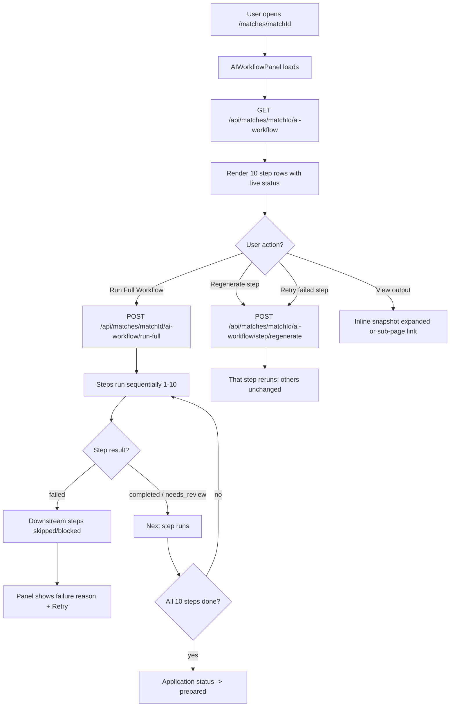
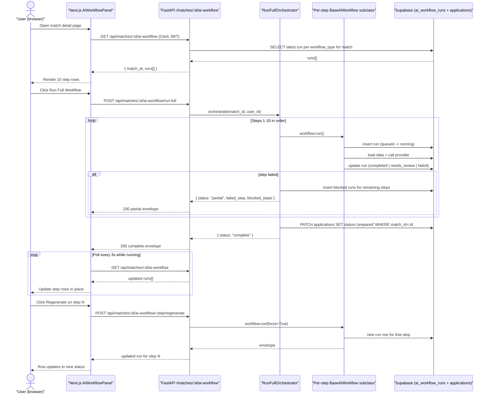
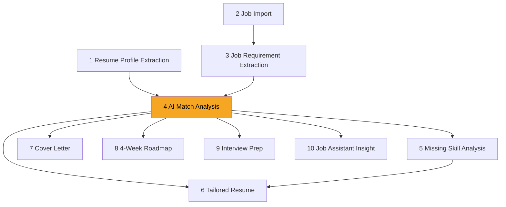
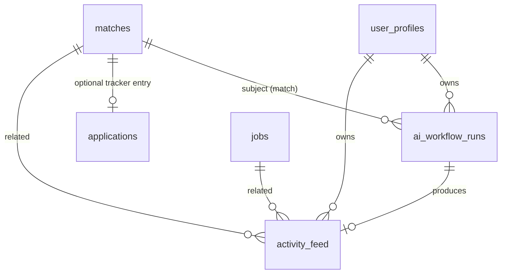
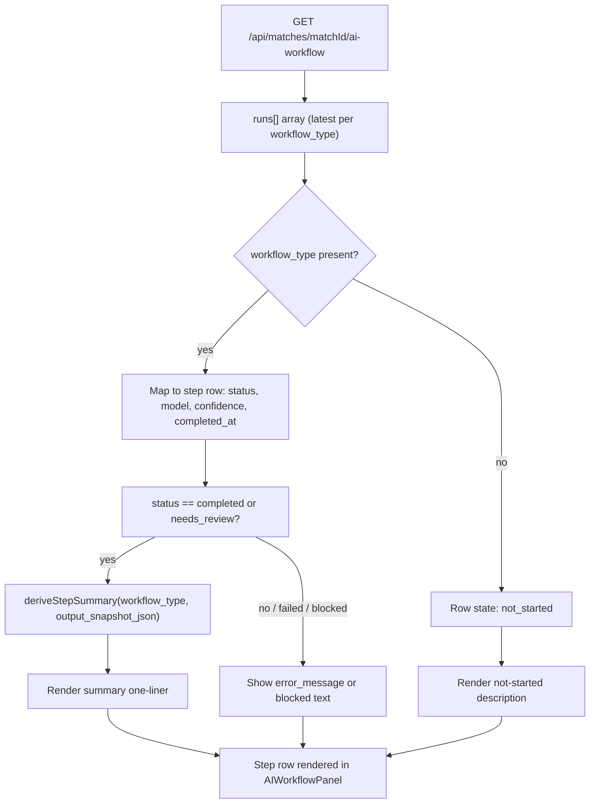

# US-038 — AI Workflow Panel · Dev Flow

> **Feature 11** of `applywise_ai_assistant_update_tasks.md`. Builds the
> user-facing AI Workflow Panel over the `ai_workflow_runs` infrastructure
> established in US-027. Reads data from `GET /api/matches/{matchId}/ai-workflow`
> (already defined in US-027) and adds `POST run-full` and `POST {step}/regenerate`
> endpoints. Direction: `docs/decisions/0012-ai-workflow-standards.md`.
>
> **Adaptation note:** The brief (`applywise_ai_assistant_update_tasks.md` §11.5,
> §11.6) specifies `{ jobId, resumeId? }` props and `/api/jobs/:jobId/ai-workflow`
> routes. Per `docs/decisions/0012-ai-workflow-standards.md` §3, routing stays
> match-centric. **Assumption:** the panel is keyed by `matchId` (a match = resume
> × job). Props become `{ matchId: string }`. Endpoints use `/api/matches/{matchId}/`.
> Pre-match steps (Resume Profile Extraction, Job Import, Job Requirement
> Extraction) read from the resume and job linked to the match record.

---

## 1. Feature Summary

- **What it does:** Renders an `AIWorkflowPanel` component on the match detail
  page (`apps/web/src/app/(app)/matches/[matchId]/page.tsx`) showing all ten AI
  workflow steps in order — their live status, AI-generated summary, model
  provider/name, confidence score, last run time, and per-step actions (View
  output, Regenerate, Retry). A **Run Full Workflow** button drives
  `POST /api/matches/{matchId}/ai-workflow/run-full`, which executes steps
  sequentially, skips dependents when a step fails, and can flip the application
  status to `prepared` when all steps complete.
- **Why the user needs it:** Replaces the developer-facing static
  `implemented` badges currently used as a proxy for AI readiness. Users need to
  know which AI-generated materials are ready, which need review, and which have
  not been started — without navigating to ten separate sub-pages.
- **Problem it solves:** Today the match detail page
  (`apps/web/src/app/(app)/matches/[matchId]/page.tsx`) shows raw score data and
  links to sub-pages but gives no visibility into which AI steps are complete,
  running, or failed. Each sub-page (`resume-suggestions/`, `resume-draft/`,
  `roadmap/`, `interview-prep/`) is reached manually. There is no orchestrated
  "run everything" flow.
- **MVP connection:** Reads `ai_workflow_runs` rows already persisted by
  US-019, US-028, US-029, US-032, US-033, US-034, US-035, US-030, and the
  job extractor (`job_extractor.py`). No new AI model; this story orchestrates
  and surfaces existing AI work. New endpoints in
  `apps/api/app/routers/matches.py` (extending US-027). New component
  `apps/web/src/components/ai-workflow-panel.tsx`.

---

## 2. User Flow

1. **Entry point:** `/matches/[matchId]` — user opens a match detail page.
2. **Panel visible:** `AIWorkflowPanel` renders below the score section, showing
   all ten steps in order. Completed steps show an AI summary. Not-started steps
   describe what the AI will do. Running steps show a spinner. Failed steps show
   the reason and a Retry button.
3. **Run Full Workflow:** user clicks the button. The system calls
   `POST /api/matches/{matchId}/ai-workflow/run-full`. Steps execute sequentially
   in dependency order. The panel polls `GET /api/matches/{matchId}/ai-workflow`
   (or receives SSE/websocket updates if added later) and updates each row as its
   status changes.
4. **Step failure:** if a step fails, all downstream dependents are skipped. The
   panel marks them `blocked`. The user sees the failure reason and a Retry button
   on the failed step.
5. **All complete:** when all ten steps reach `completed` or `needs_review`, the
   application status can become `prepared` (written to the `applications` table).
6. **Regenerate:** user clicks Regenerate on any completed step. Calls
   `POST /api/matches/{matchId}/ai-workflow/{step}/regenerate`. That step reruns;
   others are unchanged.
7. **View output:** user clicks View output. The panel expands an inline snapshot
   or navigates to the step's sub-page (e.g. `/matches/[matchId]/resume-suggestions`).



---

## 3. Technical Flow

- **Frontend component:** `apps/web/src/components/ai-workflow-panel.tsx`
  (`AIWorkflowPanel`, new). Accepts `{ matchId: string }`. On mount, calls
  `GET /api/matches/{matchId}/ai-workflow` via the existing
  `apps/web/src/lib/ai-workflow-client.mjs` client (added in US-027). Maps each
  `workflow_type` in the response to its step row definition (step name, icon,
  owning story). Derives a human-readable summary from `output_snapshot_json`.
  Polls the endpoint during run-full (or subscribes to Supabase realtime on
  `ai_workflow_runs` — see Assumption below).
- **Assumption:** for MVP, the panel re-fetches `GET ai-workflow` every 3 seconds
  while `run-full` is in progress, toggling off when no step is `queued` or
  `running`. A future story can replace polling with Supabase Realtime.
- **Render page:** `apps/web/src/app/(app)/matches/[matchId]/page.tsx` imports
  and renders `<AIWorkflowPanel matchId={matchId} />` below the score grid.
- **API layer:** `apps/api/app/routers/matches.py` (extended from US-027) adds:
  - `GET /api/matches/{matchId}/ai-workflow` — already defined in US-027;
    returns latest run per `workflow_type`.
  - `POST /api/matches/{matchId}/ai-workflow/run-full` — new.
  - `POST /api/matches/{matchId}/ai-workflow/{step}/regenerate` — new.
  - Router is mounted in `apps/api/app/main.py` under prefix `/api/matches`.
- **Orchestration service:** `apps/api/app/services/ai/run_full_orchestrator.py`
  (new). Iterates the ordered step manifest, instantiates each step's workflow
  class (e.g. `MatchAnalysisWorkflow`, `MissingSkillsWorkflow`), calls
  `workflow.run()`, checks result status. On `failed`, marks all downstream steps
  `blocked` (write a `failed`/`blocked` run row) and stops. On completion of all
  steps, calls `SupabaseDataClient.flip_application_status_prepared(match_id)`.
- **Persistence:** reads and writes `ai_workflow_runs` via
  `apps/api/app/services/supabase_data.py` methods added in US-027
  (`insert_workflow_run`, `update_workflow_run`, `get_latest_runs_for_match`).
  New method: `flip_application_status_prepared(match_id)` that PATCHes
  `applications` where `match_id = eq.{match_id}` and `status != 'prepared'`.
- **Step summary derivation:** the `AIWorkflowPanel` reads
  `output_snapshot_json` from each run row and calls a client-side
  `deriveStepSummary(workflowType, snapshot)` helper (in
  `apps/web/src/lib/ai-workflow-client.mjs`) to produce the assistant-style
  one-liner. No second network call.



---

## 4. AI Behavior

This story does not introduce new AI model calls. It orchestrates the
workflows defined in US-019, US-028, US-029, US-032, US-033, US-034, US-035,
US-030 and the job extractor. Each step's AI behavior is owned by its story.

**Step summary derivation** (client-side, no model call): the panel reads
`output_snapshot_json` from the `ai_workflow_runs` row and produces a summary
by inspecting well-known fields per `workflow_type`:

| `workflow_type` | Summary source fields | Example output |
|---|---|---|
| `resume_profile_extraction` | `confidence_score`, `basic_info.current_title` | "Completed — Candidate profile extracted with 91% confidence. Current title: Senior Backend Engineer." |
| `job_import` | `job.title`, `job.company` | "Completed — Job description imported for Senior AI Engineer at Anthropic." |
| `job_requirement_extraction` | `requirements_count` | "Completed — 14 structured requirements extracted from the job description." |
| `match_analysis` | `overall_score`, `recommendation` | "Completed — Overall match is 76%. ApplyWise recommends tailoring your resume before applying because your backend experience is relevant, but AI-specific proof is limited." |
| `missing_skills` | `gap_count` | "Completed — 6 skill gaps identified. Top gap: LLM fine-tuning experience." |
| `resume_suggestions` | `total`, `safe`, `needs_confirmation`, `do_not_use` | "Needs review — ApplyWise generated 8 suggestions: 5 safe to use, 2 need confirmation, and 1 should not be used yet." |
| `cover_letter` | `word_count` | "Completed — 380-word cover letter generated, positioning backend experience for this AI Engineer role." |
| `roadmap` | `week_count` | "Completed — 4-week skill roadmap generated with 12 actionable items." |
| `interview_prep` | `question_count` | "Completed — 9 interview questions generated with behavioral and technical coverage." |
| `assistant_insight` | `insight_type`, `headline` | "Completed — ApplyWise insight: Strong backend fit, limited AI-specific proof. Resume tailoring is the highest-leverage action." |

**Not-started state** text is hardcoded per step (no model call) — the brief
§11.4 example: "Not started — Generate a personalized cover letter that
positions your backend experience for this AI Engineer role."

**Run-full dependency order and failure propagation:**



Steps 1 and 2 are independent (run in parallel within run-full if both have not
run; **Assumption:** for MVP they run sequentially 1 then 2 to keep the
orchestrator simple). Step 3 depends on 2. Step 4 depends on 1 and 3 (both
must complete). Steps 5–10 depend on 4; step 6 additionally depends on 5.
A failure in any step causes all steps that depend on it to be marked `blocked`.
The user can Retry the failed step; run-full does not re-attempt automatically.

---

## 5. Data Model Impact

**No new tables.** This story reads from `ai_workflow_runs` and
`activity_feed` (created by US-027, migration
`apps/web/supabase/migrations/0010_period8_ai_workflow_foundation.sql`).

**`applications` table** (existing, from
`apps/web/supabase/migrations/0007_period4_applications.sql`): when run-full
completes all ten steps, the orchestrator PATCHes the `applications` row
(where `match_id = :matchId`) setting `status = 'prepared'`. Per
`docs/decisions/0009-application-tracker-status-values.md`, `prepared` is added
as a valid status value alongside `saved`, `applied`, `interviewing`, `offer`,
`rejected`, `archived`. **Assumption:** a new migration
`0012_period8_add_prepared_status.sql` updates the `applications.status` check
constraint to include `'prepared'`.

**`ai_workflow_runs.status` values used by this story:**

| Value | Meaning in panel |
|---|---|
| `queued` / `running` | Step spinner "Running…" |
| `completed` | Green badge + AI summary |
| `needs_review` | Amber badge + AI summary + review note |
| `failed` | Red badge + error message + Retry button |
| `blocked` | Grey badge "Skipped — a previous step failed." |

**Assumption:** `blocked` is written as a new run row with
`status = 'failed'` and `error_code = 'blocked_by_dependency'` (reusing the
existing status enum; no schema change to `ai_workflow_runs`).

**Example `GET /api/matches/{matchId}/ai-workflow` response** (extended from
US-027 to include `output_snapshot_json` and `error_message` for panel use):

```json
{
  "match_id": "a1b2c3d4-...",
  "runs": [
    {
      "workflow_type": "resume_profile_extraction",
      "status": "completed",
      "model_provider": "gemini",
      "model_name": "gemini-2.5-flash",
      "confidence_score": 0.91,
      "completed_at": "2026-06-08T09:00:00Z",
      "output_snapshot_json": { "basic_info": { "current_title": "Senior Backend Engineer" } },
      "error_message": null
    },
    {
      "workflow_type": "match_analysis",
      "status": "completed",
      "model_provider": "gemini",
      "model_name": "gemini-2.5-flash",
      "confidence_score": 0.82,
      "completed_at": "2026-06-08T09:01:30Z",
      "output_snapshot_json": { "overall_score": 76, "recommendation": "Tailor resume — backend experience relevant, AI-specific proof limited." },
      "error_message": null
    },
    {
      "workflow_type": "cover_letter",
      "status": "failed",
      "model_provider": "gemini",
      "model_name": "gemini-2.5-flash",
      "confidence_score": null,
      "completed_at": "2026-06-08T09:02:10Z",
      "output_snapshot_json": null,
      "error_message": "Provider rate limit exceeded. Retry to continue."
    },
    {
      "workflow_type": "roadmap",
      "status": "failed",
      "model_provider": null,
      "model_name": null,
      "confidence_score": null,
      "completed_at": null,
      "output_snapshot_json": null,
      "error_message": "Blocked — a previous step failed."
    }
  ]
}
```



---

## 6. API Requirements

### `GET /api/matches/{matchId}/ai-workflow`

Defined in US-027 (`apps/api/app/routers/matches.py`). Extended for this story
to include `output_snapshot_json` and `error_message` in each run object so the
panel can derive summaries and show failure reasons client-side.

Auth: Clerk JWT → resolve `user_profiles.id`; assert match ownership.

Response `200`:

```json
{
  "match_id": "uuid",
  "runs": [
    {
      "workflow_type": "string",
      "status": "queued | running | completed | needs_review | failed",
      "model_provider": "gemini | deterministic | null",
      "model_name": "string | null",
      "confidence_score": 0.82,
      "completed_at": "ISO-8601 | null",
      "output_snapshot_json": { "...": "..." },
      "error_message": "string | null"
    }
  ]
}
```

Steps not yet run are omitted from `runs[]`; the panel treats absent
`workflow_type` as `not_started`.

---

### `POST /api/matches/{matchId}/ai-workflow/run-full`

Triggers sequential orchestration of all ten steps. Auth: Clerk JWT + ownership.

Request body: none required. Optional `{ "force": true }` to re-run steps that
already completed.

Response `200` (all complete):

```json
{
  "status": "complete",
  "match_id": "uuid",
  "application_status": "prepared",
  "steps_completed": 10,
  "steps_failed": 0,
  "steps_blocked": 0
}
```

Response `200` (partial — a step failed):

```json
{
  "status": "partial",
  "match_id": "uuid",
  "application_status": null,
  "steps_completed": 4,
  "steps_failed": 1,
  "steps_blocked": 5,
  "failed_step": "cover_letter",
  "error": {
    "code": "provider_rate_limit",
    "message": "Provider rate limit exceeded. Retry to continue.",
    "retryable": true
  }
}
```

Errors (same taxonomy as US-027):

| Code | HTTP | retryable | When |
|---|---|---|---|
| `unauthorized` | 403 | false | match not owned by caller |
| `missing_profile` | 422 | false | no candidate profile on file |
| `missing_job_requirements` | 422 | false | job not yet parsed (step 3 not run) |
| `invalid_json` | 502 | true | model output unparseable after retry |
| `schema_validation_failure` | 502 | true | Pydantic schema mismatch |
| `model_timeout` | 503 | true | provider timeout |
| `network_failure` | 503 | true | network error to provider |
| `provider_rate_limit` | 503 | true | provider 429 |

---

### `POST /api/matches/{matchId}/ai-workflow/{step}/regenerate`

Re-runs a single step. `{step}` is the `workflow_type` string
(e.g. `match_analysis`, `cover_letter`).

Auth: Clerk JWT + ownership.

Request body: none.

Response `200`: standard envelope (per US-027):

```json
{
  "workflow_run": {
    "id": "uuid",
    "workflow_type": "cover_letter",
    "status": "completed",
    "model_provider": "gemini",
    "model_name": "gemini-2.5-flash",
    "latency_ms": 2100,
    "confidence_score": 0.87,
    "error_message": null
  },
  "result": { "...step payload..." }
}
```

Errors (same table as above + `unknown_step` → 422 / false when `{step}` is
not a recognised `workflow_type`).

---

## 7. UI Requirements

### Component: `apps/web/src/components/ai-workflow-panel.tsx`

**Props (match-centric adaptation of brief §11.5):**

```ts
interface AIWorkflowPanelProps {
  matchId: string;
  // Brief specified { jobId, resumeId? }. Adapted to { matchId } per
  // docs/decisions/0012-ai-workflow-standards.md §3. The match record
  // carries both job_id and resume_id; the panel resolves them server-side.
}
```

**Step manifest** (10 rows, in order):

| # | Display name | `workflow_type` | Icon (lucide) | Owning story |
|---|---|---|---|---|
| 1 | Resume Profile Extraction | `resume_profile_extraction` | `UserRound` | US-019 |
| 2 | Job Import | `job_import` | `Link` | US-018 / `job_extractor.py` |
| 3 | Job Requirement Extraction | `job_requirement_extraction` | `ClipboardList` | `job_extractor.py` |
| 4 | AI Match Analysis | `match_analysis` | `BarChart2` | US-028 |
| 5 | Missing Skill Analysis | `missing_skills` | `AlertTriangle` | US-029 |
| 6 | Tailored Resume | `resume_suggestions` | `FileEdit` | US-032 |
| 7 | Cover Letter | `cover_letter` | `Mail` | US-033 |
| 8 | 4-Week Roadmap | `roadmap` | `CalendarDays` | US-034 |
| 9 | Interview Prep | `interview_prep` | `MessageSquare` | US-035 |
| 10 | Job Assistant Insight | `assistant_insight` | `Sparkles` | US-030 |

**Assumption:** `resume_profile_extraction` and `job_import` / `job_requirement_extraction`
are not yet in the `workflow_type` enum in `0010_period8_ai_workflow_foundation.sql`.
A migration (`0013_period8_extend_workflow_types.sql`) adds them. Alternatively,
these pre-match steps are surfaced as read-only rows sourced from the
`user_profiles` and `jobs` tables (no `ai_workflow_runs` rows), and the panel
renders them with a static `completed` badge if the profile/job parse exists.
**Document this distinction:** steps 1–3 are pre-match and may not have
`ai_workflow_runs` rows; steps 4–10 do.

**Each step row renders (brief §11.3):**

```
[Icon]  Step name                [Status badge]
        AI-generated summary (or not-started description)
        Model: gemini-2.5-flash  ·  Confidence: 82%  ·  Last run: Jun 8 09:01
        [View output]  [Regenerate]  (Retry if failed)
```

**Status badge variants:**

| Status | Badge variant | Label |
|---|---|---|
| `not_started` | `outline` (grey) | "Not started" |
| `queued` / `running` | `secondary` + spinner | "Running…" |
| `completed` | `success` (green) | "Completed" |
| `needs_review` | `warning` (amber) | "Needs review" |
| `failed` | `destructive` (red) | "Failed" |
| `blocked` | `outline` (grey) | "Skipped" |

**Panel-level actions:**

- **Run Full Workflow** button (primary, top of panel): disabled while any step
  is `running`; calls `POST run-full`.
- **Retry** (per-row, shown only on `failed` steps): calls
  `POST {step}/regenerate`.
- **Regenerate** (per-row, shown on `completed` / `needs_review`): calls
  `POST {step}/regenerate`.
- **View output** (per-row, shown on `completed` / `needs_review`): expands an
  inline read-only JSON snapshot **or** navigates to the sub-page for steps
  that have a dedicated page (e.g. `/matches/[matchId]/resume-suggestions`).

**Panel placement:** inserted as a full-width card section below the score grid
in `apps/web/src/app/(app)/matches/[matchId]/page.tsx`. The existing links
to sub-pages (`resume-suggestions`, `resume-draft`, `roadmap`, `interview-prep`)
remain in the sidebar card and are not removed by this story.

**Loading state:** skeleton rows while the initial `GET ai-workflow` is in flight.

**Empty state (no runs at all):** "No AI steps have run yet. Click Run Full
Workflow to prepare your application materials."

---

## 8. Acceptance Criteria

**Panel visibility:**

- **Given** I open a match detail page I own, **then** the AI Workflow Panel
  renders with all ten step rows in order.
- **Given** a step has no `ai_workflow_runs` row, **then** its row shows the
  "Not started" badge and a description of what the AI will do.

**Per-step states:**

- **Given** a step's latest run has `status = running`, **then** its row shows
  a spinner and "Running…" label.
- **Given** a step's latest run has `status = completed`, **then** its row
  shows a green "Completed" badge, the AI-generated summary derived from
  `output_snapshot_json`, model name, confidence score, and last run time.
- **Given** a step's latest run has `status = needs_review`, **then** its row
  shows an amber badge, the summary, and a note prompting review.
- **Given** a step's latest run has `status = failed`, **then** its row shows a
  red "Failed" badge, `error_message`, and a Retry button.

**Run Full Workflow:**

- **Given** I have an active candidate profile and a parsed job, **when** I
  click Run Full Workflow, **then** all ten steps execute in dependency order
  (1 → 2 → 3 → 4 → 5–10 in sequence).
- **Given** step 4 (AI Match Analysis) fails during run-full, **then** steps
  5–10 are marked blocked and do not attempt to run; the panel shows a "Failed"
  row for step 4 and "Skipped" rows for steps 5–10.
- **Given** I click Retry on a failed step, **then** that step reruns via
  `POST regenerate`; blocked downstream steps remain blocked until I trigger
  run-full again or regenerate each step manually.
- **Given** all ten steps complete (status `completed` or `needs_review`),
  **then** the `applications` row for this match has its status set to
  `prepared`.
- **Given** the Run Full Workflow button is clicked, **then** it is disabled
  while any step is in `running` state; the panel polls `GET ai-workflow` every
  3 seconds and updates rows as statuses change.

**Authorization:**

- **Given** I do not own the match, **when** I call any of the three endpoints,
  **then** I receive HTTP 403 `unauthorized` and no run is created.

**Regenerate:**

- **Given** I click Regenerate on a completed step, **then** a new
  `ai_workflow_runs` row is created for that step; the previous row is
  superseded (latest-run-per-type logic in the GET response); the row updates
  in the panel.

**No static badges:**

- **Given** the panel renders, **then** no hard-coded "implemented" text appears;
  all status indicators are driven by `ai_workflow_runs.status`.

---

## 9. Mermaid Diagrams

User flow (§2), technical sequence (§3), AI run-full dependency graph and
summary-derivation table (§4), and the ER diagram (§5) are defined in their
respective sections above and render as-is.

**Data flow — how the panel populates each row:**



---

## 10. Development Tasks

### Database

1. Write migration `apps/web/supabase/migrations/0012_period8_add_prepared_status.sql`:
   add `'prepared'` to the `applications.status` check constraint.
2. Write migration `apps/web/supabase/migrations/0013_period8_extend_workflow_types.sql`
   (if needed): add `'resume_profile_extraction'`, `'job_import'`,
   `'job_requirement_extraction'` to the `ai_workflow_runs.workflow_type` check
   constraint in `0010_period8_ai_workflow_foundation.sql`. Alternatively, keep
   steps 1–3 as static/derived rows rendered from `user_profiles` and `jobs`
   tables with no `ai_workflow_runs` rows, and document the decision.

### Backend

3. `apps/api/app/services/ai/run_full_orchestrator.py` (new): `RunFullOrchestrator`
   class accepting `match_id`, `user_id`. Implements step manifest (ordered list of
   `(workflow_type, WorkflowClass, depends_on[])`). Runs sequentially; on step
   failure, writes `blocked` run rows for all dependents and returns a partial
   result. On full completion, calls `SupabaseDataClient.flip_application_status_prepared`.
4. `apps/api/app/services/supabase_data.py`: add
   `get_latest_runs_for_match(match_id)` returning a dict keyed by `workflow_type`
   (if not already added by US-027); add
   `flip_application_status_prepared(match_id)` PATCHing `applications` table.
5. `apps/api/app/routers/matches.py` (extend from US-027): add
   `POST /api/matches/{matchId}/ai-workflow/run-full` route (calls
   `RunFullOrchestrator`); add
   `POST /api/matches/{matchId}/ai-workflow/{step}/regenerate` route (instantiates
   the correct `BaseAIWorkflow` subclass for `step`, calls `.run(force=True)`).
   Extend `GET /api/matches/{matchId}/ai-workflow` response to include
   `output_snapshot_json` and `error_message` per run object.
6. Ensure `matches.router` is mounted in `apps/api/app/main.py` under
   `/api/matches` (added by US-027; verify it is present).

### Frontend

7. `apps/web/src/components/ai-workflow-panel.tsx` (new): `AIWorkflowPanel`
   component. Step manifest constant (10 entries mapping `workflow_type` to
   display name + icon + not-started description). Fetches `GET ai-workflow` on
   mount. Polls every 3 s while any run is `queued` or `running`; stops on
   quiescence. Renders 10 `StepRow` sub-components. Run Full Workflow button at
   top. Handles loading (skeleton), empty, and error states.
8. `apps/web/src/lib/ai-workflow-client.mjs` (extend from US-027): add
   `runFull(matchId)` → `POST run-full`; add `regenerateStep(matchId, step)` →
   `POST {step}/regenerate`; add `deriveStepSummary(workflowType, snapshot)`
   helper implementing the derivation table in §4.
9. `apps/web/src/app/(app)/matches/[matchId]/page.tsx`: import and render
   `<AIWorkflowPanel matchId={matchId} />` below the score grid section (after
   the `<section className="grid gap-5 lg:grid-cols-2">` block).

### AI Integration

10. Verify each step's `BaseAIWorkflow` subclass (US-028 → `MatchAnalysisWorkflow`,
    US-029 → `MissingSkillsWorkflow`, US-032 → `ResumeSuggestionsWorkflow`, US-033
    → `CoverLetterWorkflow`, US-034 → `RoadmapWorkflow`, US-035 →
    `InterviewPrepWorkflow`, US-030 → `AssistantInsightWorkflow`) is importable by
    `RunFullOrchestrator` from their respective service modules under
    `apps/api/app/services/ai/`.
11. Confirm each workflow's `output_snapshot_json` contains the summary-derivation
    fields listed in §4 (e.g. `overall_score`, `gap_count`, `word_count`,
    `question_count`). If a field is missing from a prior story's snapshot schema,
    add it in that story's Pydantic model and migration before shipping US-038.

### Testing

12. `apps/api/tests/test_ai_workflow_panel.py` (new): test `RunFullOrchestrator`
    with a fake workflow that always completes, a fake workflow that always fails,
    and a mix; assert that blocked steps are written correctly; assert
    `flip_application_status_prepared` is called only on full completion; assert
    ownership denial on `run-full` and `regenerate`; assert `unknown_step` 422 on
    `regenerate` with an invalid step name. Use fake provider — no live model calls.
13. `apps/web/tests/ai-workflow-panel.test.mjs` (new, `node --test`): test
    `deriveStepSummary` for each of the ten `workflow_type` values against a fixture
    `output_snapshot_json`; test `runFull` and `regenerateStep` envelope parsing;
    test polling logic (starts when running step present, stops when all quiescent).

**Assumptions summary (all inline in relevant sections above):**

- Panel keyed by `matchId`, not `jobId` (per ADR-0012 §3).
- Steps 1–3 (pre-match) may not have `ai_workflow_runs` rows; treat absent rows
  as `not_started`; optionally derive their status from `user_profiles` /
  `jobs.parse_status`.
- `blocked` status written as a `failed` run row with
  `error_code = 'blocked_by_dependency'` (no enum change).
- Run-full runs steps sequentially (not parallel) for MVP simplicity.
- Panel uses 3-second polling during run-full; Supabase Realtime is a future
  enhancement.
- `prepared` is a new valid `applications.status` value requiring a migration.
- `resume_profile_extraction`, `job_import`, `job_requirement_extraction` may
  need to be added to the `workflow_type` enum in a follow-up migration.
